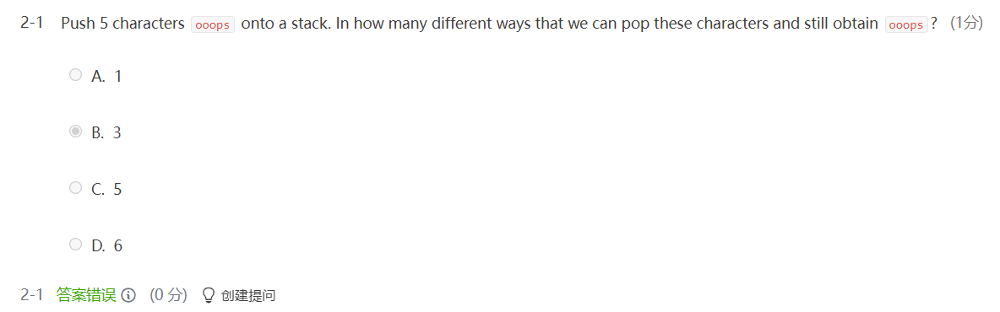
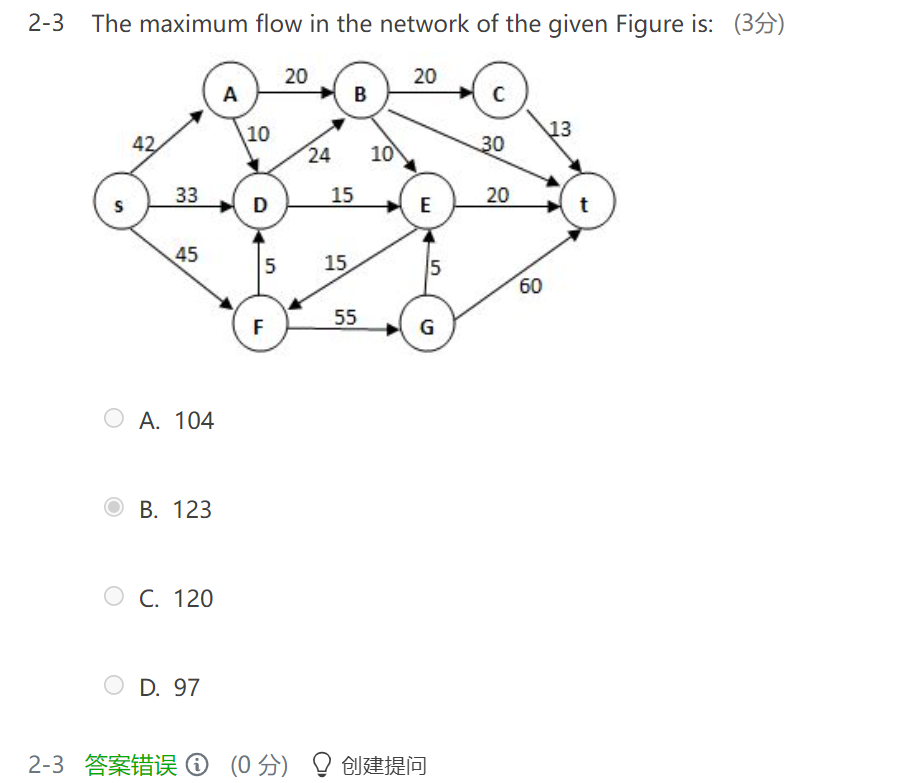
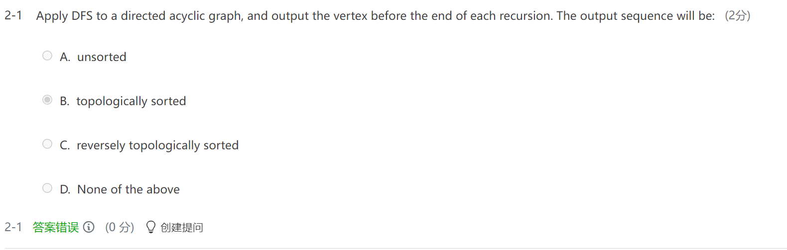
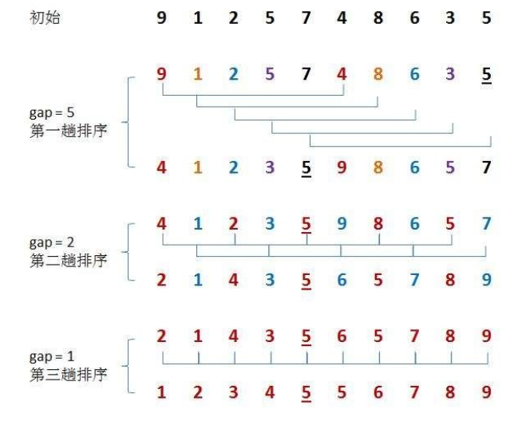
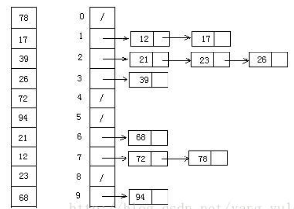
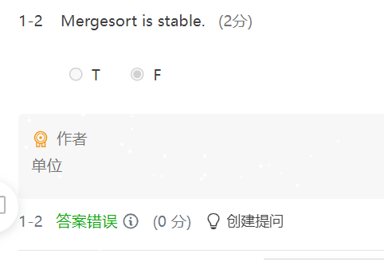
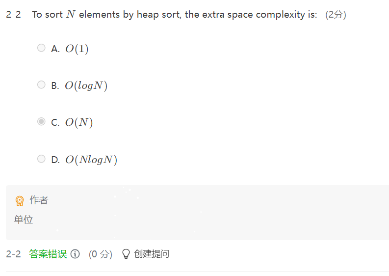
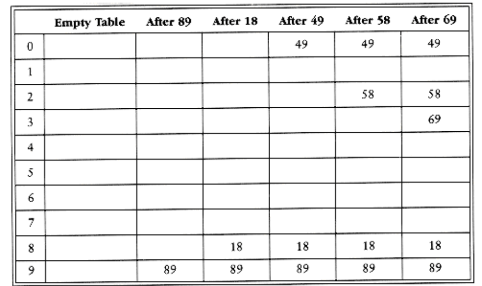
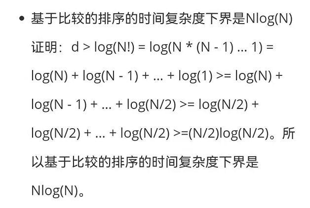
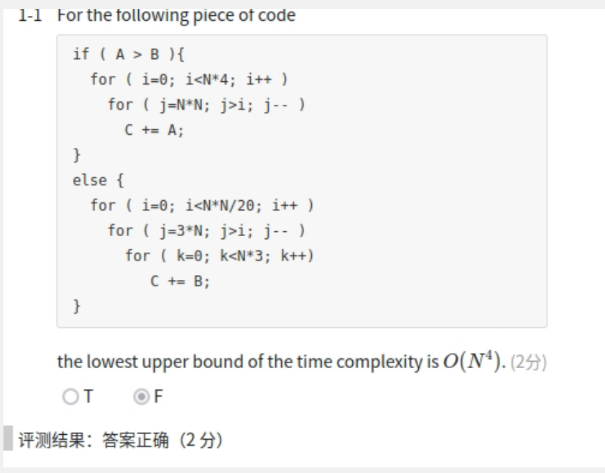

[TOC]


# 1. 树

#### 递归算时间复杂度


## 树 习题


###### 解析


- ##### degree：有几个subtree，不是depth

算子节点，三个级数为2的节点连接的子节点必然有3*2=6个，两个级数为3的同理，再加一个根节点。6+6+1

算父节点，至少有五个节点不是leafs，就是上述级数为2 和级数为3的，剩下的x我们都把它们安排成leafs，此时无确定的图，但是确定可以将他们安排好。5+x

这颗树节点数确定：   6+6+1 = 5+x         x=8

###### 同类题目：

1. Given a tree of degree 3. Suppose that there are 4 nodes of degree 2 and 3 nodes of degree 3. Then the number of leaf nodes must be  **11**
2. Given a tree of degree 3. Suppose that the numbers of nodes of degrees 1, 2 and 3 are 5, 3 and 2, respectively. Then the number of leaf nodes must be:  **8**

### 二叉树遍历

1. Preorder Traversal前序遍历  自己-左-右
2. PostOrder Traversal 后序遍历  左-右-自己
3.  InOrder（Levelorder）  Traversal有序遍历 左-自己-右

T的preorder = BT的preorder

T的postorder=BT的inorder


#### Threaded Binary Tree 线索二叉树

中序线索化二叉树：

- 若节点的_leftTag_ = 0，leftchild指向前驱
  - 否则，该节点的前驱是以该节点为根的左子树上按中序遍历的最后一个节点。
- 若_rightTag = 0，_rightchild指向后继
  - 否则，该节点的后继是以该节点为根的右子树上按中序遍历的第一个节点。

中序

前序


后序


### 折半查找判定树 Decision tree

确定向上取整还是向下取整。确定之后左右子树一定满足

##### （左子树结点数-右子树结点数 == -1）||（左子树结点数-右子树结点数 == 0）

[下列二叉树中，可能成为折半查找判定树（不含外部结点）的是（）_我就是我JJ的博客-CSDN博客](https://blog.csdn.net/qq_41754065/article/details/106590844)

[数据结构学习记录（二）——折半查找二叉判定树的画法_BlevMeM的博客-CSDN博客_折半查找判定树怎么画](https://blog.csdn.net/BlevMeM/article/details/84672731?utm_medium=distribute.pc_relevant.none-task-blog-2~default~CTRLIST~default-1.no_search_link&depth_1-utm_source=distribute.pc_relevant.none-task-blog-2~default~CTRLIST~default-1.no_search_link)


### 删除根节点

左子树最大值，右子树最小值当根。**Replace the node by the** **largest** **one in its** **left** **subtree** **or** **the** **smallest** **one in its** **right** **subtree.**

### 堆heap

最大堆max-heap：每个节点的键值（key）都大于或等于其子节点键值

最小堆min-heap：每个节点的键值（key）都小于或等于其子节点键值

### heap算法

1）push_heap算法

> 新元素插入到底层vector的end()处，然后对最底端元素执行**“上溯程序”**。时间复杂度O(logN)。
>
> 

2）pop_heap算法

堆顶元素和最底端元素交换，缩小堆长，对堆顶执行“下溯程序”。时间复杂度为O(logN)。


inline void pop_heap(RandomAccessIterator first,
                     RandomAccessIterator last);
注意：该函数接受两个迭代器，用来表现一个heap底层容器vector的头尾。

3）sort_heap算法

既然每次pop_heap都获得heap中键值最大的元素，如果持续对整个heap做pop_heap操作，每次将操作范围从后向前缩减一个元素（因为pop_heap会把键值最大的元素放在底层容器的最底端），当整个程序执行完毕时，我们便有了一个递增序列。时间复杂度O(NlogN)。


4）make_heap算法

将N个元素按输入顺序存入，先满足完全二叉树的结构特性。
调整各节点位置，以满足最大堆的堆序性。这样创建最小堆时的时间代价为O(N)。在调整节点位置时，只需对从第N/2个节点到第一个节点依次应用“下溯”程序即可，其实也就是进行了N/2次的近似删除操作。

## 二叉树


斜二叉树                                满二叉树

**完全二叉树(Complete Binary Tree)
**

```
A Complete Binary Tree （CBT) is a binary tree in which every level, 
except possibly the last, is completely filled, and all nodes 
are as far left as possible.
```

换句话说，完全二叉树从根结点到倒数第二层满足完美二叉树，最后一层可以不完全填充，其叶子结点都靠左对齐。

例如：


**完美二叉树(Perfect Binary Tree)**

```
A Perfect Binary Tree(PBT) is a tree with all leaf nodes at the same depth. 
All internal nodes have degree 2.
```

一个深度为k(>=-**1**)且有2^(k+1) - 1个结点的二叉树称为**完美二叉树**。 (注： 国内的数据结构教材大多翻译为"满二叉树")

例如：


**完满二叉树(Full Binary Tree)**

```
A Full Binary Tree (FBT) is a tree in which every node other than the leaves has two children.
```

换句话说，**所有非叶子结点的度都是2**。（**只要你有孩子，你就必然是有两个孩子。**） 

**注：**Full Binary Tree又叫做Strictly Binary Tree。

例如：


## 查找树**The Search Tree ADT** 

**(1) Every node has a** **key** **which is an** **integer**, and the keys are **distinct**.

**(2) The keys in a nonempty** **left** **subtree must be** **smaller** **than the key in the root.**

**(3) The keys in a nonempty** **right** **subtree must be** **larger** **than the key in the root.**

**(4) The left and right subtrees are also binary search trees.**

## 错题集1

binary search tree默认按数字大小从左到右，最大的不一定，因为可以有左节点，只要没有右节点就行。

### Smart Union Algorithm

1. ##### union-by-size

A simple improvement is always to make the smallest tree a subtree of the larger, breaking ties by any method; we call this approach **union-by-size**.

If unions are done by size(# of elements), the depth of any node is never more than logN. So the running time of a Find operation is **O(logN)**
To implement smart union, we need to keep track of the size of each tree. we can have the array entry of each root contain the negative of the size of its tree. When a union is performed, check the sizes; the new size is the sum of the old.

```
Find(ElementType X,DisjSet S){
	if(s[x]<=0) return x;
	else return s[x]=Find(s[x],s);
}
```


2. ##### union-by-height

We keep track of the height of a tree. The height of the tree increases only when two equal deep trees are joined(and then the height goes up by one).

```c
// Assume Root1 and Root2 are roots
// Union by height
void SetUnion( DisjSet S, SetType Root1, SetType Root2 )
{
    if( S[Root2] < S[Root1] ) // Root2 is deeper
        S[ Root1 ] = Root2;
    else
    {
        if( S[Root1] == S[Root2] )  //Same height
            S[Root1]--;
        S[ Root2 ] = Root1;
    }
}

```

- Path compression is perfectly compatible with union-by-size: path compression will not change the size of each tree
- Path compression is not entirely compatible with union-by-height: path compression may change the depth of a tree
  

3. #### Union-by-Rank（附加，按秩合并）

```c
function MakeSet(x)
     x.parent := x
     x.size := 1
 end function
 
 function Union(x, y)
     xRoot := Find(x)
     yRoot := Find(y)
     
     if xRoot ≠ yRoot then
         if xRoot.size < yRoot.size then
             large := yRoot
             small := xRoot
         else
             large := xRoot
             small := yRoot
         end if
         
         small.parent := large
         large.size := large.size + small.size
     end if
 end function
```

#### 错题集

1. In Union/Find algorithm, if Unions are done by size, the depth of any node must be no more than ~~N/2~~, but not O(logN).

每做一次归并，都会使得小的集合深度加1，但是总的深度还是看大的集合。只有深度相同的归并才能使得总的深度加1，2,2归并，深度变为3；3,3归并深度变为4。因此深度最大为
$$
log_2N + 1
$$
所以，N次归并和M次查找，复杂度为
$$
O(N + M log_2 N)
$$

2. The array representation of a disjoint set containing numbers 0 to 8 is given by { 1, -4, 1, 1, -3, 4, 4, 8, -2 }. Then to union the two sets which contain 6 and 8 (with union-by-size), the index of the resulting root and the value stored at the root are 4 and -5

正的数代表根，负的数代表最终根以及集合的元素个数。最后结果是{0，1，2，3}，{4，5，6}，{8，9}

3. The array representation of the disjoint sets is given by {2, –4, 2, 3, -3, 5, 6, 9, -2}. Keep in mind that the elements are numbered from 1 to 9. After invoking Union(Find(4), Find(6)) with union-by-size, which elements will be changed in the resulting array?

   A. a. elements of index 4 and 5
   B. a. elements of index 2 and 5
   C. a. elements of index 4 and 6
   D. a. elements of index 2 and 6

改变的是小的集合的根和大的集合的根（size被改变），所以是4，6的根，即2，5

4. A relation *R* is defined on a set *S*. If for every element *e* in *S*, "*e* *R* *e*" is always true, then *R* is said to be __ over *S*.

   A. consistent 古典相容的

   B. symmetric 对称 aRb=>bRa

   C. transitive   传递 aRb & b&c =>a&c

   D. reflexive   自反(每一个顶点都有环) aRa=>R
   
5. 

   答案是3，先把两个图分别都连到根节点，改变4->3，再将两个根连接，改变3和6。8不会被改变，因为find过程它的根就是这个堆的根。

6. 

   答案是D，find的时候会压缩路径。

7. 

   1. ```
      答案是5
      o  o  o123
      oo o213
      o o o 231
      o oo 132
      ooo321
      ```

8. 

# 2. 图

###  *DAG*(Directed Acyclic Graph)有向无环图

- 无自身闭环，1不会指向1

- 有关 adjacent  to/from。(vi,vj) is **incident** on vi and vj.边相连

- 简单路径：无环图

- Component of an undirected G ::= the maximal connected subgraph.

- DAG: directed acyclic graph 有向无环图

- (Strongly)强连通有向图:从任何一个节点都有路径走到其他点。

  - 

- 弱连通图：有向边不满足所有路径，换成无向边满足。

  - 强连通组件Strongly connected component::=

    the maximal subgraph that is strongly connected.

- Degree:入度出度

#### 无向图

- 关节点(Articulation Poinst)`是指，在原本连通的图，在删除关节点及依附的边之后，图将被分割成至少两个连通分量(原本整连通的图变得不连通)。
  另外,没有一个关节点的连通图称为`双连通图(Biconnect Graph)

  - [寻找无向图的关节点(Articulation Points)和判断图是否是双连通图(Biconnect Graph)_KRYON!的博客-CSDN博客_寻找关节点](https://blog.csdn.net/qq_40691051/article/details/103092444)

  

### 邻接矩阵

adj_mat[ i ] [ j ] =1(if (vi,vj))  /  weight

时间复杂度：O(n^2)

### 邻接列表

$$
T(examine(G))=O(n+e)
$$

将它能走到的路径点穿在它后面，搞两个数组存一波indegree和outdegree

```
struct edge{
	int indexA,indexB;
	int *nextindexA,*nextindexB;
}edge[1000];
```

### **拓扑排序**  Topological Order

满足事件时序顺序。

#### 性质：

1. 拓扑排序不止一种
2. 起始点入度为0.

##### 一些词汇

- i is a **predecessor** of j : i有路径到j

  Then j is a **successor** of i;

- **Partial order**: transitive and irreflexive可传递，反自反。

4+3—+4

期中复习

1. Which sorting methods will be slowed down if we store the elements ina a linked structure instead of a sequential structure?

   1. Insertion sort
   2. Selection sort
   3. Bubble sort
   4. Shell sort希尔排序，分组插入，每次减半增量
   5. Heap sort堆排序，维持最大堆，依次pop出根

   答案：2，3因为没办法顺序遍历

   快排：找分界值，左右两边排序

   Among the following sorting methods, which ones will be slowed down if we store the elements in a linked structure instead of a sequential structure? (5分)

   1. Insertion sort; 2. Selection Sort; 3. Bubble sort; 4. Shell sort; 5. Heap sort

   - 1 and 2 only
   - 2 and 3 only
   - 3 and 4 only
   - 4 and 5 only

   评测结果 D

   答案正确（5 分）

   

2. If a complete binary tree with 1102 nodes, there must be __leaf nodes?

   答案：1102-1023=79

   ​			79 / 2=39

   ​			39+512=551

3. Which of the following statements is TRUE about topological sorting? (5分)

   1. If a graph has a topological sequence, then its adjacency matrix must be triangular. 2->3->1可以直接排除对称或三角
   2. If the adjacency matrix is triangular, then the corresponding directed graph must have a unique topological sequence.矩阵为三角形，证明这是一个有向无环图，有向图一定有拓扑序列。
   3. In a DAG, if for any pair of distinct vertices *V* *i* and *V* *j*, there is a path either from *V* *i* to *V* *j* or from *V* *j* to *V* *i*, then the DAG must have a unique topological sequence.有向图的拓扑序列不一定唯一
   4. If *V* *i* precedes *V* *j* in a topological sequence, then there must be a path from *V* *i* to *V* *j*.不一定，如果vi在vj之前。

4. The preorder traversal sequence of any min-heap must be in sorted (non-decreasing) order.错的，不一定，AVL二叉查找树的中序一定是sorted的

5.  ADT is the abbreviation for Abstract Data Type in the textbook of data structures

   ADT是基本数据类型的缩写，对的

6. For a sequentially stored linear list of length N, the time complexities for query and insertion are **O(1) and O(N)**, respectively.

   T 

   顺序存储的线性表支持随机存取，所以查询的时间是常数时间，但插入需要把后面每一个元素的位置都进行调整，所以是线性时间。

7.  For a non-empty **doubly linked circular list**, with h and t pointing to its head and tail nodes, respectively, the TRUE statement is: 

    A. t->next == h B. h->next == t C. t->next == h->next D. h->pre == NULL

   答案是A应该 因为双向循环链表首尾相接。

8. If there are less than 20 inversions in an integer array, then Insertion Sort will be the best method among Quick Sort, Heap Sort and Insertion Sort. (3分)

   T   

9. For the quicksort implementation with the left pointer stops at an element with the same key as the pivot during the partitioning, but the right pointer does not stop in a similar case, what is the running time when all keys are equal? (5分)

   1. *O*(*logN*)

   2. *O*(*N*)

   3. *O*(*NlogN*)  

   4. *O*(*N*2)

      C是错的，那应该就是A吧

10. For an in-order threaded binary tree, if the pre-order and in-order traversal sequences are B E A C F D and A E C B D F respectively, which pair of nodes’ right links are both threads?
    (4分)
    A.E and F
    B.A and D
    C.A and E
    D.B and E
    从中序和前序看树：前序的第一个是根，即B是根，对应到中序，AEC和DF是两个子树，再看前序中，AEC最前面是E，所以E是根，F是根，然后确定,注意当孩子是NULL时才换成线索，因此只有没有右孩子的才满足。
    原文链接：https://blog.csdn.net/HGGshiwo/article/details/109276742

11. In a connected graph, the number of edges must be greater than the number of vertices minus 1.           F

    边最小值是n-1	

12. If a directed graph G=(V, E) is weakly connected, then there must be at least |V| edges in G.                          F

    v是顶点数，e是边，最少v-1个边

13. If graph G is NOT connected and has 35 edges, then it must have at least ____ vertices.         

    A. 7

    B. 8

    C. 9

    D. 10

    答案是D，$\C_8^2$ =28<35, $$C^2_9$$=36>35,也就是说，需要九个顶点才能把这些边连完，那么还得多出一个使它未联通。

14. 

#### AOE network

###### 定义

Activity On edge Network 带权有向图中，用顶点表示事件，用有向边表示活动，用边上的权值表示活动的持续时间

如果某项活动的最早开始时间和最晚开始时间一样，表示中间没有空隙，则此项活动就为关键活动。为此，我们需要定义以下几个参数。

1、事件的最早发生时间 etv（earliest time of vertex）：即顶点vk 的最早发生时间。

2、事件的最晚发生时间 ltv（latest time of vertex）：即顶点vk 的最短发生时间。也就是每个顶点对应的事件最晚需要开始的时间，超出此时间将会延误整个工期。

3、活动的最早开工时间 ete （earliest time of edge）：即弧ak 的最早发生时间。

4、活动的最晚开工时间 lte （latest time of edge ）：即弧ak 的最晚发生时间，也就是不推迟工期的最晚开工时间。

###### 步骤

我们首先求得1和2，而 ete 本来是表示活动<vk, vj> 的最早开工时间，是针对弧来说的，但只有此弧的弧尾顶点vk的事件发生了，它才可以开始，因此ete = etv[k]。

而lte 表示的是活动<vk, vj> 的最晚开工时间，但此活动再晚也不能等vj 事件发生才开始，所以lte = ltv[j] - len<vk, vj> 。

最终，我们再来判断ete 和 lte 是否相等，相等意味着活动没有任何空闲，是关键路径，否则就不是。


##### 图习题hw10

1. Let P be the shortest path from S to T. If the weight of every edge in the graph is incremented by 2, P will still be the shortest path from S to T.

   F 因为最短路可能从负边被调整成正边，每个路径都被加了边*2，不同路径被加的长度不同。

2. 

   选A，画图即可推出答案

3. When solving the maximum flow problem for graph *G*, if partial states of the $G_f$ ( will be the maximum flow when the algorithm terminates) and $G_r$ (residual graph) are shown as the following, what must be the capacity of (v1, v2) or of (v2,v1) in the original graph *G*?

   

   A. the capacity of (v1, v2) is 2

   B. the capacity of (v1, v2) is 3

   C. the capacity of (v1, v2) is 5

   D. the capacity of (v2, v1) is 5

   由下面的最大流定义可以看出，如果有新增路径，则在 Gf 中添加路径，在Gr中反向添加，因此在 Gf 中添加了一个V1-V2长度为3的路径，就需要在Gr中反向添加了V2-V1的路径，此时Gr中还剩余2流量可以用，所以最开始Gr里可以容纳流量是5，选 C

## 最大流算法

Gf:流量图,Gr:余量图

初始时Gf为空，Gr和G相同。

1.选择路径：在图Gr任意选择一条源点到目标点的路径，

2.更新Gf:在Gf中添加该路径，路径的流量由最小流量确定

3.更新Gr:如果路径中的一部分为为a->b，整条路径的最小流量为q，a->b本身的流量为p，则Gr中添加b->a，流量为q，a->b流量更新为p-q（如果为0就删去a->b）

4.重复1，2，3直到Gr中找不到路径为止

[样例](.\邻接矩阵的最大流.cpp)

## 最小生成树

经典的最小生成树算法的主要提出者是kruskal和prim，所以今天我们介绍的也是kruskal算法和[prim算法](https://so.csdn.net/so/search?q=prim算法)。简单来说最小生成树就是用最少的代价使得一个图连通。

##### kruskal算法:

1：先对每条的权重按从小到大排序；

2：每次选取其中没有被选过的最小权重的边，并且不能形成环

3：一直搜索到边数=点数-1，如果不能则该图不连通

#### prim算法：

1：先在图中任意选一个起点v1，放入集合VT

2：然后选取与VT中的点相连的未被选取过且使得边权最小的点，加入VT

3：然后重复步骤2直到所有点都被选取

## 插入排序

总是将有序数组的后一个元素插入到有序数组中。

有序数组从一个元素开始。

- 最坏情况：逆序O(N^2)
- 最好情况：顺序O(N)
- 平均情况：O(N^2)

inversion:两个元素的位置是逆序的。

有几个逆序对就需要交换几次，若有I个逆序对,时间复杂度为O(N+I)

```c
void InsertionSort ( ElementType A[ ], int N ) 
{ 
    int  j, P; 
    ElementType  Tmp; 

    for ( P = 1; P < N; P++ ) { 
        Tmp = A[ P ];   /* the next coming card */
        for ( j = P; j > 0 && A[ j - 1 ] > Tmp; j-- ) 
            A[ j ] = A[ j - 1 ]; 
            /* shift sorted cards to provide a position 
            for the new coming card */
            A[ j ] = Tmp;  /* place the new card at the proper position */
        }  /* end for-P-loop */
}
```

#### 习题hw11

1. For a graph, if each vertex has an even degree or only two vertexes have odd degree, we can find a cycle that visits every edge exactly once

   欧拉环的条件是所有点的度数为偶数，也没说是联通的，F

   - 欧拉环：无向图经过所有点且只经过一次

2. After the first run of Insertion Sort, it is possible that no element is placed in its final position.

   如果是逆序，只有3个元素，则可以。T

3. Graph G is an undirected completed graph of 20 nodes. Is there an Euler circuit in G? If not, in order to have an Euler circuit, what is the minimum number of edges which should be removed from G?

   A. Yes, Graph G has an Euler circuit

   B. No, Graph G has no Euler circuit. 10 edges should be removed.

   C. No, Graph G has no Euler circuit. 20 edges should be removed.

   D. No, Graph G has no Euler circuit. 40 edges should be removed.

   20个点的完全图，每个点的度数为19，欧拉图每个点的必须是一个偶数，因此使得每一个点的度数是18，一条边对应两度，减少的边为：20*1/2=10
   
4. 

## 强连通分量

**习题**：USACO 2003 Fall

#### 定义

Tarjan算法是基于对图深度优先搜索的算法，每个强连通分量为搜索树中的一棵子树。搜索时，把当前搜索树中未处理的节点加入一个堆栈，回溯时可以判断栈顶到栈中的节点是否为一个强连通分量。 时间复杂度是O(N+M)

1. 定义DFN(u)为节点u搜索的次序编号(时间戳)，Low(u)为u或u的子树能够追溯到的最早的栈中节点的次序号。 
2. 由定义可以得出，Low(u)=Min {Low(u), Low(v) } (u,v)为树枝边，u为v的父节点 . 
3. Low(u)=Min {Low(u), DFN(v) } DFN(v),(u,v)为指向栈中节点的后向边(指向栈中结点的横叉边) } 
4. 当结点u搜索结束后，若DFN(u)=Low(u)时，则以u为根的搜索子树上所有还在栈中的节点是一个强连通分量。

讲解：[强连通分量（超详细！！！） - endl\n - 博客园 (cnblogs.com)](https://www.cnblogs.com/ljy-endl/p/11562352.html)

```c

void Tarjan(int u,PtrToVNode pt){
	dfn[u]=low[u]=++num;
	stack[++top]=u;
	vis[u]=1;
	while(pt!=NULL){
		int v=pt->Vert;
		if(dfn[v]==-1){
			Tarjan(v,G);
			low[u]=mymin(low[u],low[v]);
		}
		else if(whether[v]==0){
			low[u]=mymin(low[u],dfn[v]);
		}
		pt=pt->Next;
	}
	if(dfn[u]==low[u]){
		//printf("%d\n",top);
		int t=stack[top--];
		printf("%d ",t);
		whether[t]=1;
		while(u!=t){		
			t=stack[top--];
			printf("%d ",t);
			whether[t]=1;
		}
		printf("\n");
	}
}
```

# 3.排序

① 稳定性排序：冒泡排序，插入排序、归并排序、基数排序

② 不稳定性排序：选择排序、快速排序、希尔排序、堆排序


|             **比较排序算法（Comparison Sorts）**             |                                                              |          |             |           |            |               |
| :----------------------------------------------------------: | :----------------------------------------------------------: | :------: | ----------- | --------- | :--------: | ------------- |
|                         **Category**                         |                           **Name**                           | **Best** | **Average** | **Worst** | **Memory** | **Stability** |
|           **插入排序** **（Insertion** **Sorts）**           | [插入排序](https://www.cnblogs.com/gaochundong/p/comparison_sorting_algorithms.html#insertion_sort)[（Insertion Sort）](https://www.cnblogs.com/gaochundong/p/comparison_sorting_algorithms.html#insertion_sort) |    n     | n2          | n2        |     1      | Stable        |
| [希尔排序](https://www.cnblogs.com/gaochundong/p/comparison_sorting_algorithms.html#shell_sort)[（Shell Sort）](https://www.cnblogs.com/gaochundong/p/comparison_sorting_algorithms.html#shell_sort) |                              n                               | n log2 n | n log2 n    | 1         | Not Stable |               |
|           **交换排序****（Exchange** **Sorts ）**            | [快速排序](https://www.cnblogs.com/gaochundong/p/comparison_sorting_algorithms.html#quick_sort)[（Quick Sort）](https://www.cnblogs.com/gaochundong/p/comparison_sorting_algorithms.html#quick_sort) | n log n  | n log n     | n2        |   log n    | Not Stable    |
| [冒泡排序](https://www.cnblogs.com/gaochundong/p/comparison_sorting_algorithms.html#bubble_sort)[（Bubble Sort）](https://www.cnblogs.com/gaochundong/p/comparison_sorting_algorithms.html#bubble_sort) |                              n                               |    n2    | n2          | 1         |   Stable   |               |
| [鸡尾酒排序](https://www.cnblogs.com/gaochundong/p/comparison_sorting_algorithms.html#cocktail_sort)[（Cocktail Sort）](https://www.cnblogs.com/gaochundong/p/comparison_sorting_algorithms.html#cocktail_sort) |                              n                               |    n2    | n2          | 1         |   Stable   |               |
| [奇偶排序](https://www.cnblogs.com/gaochundong/p/comparison_sorting_algorithms.html#odd_even_sort)[（Odd-Even Sort）](https://www.cnblogs.com/gaochundong/p/comparison_sorting_algorithms.html#odd_even_sort) |                              n                               |    n2    | n2          | 1         |   Stable   |               |
|           **选择排序****（Selection** **Sorts）**            | [选择排序](https://www.cnblogs.com/gaochundong/p/comparison_sorting_algorithms.html#selection_sort)[（Selection Sort）](https://www.cnblogs.com/gaochundong/p/comparison_sorting_algorithms.html#selection_sort) |    n2    | n2          | n2        |     1      | Not Stable    |
| [堆排序](https://www.cnblogs.com/gaochundong/p/comparison_sorting_algorithms.html#heap_sort)[（Heap Sort）](https://www.cnblogs.com/gaochundong/p/comparison_sorting_algorithms.html#heap_sort) |                           n log n                            | n log n  | n log n     | 1         | Not Stable |               |
|             **合并排序****（Merge** **Sorts）**              | [合并排序](https://www.cnblogs.com/gaochundong/p/comparison_sorting_algorithms.html#merge_sort)[（Merge Sort）](https://www.cnblogs.com/gaochundong/p/comparison_sorting_algorithms.html#merge_sort) |    n     | n log n     | n log n   |     n      | Stable        |
|             **混合排序****（Hybrid** **Sorts）**             | [内省排序](https://www.cnblogs.com/gaochundong/p/comparison_sorting_algorithms.html#intro_sort)[（Introspective Sort）](https://www.cnblogs.com/gaochundong/p/comparison_sorting_algorithms.html#intro_sort) | n log n  | n log n     | n log n   |   log n    | Not Stable    |

*注：关于 Memory，如果算法为 "in place" 排序，则仅需要 O(1) 内存；有时对于额外的 O(log(n)) 内存也可以称为 "in place"。*

#### 冒泡排序

###### 每次比较相邻两个数，将较大的数放在后面

- 第n次做完后，末尾n个数符合排序
- $O(n^2)$

```c
for(int i=1;i<=n;i++){
	for(int j=i;j<=n;j++){
        if(a[j]>a[j+1]) swap;
    }
}
```

#### 选择排序

###### 维护当前第一个值为后续队列最小值，如果有更小的就交换到开头。

- 第n次做完，前n个数符合排序
- $O(n^2)$

```c
for(int i=1;i<=n-1;i++){
    for(int j=i+1;j<=n;j++){
        if(a[i]>a[j]) swap(i,j);
    }
}
```

#### 插入排序

###### 每次将新拿到的数，插入到已经排好的队伍里，前n有序

- 维护前n个的顺序
- $O(n^2)$

```c
for(int i=1;i<=n;i++){
    //找前面序列中的位置
    int j,mark=a[i];
	for(j=i-1;j>0&&a[j]>a[i];j--){
        swap(j+1,j);
    }
    a[j+1]=mark;
}
```

#### 希尔排序



###### 每次取分组个数${n/2,n/4,n/8……,1}$ ，相隔gap的两个比较交换，第一次做完可以保证2/n的每一个分别小于后2/n。

increment是用来分组，每隔几个为一组，每次交换是在组内有的顺序里排序放置。

- 排好序之前不确定顺序
- 平均： $O(n^{1.3})$

```c
for(int gap=n/2;gap>0;gap/=2){
    for(int i=1;i<=gap;i++){
        int j=i;
        while(j<=n){
            if(a[j]>a[j+gap]) swap();
            j+=gap;
        }
    }
}
```

#### 归并排序

###### 二分，先处理小数列，逐渐合并到大数列

合并的情况：

1. 子数列已经完全放到答案数列了，把另一个放进去
2. 满足在范围内，且较小，则将这个数列的元素放到合并数列中

- 每次二分返回时，小数列有序，总的无序
- $O(n·logn)$

```c
void merge_pass( ElementType list[], ElementType sorted[], int N, int length )
{
    int num=0,k=0;
    while(num<N){
        int a1=num;
        int a2=num+length;
        num+=length*2;
        int fa2=mymin(N,num);
        while((a1<N&&a1<num-length)||(a2<fa2)){
        	if(a1==num-length){
                while(a2<N&&a2<num){
                    sorted[k++]=list[a2];
                    a2++;
                }
            }
            else if(a2>=fa2){
                while(a1<num-length) {
                    sorted[k++]=list[a1];
                    a1++;
                }
            }
            else if(list[a1]>=list[a2]&&a2<fa2){
                sorted[k++]=list[a2];
                a2++;
            }	
            else if(list[a1]<=list[a2]&&a1<num-length){
                sorted[k++]=list[a1];
                a1++;
            }
            else{

            }
        }
    }
}
```

#### 快速排序

###### 挑一个 “基准”（pivot），所有元素比基准值小的往前交换，扫一遍的同时记录比基准小的节点序号，然后把基准交换到中间。

- 只保证前部分小于后部分，不保证顺序
- 在这个分区退出之后，该基准就处于数列的中间位置。这个称为分区（partition）操作；

- 递归地（recursive）把小于基准值元素的子数列和大于基准值元素的子数列排序。

###### 6.2 动图演示


```

```

#### 堆排序 Heap Sort

###### （数组实现，不是靠结构体）每次删除根节点，维护大根堆，根节点从后向前放。

- 每次末尾n个符合顺序
- 大根堆的性质，i 子节点 为 2 * i  和 2 * i + 1 。删除根节点就从子结点中选取最大的补位，再将子节点找到下面的数补位。

```c
void AdjustDown(DataType* a, size_t n, int parent)//向下调整
{
    int child = parent * 2 + 1;
    while (child < n)
    {
        //找到最大的孩子
        if ((child + 1 < n)&&(a[child+1]>a[child]))
        {
            ++child;
        }
        //进行调整
        if (a[child]>a[parent])
        {
            Swap(&a[child], &a[parent]);
            parent=child;
            child = parent * 2 + 1;
        }
        else
        {
            break;
        }
    }
}
void HeapSort(DataType* a, size_t n)//堆排序，升序，建大堆
{
    assert(a);
    for (int i = (n - 2) / 2; i >= 0; i--)//i定义为int ,不能定义为size_t,否则死循环，
    {                       //n为元素个数，不是最后一个元素的下表，所以用（n-2）/2
        AdjustDown(a, n, i);
    }
    int end = n - 1;
    while (end > 0)
    {
        Swap(&a[0], &a[end]);
        AdjustDown(a, end, 0);//从堆顶开始向下调整，因为有一半已经有序
        --end;
    }
}
```


#### 桶排序 Bucket Sort

###### 从最高位，把数据分到不同的有序桶里。不同的桶里先排序，再合并。



#### 基数排序 Radix Sort

###### 先在按个位排序，再按十位排序。保证了对十位排序的时候个位是有序的。

先找到最大数，算出位数。从每个数位开始开10个桶，个位10个，十位10个，百位10个。挨个分别扔到这些桶。


##### 习题hw12

对初始数据序列(8, 3, 9, 11, 2, 1, 4, 7, 5, 10, 6)进行希尔排序。若第一趟排序结果为(1, 3, 7, 5, 2, 6, 4, 9, 11, 10, 8)，第二趟排序结果为(1, 2, 6, 4, 3, 7, 5, 8, 11, 10, 9)，则两趟排序采用的增 量（间隔）依次是

- ```
  3, 1
  ```

- ```
  3, 2
  ```

- ```
  5, 2
  ```

- ```
  5, 3
  ```

答案：5，3.先看第一趟，1从最开始的5号位移动到0号位，说明第一趟步长是5，直接排除A,B

再看第二趟，2从第一趟排序结果的第4位移动到1号位，说明第二趟步长是3

- 

- 

  答案是A，默认已经有堆。

##### hw13

- During the sorting, processing every element which is not yet at its final position is called a "run". Which of the following cannot be the result after the second run of quicksort?

  A. 5, 2, 16, 12, 28, 60, 32, 72 (28,72)

  B.  2, 16, 5, 28, 12, 60, 32, 72 (2, 72)

  C. 2, 12, 16, 5, 28, 32, 72, 60 (2, 28, 32)

  D. 5, 2, 12, 28, 16, 32, 72, 60 (12, 32)

  答案：D  

  每次快排都能达到一个数，满足它左边小于它，右边大于它。

  一个run要把所有跑一遍，所以如果第一遍的基准在中间的话，下一步就需要将前半个和后半个都走一遍。ABC都有在开头结尾的，所以只需要大于等于两个数满足条件即可。

- Among the following sorting methods, which ones will be slowed down if we store the elements in a linked structure instead of a sequential structure?

  1. Insertion sort; 2. Selection Sort; 3. Bubble sort; 4. Shell sort; 5. Heap sort

  A. 1 and 2 only

  B. 2 and 3 only

  C. 3 and 4 only

  D. 4 and 5 only

  答案：D

  如果在链表中存储数据，变慢的操作是：访问第n个元素，变快的是插入

  shell需要访问第k个元素，heap需要访问i/2的元素

## Hash

loading density：已有/所有

#### 处理冲突collision

- 哈希冲突解决策略：开放寻址法（Open Addressing）

  - 线性探查（Linear Probing）

    不行就往后放一个

    

  - 二次探查（Quadratic Probing）

    一种改进的方式为**二次探查（Quadratic Probing）**，即每次检查位置空间的步长为平方倍数。也就是说，如果位置 s 被占用，则首先检查 s + 1^2^ 处，然后检查s - 1^2^，s + 2^2^，s - 2^2^，s + 3^2^ 依此类推，而不是象线性探查那样以 s + 1，s + 2 ... 方式增长。尽管如此，二次探查同样也会导致同类哈希聚集问题（Secondary Clustering）。

    

  - 二度哈希（Rehashing）/

    hash table扩大两倍，rehashing:找一个两倍大之后的素数作为新的表长，每一个原来元素重新hash
    
  - 双重哈希（Double Hashing）

    在原表上解决冲突(双哈希好像就是设置了特定的步长)

    

- 链接技术（separate chaining)

  **链接技术（chaining）**将采用额外的数据结构来处理冲突，其将哈希表中每个位置（slot）都映射到了一个链表。当冲突发生时，冲突的元素将被添加到桶（bucket）列表中，而每个桶都包含了一个链表以存储相同哈希的元素。


2. 再散列法（多个函数）：Hi=RHi(key),i=1,2，…，k RHi均是不同的[散列函数](https://baike.baidu.com/item/散列函数)，即在同义词产生地址冲突时计算另一个散列函数地址，直到冲突不再发生，这种方法不易产生“聚集”，但增加了计算时间。
4. 建立一个公共溢出区

#### quadratic probing

为了消除一次聚集，我们使用一种新的方法：平方探测法。顾名思义就是冲突函数F(i)是二次函数的探测方法。通常会选择f(i)=i2。和上次一样，把{89,18,49,58,69}插入到一个散列表中，这次用平方探测看看效果，再复习一下探测规则：

==hi(x)= ( Hash(x) + F(I) ) % TableSize(I=0,1,2…)==



###### 定理

如果使用平方探测，且表的规模是素数，那么当表至少有一半是空的时候，总能插入新的元素。

##### hw14

1. The average search time of searching a hash table with *N* elements is

   O()
   
2. Given input {4371, 1323, 6173, 4199, 4344, 9679, 1989} and a hash function *h*(*X*)=*X*%10. If the collisions are solved by open addressing hash table with second hash function *h*2(*X*)=7−(*X*%7) and table size being 10, then the indices of the input numbers in the hash table are: (-1 means the insertion cannot be successful)  B

   A. 1, 3, 3, 9, 4, 9, 9

   B. 1, 3, 4, 9, 7, 5, -1

   C. 1, 3, 4, 9, 5, 0, 8

   D. 1, 3, 4, 9, 5, 0, 2

   冲突解决函数是 f(i) = h(x) + i*h2（x）

   - 第三个冲突，h(6173)=3, h2(6173)=7-6=1, i=1,
     - f(i) = h(x) + i*h2（x）=3+1=4
   - 第五个冲突，h(4344) = 4, h2(4344) = 7-4=3 i=1
   
3. Suppose that the numbers {4371, 1323, 6173, 4199, 4344, 9679, 1989} are hashed into a table of size 10 with the hash function *h*(*X*)=*X*%10, and hence have indices {1, 3, 4, 9, 5, 0, 2}. What are their indices after rehashing using *h*(*X*)=*X*%*T**ab**l**e**S**i**ze* with linear probing?

   (2分)

   A. 11, 3, 13, 19, 4, 0, 9

   B. 1, 3, 4, 9, 5, 0, 2

   C. 1, 12, 9, 13, 20, 19, 11

   D. 1, 12, 17, 0, 13, 8, 14

   取最近质数，所以是D，不是两倍

## 期末

1. It is always possible to represent a tree by a one-dimensional integer array.

任何二叉树可以通过一维数组表示（只需要把空结点空出来），任何树可由二叉树表示。因此对。T

2. For binary heaps with *N* elements, the *BuildHeap* function (which adjust an array of elements into a heap in linear time) does at most *N*−*l**o**g*(*N*+1) comparisons between elements.

​	F

3. Let P be the shortest path from S to T. If the weight of every edge in the graph is multiplied by 2, P will still be the shortest path from S to T.

​	T，看清是加二还是乘二

##### 

4. The best "worst-case time complexity" for any algorithm that sorts by comparisons only is:

  A.O(logN)
  B.O(N)
  C.O(NlogN)
  D.O(N2)

对于比较排序算法，堆排序和归并排序的最坏时间复杂度都是O(NlogN)。



2.If the most commonly used operations are to insert a new element after the last element, and to delete the first element in a linear list, then which of the following data structures is the most efficient?  ==B==

  A.singly linked list
  B. singly linked circular list with a tail pointer
  C.singly linked circular list with a head pointer
  D.doubly linked list

循环链表的尾指针可以很快地找到头指针，头指针却不能很快地找到尾指针

For a complete binary tree with even number of nodes, among the following statements, how many statement(s) is/are true?

a) the height of the left subtree must be greater than that of the right subtree

b) the number of nodes in the left subtree must be greater than that in the right subtree

c) the number of leaf-nodes in the left subtree must be twice over that in the right subtree

d) the number of leaf-nodes and that of non-leaf-nodes are exactly the same

答案：2个，b

1. There exists a binary tree with 2016 nodes in total, and with 16 nodes having only one child.

   译文：存在一棵总共有2016个结点的二叉树，其中有16个结点只有一个孩子

   F

   如果没有两个孩子的节点，那这个二叉树一定有奇数个点，偶数个点的话就需要减去奇数个子节点，-16不行。

2. To sort *N* records by merge sort, the number of merge runs is *O*(*N**l**o**g**N*). (1分)

   F，因为问的是merge runs，进一次merge算一次，应该是O(logN)

看到2-12



else里面，因为他那个i取不到n方，所以On^3^

1. 所有klogn的时间复杂度=On

2. Graph G is an undirected completed graph of 20 nodes. Is there an Euler circuit in G? If not, in order to have an Euler circuit, what is the minimum number of edges which should be removed from G?

   B

   A. Yes, Graph G has an Euler circuit

   B. No, Graph G has no Euler circuit. 10 edges should be removed.

   C. No, Graph G has no Euler circuit. 20 edges should be removed.

   D. No, Graph G has no Euler circuit. 40 edges should be removed.

   因为每个节点有19个出度，减去10个边就可以有20个出入度减去。

3. For binary heaps with *N* elements, the *BuildHeap* function (which adjust an array of elements into a heap in linear time) does at most 2*N*−2 comparisons between elements.

   (2分)

   T

4.  A is a descendant of node B，A是B的后代

5. A may precede B A在B排序前面

6. 飞书

7. 

###### End
