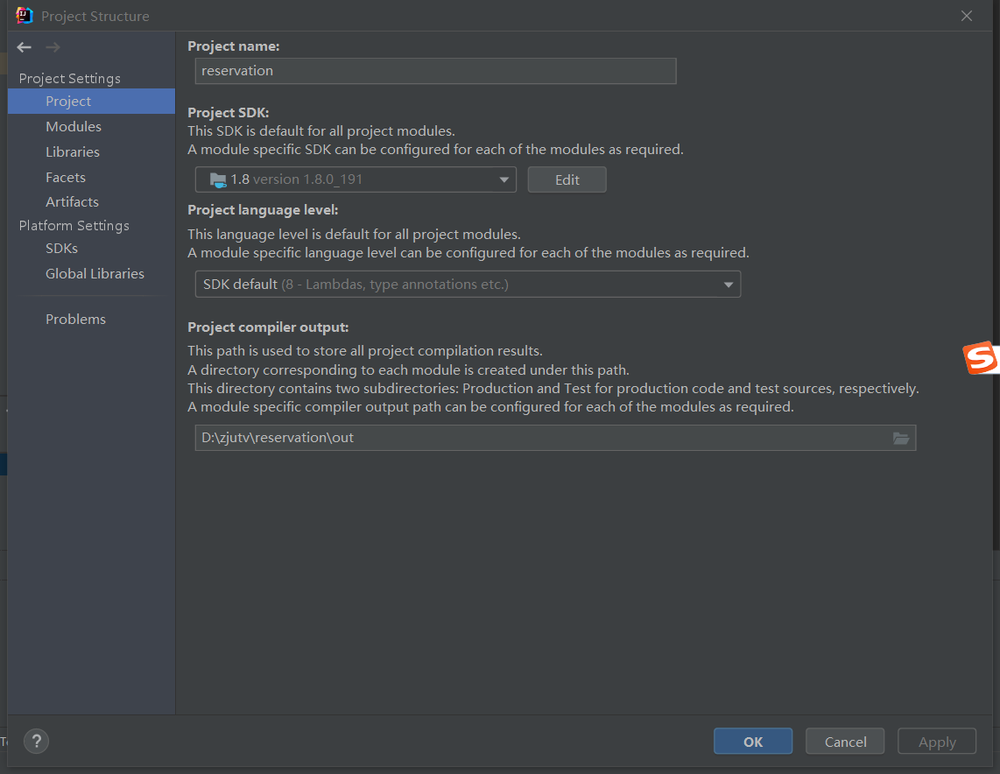
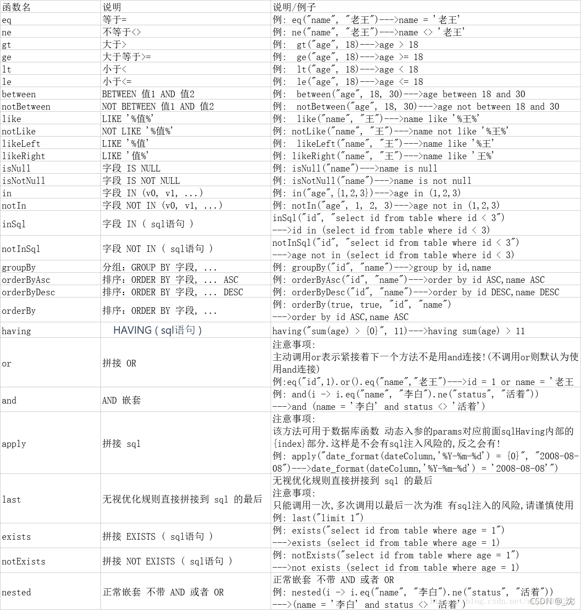

#### 关于Java

[Java虚拟机（JVM）你只要看这一篇就够了！_Java笔记-CSDN博客_jvm](https://blog.csdn.net/qq_41701956/article/details/81664921)

里面有关于操作系统的运行的一些东西。

#### idea打开Java后端

1. 打开文件夹
1. 将左上选项选成preject模式
2. 右键mavean，reset什么

遇到报错：java: 程序包jdk.nashorn.internal.ir.annotations不存在

解决方案：将java11改成Java8



分屏：右键点击文件，split什么的

##### lambda表达式

[Java Lambda 表达式 | 菜鸟教程 (runoob.com)](https://www.runoob.com/java/java8-lambda-expressions.html)可以将前面的参数传入，返回后面的值

#### QueryWrapper的查询方法

[Wrapper](https://so.csdn.net/so/search?q=Wrapper&spm=1001.2101.3001.7020): 条件构造抽象类，最顶端父类

```
 AbstractWrapper: 用于查询条件封装，生成 sql 的 where 条件
 QueryWrapper ： Entity 对象封装操作类，不是用lambda语法
 UpdateWrapper ： Update 条件封装，用于Entity对象更新操作
 AbstractLambdaWrapper ： Lambda 语法使用 Wrapper统一处理解析 lambda 获取 column。
 LambdaQueryWrapper ：看名称也能明白就是用于Lambda语法使用的查询Wrapper
 LambdaUpdateWrapper ： Lambda 更新封装Wrapper
```



##### 流式计算

[流计算_百度百科 (baidu.com)](https://baike.baidu.com/item/流计算/15441007?fromtitle=流式计算&fromid=23714673&fr=aladdin)

##### 一个例子

这是一个

- 返回值为List< RoomRecordEntity >类型的
- 传进来的参数为RoomRecordDto类型的
- 里面用了QueryWrapper条件构造器，是用于Lambda语法使用的查询Wrapper，eq是让前面等于后面

1. 疑问1：为什么RoomRecordEntity::getBorrowerStudentId中间是::,

​	答：::是成员函数，就是说entity这个类里面有一个get _ _ _ （）的方法，返回值是 _ __ _。

​	::前面是类名  .前面是实例化的对象名

2. 疑问2：为什么这两个函数都没写就能用

​	答：因为底层我们用的mybatis。[MyBatis_百度百科 (baidu.com)](https://baike.baidu.com/item/MyBatis/2824918?fr=aladdin)在java平台上的，MyBatis 是一款优秀的持久层框架，它支持定制化 SQL、存储过程以及高级映射。

3. 疑问3：lambda在里面起的作用

​	答：流式计算，后面可以跟很多子句的[流计算_百度百科 (baidu.com)](https://baike.baidu.com/item/流计算/15441007?fromtitle=流式计算&fromid=23714673&fr=aladdin)，[flink入门-流式计算概念 - 知乎 (zhihu.com)](https://zhuanlan.zhihu.com/p/63187296)，

​	

```java
    /**
     * 测试接口，按照学号查询借用记录
     *
     * @param roomRecordDto
     * @return
    * */
    public List<RoomRecordEntity> getRoomRecordList(RoomRecordDto roomRecordDto) {
        QueryWrapper<RoomRecordEntity> queryWrapper = new QueryWrapper<>();
        if (roomRecordDto.getBorrowerStudentId() != null)
            queryWrapper.lambda().eq(RoomRecordEntity::getBorrowerStudentId, roomRecordDto.getBorrowerStudentId());
        return roomRecordMapper.selectList(queryWrapper);
    }

```

##### DTO和ENTITY的关系

DTO是数据传输对象：主要用于封装前台页面传过来的数据，在各个层之间进行数据的传递，主要用于接受前台数据进行封装并向各个层之间传递数据（个人理解是向下层传递数据），定义方法跟Bean规范一致

ENTITY是实体对象：主要用于封装从数据库里取的数据，字段跟数据库中的表可一致，定义规范跟Bean一致，主要用于封装从数据库里获取的数据并向各个层之间传递（个人理解是向上层传递数据）

#### throw和return

- return的作用很简单，意思是方法直接返回了，该方法不在向下执行。但是调用该方法的方法继续执行。
  - ApiResult是处理中断的函数
- 而throw指抛出异常，并且该方法以及调用该方法的一切方法将不会向下执行。
  - ApiExceptionInstance是处理异常的函数

#### 关于LambdaQueryWrapper

LambdaQueryWrapper是mybatis plus中的一个条件构造器对象，只是是需要使用Lambda 语法使用 Wrapper

这个东西，它就是为了查询单条，就没办法查所有，就是有条件的。

```Java
/**
     * 获取用户提交的问题
     */
    public List<Question> getUserQuestion(int userId) {
        LambdaQueryWrapper<Question> wrapper = new LambdaQueryWrapper<>();
        wrapper.eq(Question::getSubmitter, userId).orderByDesc(Question::getSubmitTime);

        return questionMapper.selectList(wrapper);
    }
```

##### 关于数据类型和包装类的不同

Long和Integer是底层封装过的类，数据库表的主键Id字段一般就只建议用Long好像。

Integer你可以对它进行！=null或者==null啥的判断

[java面试题之int和Integer的区别 - 果冻迪迪 - 博客园 (cnblogs.com)](https://www.cnblogs.com/guodongdidi/p/6953217.html)

1、Integer是int的包装类，int则是java的一种基本数据类型 
2、Integer变量必须实例化后才能使用，而int变量不需要 
3、Integer实际是对象的引用，当new一个Integer时，实际上是生成一个指针指向此对象；而int则是直接存储数据值 
4、Integer的默认值是null，int的默认值是0

#### **包装类**

   包装类（[Wrapper](https://so.csdn.net/so/search?q=Wrapper&spm=1001.2101.3001.7020) Class）： Java是一个面向对象的编程语言，但是Java中的八种基本数据类型却是不面向对象的，为了使用方便和解决这个不足，在设计类时为每个基本数据类型设计了一个对应的类进行代表，这样八种基本数据类型对应的类统称为包装类(Wrapper Class)，包装类均位于java.lang包。

###### ** 基本数据类型与对应的包装类型**


