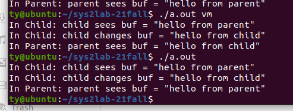
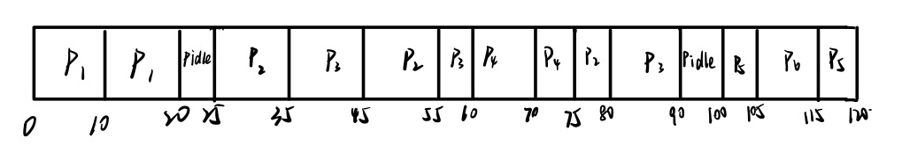

# Homework 4

> | ????? | ???3200106252 |
> | ---------- | ---------------- |

1. Operating System Concept Chapter 2 Exercises: 2.9, 2.10, 2.12. 2.17 (40 points)

   2.9 The services and functions provided by an operating system can be divided into two main categories. Briefly describe the two categories, and discuss how they differ. 

   1. Helping the user. This kind of function is closer to users.
   2. Ensuring the efficient operation of the system. This kind of functions deal with computer resource. Users may mot pay attention to this kind of functions.

   

   2.10 Describe three general methods for passing parameters to the operating system

   1. Pass the parameters in registers
   2. The parameters are stored in a block, or table, in memory, and the address of the block is passed as a parameter in a register.
   3. Parameters are pushed onto a stack by program and popped off the stack by operating system.

   

   2.12 What are the advantages and disadvantages of using the same systemcall interface for manipulating both files and devices?

   Advantages: A set of system calls can be used on both files and devices. It improves function utilization.

   Disadvantages: It may cause the potential for device contention and perhaps deadlock.

   

   2.17 Why is the separation of mechanism and policy desirable?

   The separation is important for flexibility. The policy is a way to accomplish a mechanism and it's easy to change. If mechanism and policy are related closely, every changes on policy may change mechanism which is inefficient for developer.

   policy????

   

2. Operating System Concept Chapter 3 Exercises: 3.1. (10 points)

   3.1 Using the program shown in Figure 3.30, explain what the output will be at LINE A.

   ```c
   #include <sys/types.h>
   #include <stdio.h>
   #include <unistd.h>
   int value = 5;
   int main()
   {
       pid t pid;
       pid = fork();
       if (pid == 0) { /* child process */
           value += 15;
           return 0;
       }
       else if (pid > 0) { /* parent process */
           wait(NULL);
           printf("PARENT: value = %d",value); /* LINE A */
           return 0;
       }
   }
   ```

   output:  `PARENT: value = 5`

   

3. Operating System Concept Chapter 3 Exercises: 3.2. (20 points)

   3.2 Including the initial parent process, how many processes are created by the program shown in Figure 3.31?

   The analysis is in code. All processes pid is just an example. `gchild` means grandchild, `ggchild` means grand-grandchild.
   
   ```c
   #include <stdio.h>
   #include <unistd.h>
   int main()
   {
       fork();
       /* parent -> child   */
       /*(pid:1) -> (pid:2) */
       fork();
       /* parent -> gchild    child -> gchild    */
       /*(pid:1) -> (pid:3)  (pid:2) -> (pid:4)   */
       fork();
       /* parent -> ggchild    child -> ggchild   gchild -> ggchild    gchild -> ggchild  */
       /*(pid:1) -> (pid:5)   (pid:2) -> (pid:6)   (pid:3) -> (pid:7)    (pid:4) -> (pid:8)   */
       return 0;
   }
   ```
   
   
   
   So 8 processes would be created.
   
   
   
4. Operating System Concept Chapter 4 Exercises: 4.8 4.9. 4.10 4.17 4.19 (50 points, 10 points each)

   4.8 Provide two programming examples in which multithreading does **not** provide better performance than a single-threaded solution. 

   1. The functions of the program have strict execution sequence. Then the multithreading and  single-threaded will perform similarly. The multithreading may perform worse due to context switch.
   2. Program which need to use output device or other device. One thread may occupied the device and other thread can't use it, so all the threads will wait for the result of device.

   ?????

   4.9 Under what circumstances does a multithreaded solution using multiple kernel threads provide better performance than a single-threaded solution on a single-processor system? 

   Most of circumstance. A multithreaded solution using multiple kernel threads can perform many unrelated threads at the same time. Therefore, we can use more than one process and the process run faster than single-threaded solution.

   

   4.10 Which of the following components of program state are shared across threads in a multithreaded process? 

   a. Register values 

   b. Heap memory 

   c. Global variables 

   d. Stack memory.

   Answer: bc

   

   4.17 Consider the following code segment: 

   ```c
   pid t pid; 
   pid = fork(); 
   /*  parent -> child   */
   /* (pid:1) -> (pid:2) */
   if (pid == 0) { /* child process */ 
   	fork(); 
       /*  child  -> gchild  */
       /* (pid:2) -> (pid:3) */	
   	thread create( . . .); 
   } 
   fork();
   /* parent -> ggchild     child -> ggchild    gchild -> ggchild  */
   /*(pid:1) -> (pid:4)   (pid:2) -> (pid:5)   (pid:3) -> (pid:6)  */
   ```

    a. How many unique processes are created? 

   

   So there are 6 unique processes created.

   

   b. How many unique threads are created?

   Each child process related with process 2 would create a thread. Processs whose pid are 2, 5, 3, 6 will create thread. So 4 unique threads are created.

   ??????????????????????????????

   4.19 The program shown in Figure 4.23 uses the Pthreads API. What would be the output from the program at LINE C and LINE P?

   ```c
   #include <pthread.h>
   #include <stdio.h>
   int value = 0;
   void *runner(void *param); /* the thread */
   int main(int argc, char *argv[])
   {
       pid t pid;
       pthread t tid;
       pthread attr t attr;
       pid = fork();
       if (pid == 0) { /* child process */
           pthread attr init(&attr);
           pthread create(&tid,&attr,runner,NULL);
           pthread join(tid,NULL);
           printf("CHILD: value = %d",value); /* LINE C */
       }
       else if (pid > 0) { /* parent process */
           wait(NULL);
           printf("PARENT: value = %d",value); /* LINE P */
       }
   }
   void *runner(void *param) {
       value = 5;
       pthread exit(0);
   }
   ```

   LINE C:  CHILD: value = 5

   LINE P: PARENT: value = 0

   Because the child process and parent process use different memory space. Value in child process is set 5, and it has nothing to do with parent process. Value in parent process is still 0.

   

5. Compile and run the clone.c program twice, with  ‘vm’ and without ‘vm’ as the argument, respectively. Take the screenshots of the running results (20 points) and explain why the output is different (30 points). Hint: Understand the meaning of the CLONE_VM flag of the clone system call.

   

   ```
   // When called with the command-line argument "vm", set the CLONE_VM flag on. 
   	unsigned long flags = 0;
   	if (argc > 1 && !strcmp(argv[1], "vm")) {
   		flags |= CLONE_VM; 
   	}
   ```

   As in most C functions, multiple flags are simply read together. The flags available to the clone call are many, including CLONE_VM - share memory.

   When we input `./a.out vm`,  argc=2   argv[0]=`./a.out`    argv[1]=`vm`.  CLONE_VM is set 1. The child thread share memory with parent.  `buf` is changed in child_fun. So the `buf` in shared memory is changed. Therefore, when parent process print buf, it prints `"hello from child"`.

   

6. Operating System Concept Chapter 5 Exercises: 5.3 5.4 5.5 5.8 (40 points, 10 points each)

   5.3 Suppose that the following processes arrive for execution at the times indicated. Each process will run for the amount of time listed. In answering the questions, use nonpreemptive scheduling, and base all decisions on the information you have at the time the decision must be made. 

   | Process | Arrival Time | Burst Time |
   | :-----: | :----------: | :--------: |
   |   P1    |     0.0      |     8      |
   |   P2    |     0.4      |     4      |
   |   P3    |     1.0      |     1      |

   a. What is the average turnaround time for these processes with the FCFS scheduling algorithm? 

   ?	Average turnaround time=(8+(12-0.4)+(13-1))/3=31.6/3=10.53?

   b. What is the average turnaround time for these processes with the SJF scheduling algorithm? 

   ?	Average turnaround time=(8+(9-1)+(13-0.4))/3=28.6/3=9.53?

   c. The SJF algorithm is supposed to improve performance, but notice that we chose to run process P1 at time 0 because we did not know that two shorter processes would arrive soon. Compute what the average turnaround time will be if the CPU is left idle for the first 1 unit and then SJF scheduling is used. Remember that processes P1 and P2 are waiting during this idle time, so their waiting time may increase. This algorithm could be known as future-knowledge scheduling.

   ?	At time 1, there are three processes in the waiting queue, so the order is P3, P2, P1.

   ?	Average turnaround time=((2-1)+(6-0.4)+(14-0.0))/3=6.87?

   

   5.4 Consider the following set of processes, with the length of the CPU burst time given in milliseconds: 

   | Process | Burst Time | Priority |
   | :-----: | :--------: | :------: |
   |   P1    |     2      |    2     |
   |   P2    |     1      |    1     |
   |   P3    |     8      |    4     |
   |   P4    |     4      |    2     |
   |   P5    |     5      |    3     |

   The processes are assumed to have arrived in the order P1, P2, P3, P4, P5, all at time 0. 

   a. Draw four Gantt charts that illustrate the execution of these processes using the following scheduling algorithms: FCFS, SJF, non-preemptive priority (a larger priority number implies a higher priority), and RR (quantum = 2). ?

   

   b. What is the turnaround time of each process for each of the scheduling algorithms in part a? 

   | algorithm               | turnaround time  |
   | ----------------------- | ---------------- |
   | FCFS                    | 2+3+11+15+20=51  |
   | SJF                     | 1+3+7+12+20=43   |
   | non-preemptive priority | 8+13+15+19+20=75 |
   | RR                      | 2+3+20+13+18=56  |

   c. What is the waiting time of each process for each of these scheduling algorithms? 

   | algorithm               | waiting time                    |
   | ----------------------- | ------------------------------- |
   | FCFS                    | 0+2+3+11+15=31                  |
   | SJF                     | 0+1+3+7+12=23                   |
   | non-preemptive priority | 0+8+13+15+19=55                 |
   | RR                      | 0+(3-1)+(20-8)+(13-4)+(18-5)=36 |

   d. Which of the algorithms results in the minimum average waiting time (over all processes)?

   ?	SJF(Shortest Remaining First) results in the minimum average waiting time.

   

   5.5 The following processes are being scheduled using a preemptive, round-robin scheduling algorithm

   | Process | Priority | Burst | Arrival |
   | ------- | -------- | ----- | ------- |
   | $P_1$   | 40       | 20    | 0       |
   | $P_2$   | 30       | 25    | 25      |
   | $P_3$   | 30       | 25    | 30      |
   | $P_4$   | 35       | 15    | 60      |
   | $P_5$   | 5        | 10    | 100     |
   | $P_6$   | 10       | 10    | 105     |

   Each process is assigned a numerical priority, with a higher number indicating a higher relative priority. In addition to the processes listed below, the system also has an idle task (which consumes no CPU resources and is identified as Pidle). This task has priority 0 and is scheduled whenever the system has no other available processes to run. The length of a time quantum is 10 units. If a process is preempted by a higher-priority process, the preempted process is placed at the end of the queue. 

   a. Show the scheduling order of the processes using a Gantt chart. 

   

   b. What is the turnaround time for each process? 

   | Process | Turnaound time |
   | ------- | -------------- |
   | P1      | 20-0=20        |
   | P2      | 80-25=55       |
   | P3      | 90-30=60       |
   | P4      | 75-60=15       |
   | P5      | 120-100=20     |
   | P6      | 115-105=10     |

   c. What is the waiting time for each process? 

   | Process | Waiting time  |
   | ------- | ------------- |
   | P1      | 0-0=0         |
   | P2      | 80-20-25=35   |
   | P3      | 90-25-30=45   |
   | P4      | 75-60-15=0    |
   | P5      | 120-10-100=10 |
   | P6      | 115-105-10=0  |

   d. What is the CPU utilization rate?

   CPU utilization rate = (120-$T_{Pidle}$) / 120 = 87.5%

   

   5.8 Suppose that a CPU scheduling algorithm favors those processes that have used the least processor time in the recent past. Why will this algorithm favor I/O-bound programs and yet not permanently starve CPU-bound programs?

   Because I/O-bound programs spend most of time waiting for I/O device respond, it takes little of time to execute on CPU. As for CPU, I/O-bound programs use less processor. So I/O-bound program is preferred and executed before some CPU-bound program.

   

7. According to the ppt we have learned in the class, explain the reason why the MarsPathfinder had reset itself, and how to avoid that. (10 points) 

   Two threads both use the same bus to pass information. The CPU observe Shortest-Remaining-Time-First principle. When low priority thread occupied the bus, a high priority thread comes. So context switch will stop low priority thread and change to high priority thread. High priority thread wants to use the bus but the bus isn't available. During this period, the lower priority cannot run. Since it holds the mutex, then high information bus thread cannot run  —it’s waiting for the release of the mutex. Watchdog will reset the machine when all the threads are waiting for a period of time.

   The method to avoid it is priority inversion. When high priority thread want to use bus, keep low priority thread running if it is occupying the bus. We can change low priority thread to high priority thread at this time.

