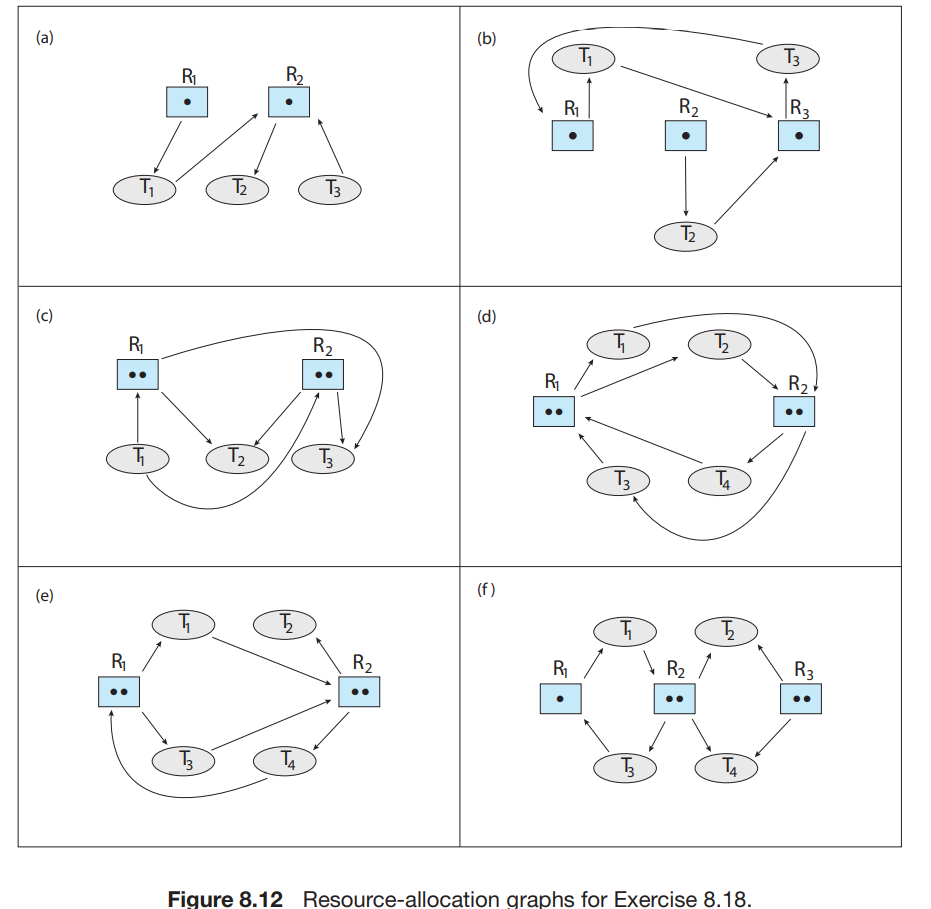
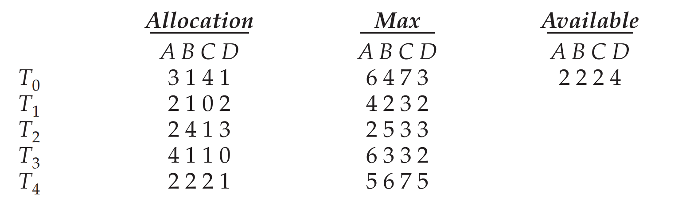

## Homework 5

1. Operating System Concepts Chapter 6:

- 6.2 : 15points

  What is the meaning of the term busy waiting? What other kinds of waiting are there in an operating system? Can busy waiting be avoided altogether? Explain your answer.

  Answer:

  1. A practice that allows a thread  or process to use CPU time continuously while  waiting for something. The process loop continuously in enter section until requirement is satisfied and critical section can run. 
  2. An other kind of waiting is block() and wakeup(). The process would stop and continue if it is waked up by other process.
  3. Busy waiting can be avoided by block() and wakeup() using linked list. Processes won't continue loop and execute when there are enough resources.                                                                                                                                                 

  

- 6.3 : 15 points

  Explain why spinlocks are not appropriate for single-processor systems yet are often used in multiprocessor systems.

  Answer: No context switch is required when a process must wait on a lock, and a context switch may take considerable time. In certain circumstances on multi-core systems, spinlocks are in fact the preferable choice for locking.

  

- 6.8: 20 points

  Race conditions are possible in many computer systems. Consider an online auction system where the current highest bid for each item must be maintained. A person who wishes to bid on an item calls the bid(amount) function, which compares the amount being bid to the current highest bid. If the amount exceeds the current highest bid, the highest bid is set to the new amount. This is illustrated below: 

  ```c
  void bid(double amount) { 
      if (amount > highestBid) 
      	highestBid = amount; 
  }
  ```

  Describe how a race condition is possible in this situation and what might be done to prevent the race condition from occurring.

  Answer: The computer would do follow steps:

  1. Read highestBid from memory to register
  2. Do  comparison
  3. Write new value to memory.

  If the process is interrupted before writing back, the value maybe changed in the interrupt. So the write-back value may be wrong. We can use semaphore or mutex lock to protect critical part run from interrupt .

  ```c
  //semaphore version
  void bid(double amount) { 
      acquire();
      if (amount > highestBid) 
      	highestBid = amount; 
      release();
  } 
  ```

   

- 6.11: 20 points

  One approach for using compare and swap() for implementing a spinlock is as follows: 

  ```c
  void lock spinlock(int *lock) { 
  	while (compare and swap(lock, 0, 1) != 0) ; /* spin */ 
  }
  ```

   A suggested alternative approach is to use the “compare and compare and-swap” idiom, which checks the status of the lock before invoking the compare and swap() operation. (The rationale behind this approach is to invoke compare and swap()only if the lock is currently available.) This strategy is shown below: 

  ```c
  void lock spinlock(int *lock) { 
  	while (true) { 
          if (*lock == 0) { /* lock appears to be available */ 
              if (!compare and swap(lock, 0, 1)) break; 
          } 
      } 
  } 
  ```

  Does this “compare and compare-and-swap” idiom work appropriately for implementing spinlocks? If so, explain. If not, illustrate how the integrity of the lock is compromised.

  **Answer**: First, compare and swap () in spinlock can't solve deadlock perfectly. For example, the process that owns the lock requests the lock again so that a deadlock occurs. This “compare and compare-and-swap” idiom work has the same performance as compare and swap(). It may be interrupted during spin lock, but it doesn't matter.

  

- 6.13: 30 points

  The first known correct software solution to the critical-section problem for two processes was developed by Dekker. The two processes, P0 and P1, share the following variables:

  ```c
   boolean flag[2]; /* initially false */ 
   int turn;
  //6.19
  while (true) {
  	flag[i] = true;	//f[0]=1
      while (flag[j]) {  //f[1]=1
          if (turn == j) {
              flag[i] = false;
              while (turn == j)
              ; /* do nothing */
              flag[i] = true;
          }
      }
      /* critical section */
      turn = j;
      flag[i] = false;
      /* remainder section */
  }
  ```
  
   The structure of process Pi (i == 0 or 1) is shown in Figure 6.18. The other process is Pj (j == 1 or 0). Prove that the algorithm satisfies all three requirements for the critical-section problem.
  
  Answer: Three requirements:
  
  1. Mutual exclusion. When flag[0] and flag[1] both are 1, the process x which doesn't have turn will enter the loop and set flag[x]=0, so that the process(1-x) will break out of loop and run. So only one process in turn can run.
  2. Progress. If there are other process running, current process is first busy waiting and waits for other process finishing. When current process finished, turn will be set another process and that process can run.
  3. Bounded waiting. There are only two choices for turn and the program must run after the other process finished. 
  
  

2. Operating System Concepts Chapter 7:

- 7.1: 40 points

  Explain why Windows and Linux implement multiple locking mechanisms. Describe the circumstances under which they use spinlocks, mutex locks, semaphores, and condition variables. In each case, explain why the mechanism is needed.

  Answer: 

  1. Multiple locking mechanisms ensure the orderly execution of cooperating processes that share a logical address space, so that data consistency is maintained.
  2. Spinlocks are often used in multiprocess system to lock resource because process don't need to do context switch. Mutex locks are used for resource lock. Semaphore and condition variables are used in a condition that a resource will be held for a long time.

  

- 7.3: 15 points

  Describe what changes would be necessary to the producer and consumer processes in Figure 7.1 and Figure 7.2 so that a mutex lock could be used instead of a binary semaphore

  ```c
  //Figure 7.1 The structure of the producer process.
  while (true) {
      ...
      /* produce an item in next produced */
      ...
      wait(empty);
      wait(mutex);
      ...
      /* add next produced to the buffer */
      ...
      signal(mutex);
      signal(full);
  }
  //Figure 7.2 The structure of the consumer process.
  while (true) {
      wait(full);
      wait(mutex);
      ...
      /* remove an item from buffer to next consumed */
      ...
      signal(mutex);
      signal(empty);
      ...
      /* consume the item in next consumed */
      ...
  }
  ```
  
  Answer: A binary semaphore can't limit the number of user.  So we need to add a signal variable to protect critical section.
  
  ```c
  int available;// 0 - empty , 1 - full
  // producer process.
  while (true) {
      ...
      /* produce an item in next produced */
      ...
      
      available = 0;
      wait(mutex);
      ...
      /* add next produced to the buffer */
      ...
      signal(mutex);
      available = 1;
  }
  // consumer process.
  while (true) {
      available = 1;
      wait(mutex);
      ...
      /* remove an item from buffer to next consumed */
      ...
      signal(mutex);
      available = 0;
      ...
      /* consume the item in next consumed */
      ...
  }
  ```
  
  

3. Operating System Concepts Chapter 8:

- 8.12: 10 points

  Consider the traffic deadlock depicted in Figure 8.12. 

  

  a. Show that the four necessary conditions for deadlock hold in this example. 

  Answer:

  - Mutual exclusion
  - Hold and wait
  - No preemption
  - Circular wait

  b. State a simple rule for avoiding deadlocks in this system

  The four conditions is four must-happen condition in deadlocks, so a simple rule can be trying to avoid 4 conditions.

  

- 8.18: 20 points

  Which of the six resource-allocation graphs shown in Figure 8.12 illustrate deadlock? For those situations that are deadlocked, provide the cycle of threads and resources. Where there is not a deadlock situation, illustrate the order in which the threads may complete execution.

  Answer:

  - Deadlock
    - b: R1-T1-R3-T3-R1
    - d: R1-T1(T2)-R2-T4(T3)-R1
  - No deadlock(one condition for example)
    - a: T3-T2-T1
    - c: T2-T1-T3
    - e: T2-T1-T3-T4
    - f: T1-T3-T2-T4

  

- 8.22: 10 points

  Consider a system consisting of four resources of the same type that are shared by three threads, each of which needs at most two resources. Show that the system is deadlock free.

  Answer: If there are only 3 resources, the system may form a circular wait. However, the fourth resource break the circle. There must be enough resource for one thread, so all the threads can be satisfied one by one. 

  

- 8.23: 20 points

  Consider a system consisting of m resources of the same type being shared by n threads. A thread can request or release only one resource at a time. Show that the system is deadlock free if the following two conditions hold: 

  a. The maximum need of each thread is between one resource and m resources. 

  b. The sum of all maximum needs is less than m + n.

  Answer: 

  - The condition a represents $$max_i≥1$$. The condition b represents $$\sum_{i}{max_i}<m+n$$.

  - Because there are   $$need=max-allocation$$ for each process and $$\sum{need}=\sum{max}-\sum{allocation}$$

  - Since   $$\sum{allocation_i}=m$$ ,     $$\sum{need}<n$$ . 

  - It shows at least one processes' need is 0. So deadlock won't happen.

  

- 8.28: 40 points

  Consider the following snapshot of a system: 

  

  Answer the following questions using the banker’s algorithm: 

  a. Illustrate that the system is in a safe state by demonstrating an order in which the threads may complete. 

  Answer: T2-T3-T1-T0-T4

  b. If a request from thread T4 arrives for (2, 2, 2, 4), can the request be granted immediately? 

  Answer: No.

  c. If a request from thread T2 arrives for (0, 1, 1, 0), can the request be granted immediately? 

  Answer: Yes. The resource allocated to T2 is larger than (0,1,1,0).

  d. If a request from thread T3 arrives for (2, 2, 1, 2), can the request be granted immediately?

  Answer: No. The resource allocated to T3 is less than (2,2,1,2) in D.