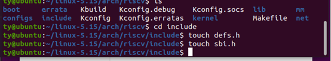
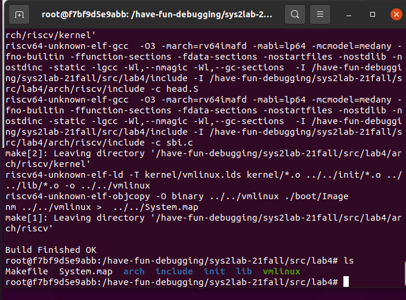
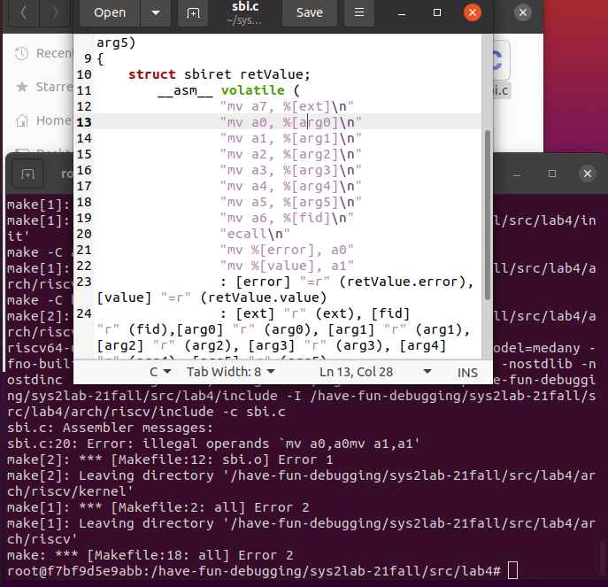
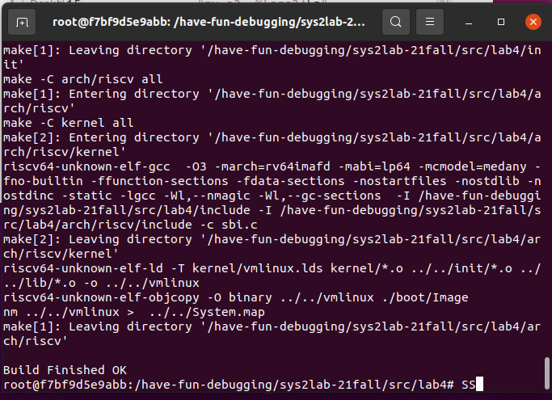
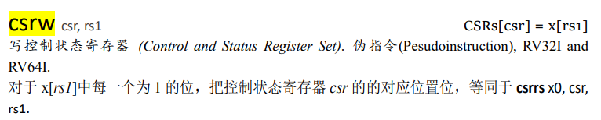
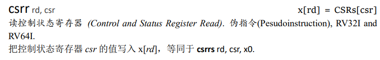
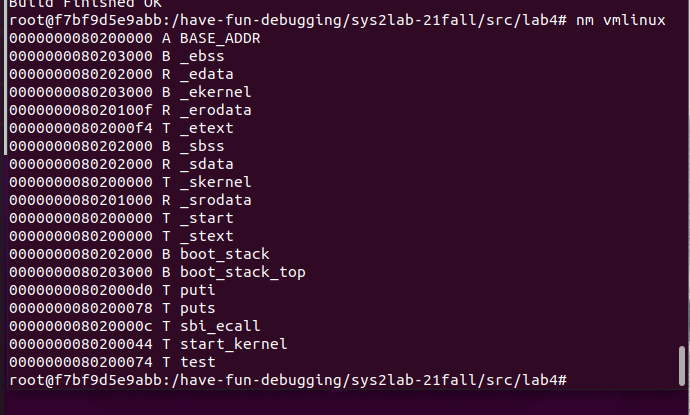
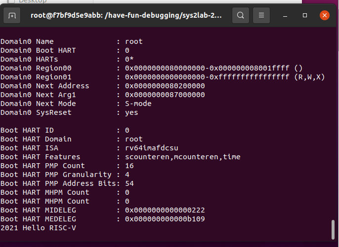

# 实验4——RV64内核引导

> | 姓名：汤尧            | 学号：3200106252 |
> | --------------------- | ---------------- |
> | 课程名称：计算机系统Ⅱ | 指导老师：申文博 |

## 一   实验目的

- 学习 RISC-V 汇编， 编写 head.S 实现跳转到内核运行的第一个 C 函数。
- 学习 OpenSBI，理解 OpenSBI 在实验中所起到的作用，并调用 OpenSBI 提供的接口完成字符的输出。
- 学习 Makefile 相关知识， 补充项目中的 Makefile 文件， 来完成对整个工程的管理。

## 二  实验原理和内容

#### RISC-V 的三种特权模式

RISC-V 有三个特权模式：U (user) 模式、S (supervisor) 模式和 M (machine) 模式。

| Level | Encoding | Name             | Abbreviation |
| :---- | :------- | :--------------- | :----------- |
| 0     | 00       | User/Application | U            |
| 1     | 01       | Supervisor       | S            |
| 2     | 10       | Reserved         |              |
| 3     | 11       | Machine          | M            |

其中：

- M 模式是对硬件操作的抽象，有**最高**级别的权限
- S 模式介于 M 模式和 U 模式之间，在操作系统中对应于内核态 (Kernel)。当用户需要内核资源时，向内核申请，并切换到内核态进行处理
- U 模式用于执行用户程序，在操作系统中对应于用户态，有**最低**级别的权限

#### 内联汇编

 内联汇编（通常由 asm 或者 __asm__ 关键字引入）提供了将汇编语言源代码嵌入 C 程序的能力。 内联汇编的详细介绍请参考 [Assembler Instructions with C Expression Operands](https://gcc.gnu.org/onlinedocs/gcc/Extended-Asm.html) 。


#### Makefile

Makefile 可以简单的认为是一个工程文件的编译规则，描述了整个工程的编译和链接流程。在 Lab3 中我们已经使用了 make 工具利用 Makefile 文件来管理整个工程。在阅读了 [Makefile介绍](https://seisman.github.io/how-to-write-makefile/introduction.html) 这一章节后，同学们可以根据工程文件夹里 Makefile 的代码来掌握一些基本的使用技巧。

#### SBI 与 OpenSBI

SBI (Supervisor Binary Interface) 是 S-mode 的 Kernel 和 M-mode 执行环境之间的接口规范，而 OpenSBI 是一个 RISC-V SBI 规范的开源实现。RISC-V 平台和 SoC 供应商可以自主扩展 OpenSBI 实现，以适应特定的硬件配置。

简单的说，为了使操作系统内核适配不同硬件，OpenSBI 提出了一系列规范对 M-mode 下的硬件进行了统一定义，运行在 S-mode 下的内核可以按照这些规范对不同硬件进行操作。

#### vmlinux.lds

GNU ld 即链接器，用于将 `*.o` 文件（和库文件）链接成可执行文件。在操作系统开发中，为了指定程序的内存布局，ld 使用链接脚本（Linker Script）来控制，在 Linux Kernel 中链接脚本被命名为 vmlinux.lds。更多关于 ld 的介绍可以使用 `man ld` 命令。

更多有关链接脚本语法可以参考[这里](https://sourceware.org/binutils/docs/ld/Scripts.html)。

| 段名    | 主要作用                             |
| :------ | :----------------------------------- |
| .text   | 通常存放程序执行代码                 |
| .rodata | 通常存放常量等只读数据               |
| .data   | 通常存放已初始化的全局变量、静态变量 |
| .bss    | 通常存放未初始化的全局变量、静态变量 |

#### System.map

System.map是内核符号表（Kernel Symbol Table）文件，是存储了所有内核符号及其地址的一个列表。“符号”通常指的是函数名，全局变量名等等。使用 `nm vmlinux` 命令即可打印vmlinux的符号表，符号表的样例如下：

```
0000000000000800 A __vdso_rt_sigreturn
ffffffe000000000 T __init_begin
ffffffe000000000 T _sinittext
ffffffe000000000 T _start
ffffffe000000040 T _start_kernel
ffffffe000000076 t clear_bss
ffffffe000000080 t clear_bss_done
ffffffe0000000c0 t relocate
ffffffe00000017c t set_reset_devices
ffffffe000000190 t debug_kernel
```

使用 System.map 可以方便地读出函数或变量的地址，为 Debug 提供了方便。

## 三  主要仪器设备

- Ubuntu虚拟机
- Docker in Lab3

## 四 实验步骤与分析

### 4.1 准备工程

使用`git clone`将仓库文件clone到虚拟机上，因为lab3中已经实现了本地在docker的挂载，故可以在本地端直接修改，之后在docker中利用编译工具运行。

1. 将本地目录挂载在oslab1的容器中后，使用git clone将os21fall拉取到本地。

2. 根据实验手册的文件架构，使用touch指令建立新文件。



### 4.2 编写head.S

在 arch/riscv/kernel/head.S 中，首先为即将运行的第一个 C 函数设置程序栈（栈的大小可以设置为4KB），并将该栈放置在`.bss.stack` 段。接下来我们只需要通过跳转指令，跳转至 main.c 中的 `start_kernel` 函数即可。

```assembly
    la sp,boot_stack_top
    call start_kernel
    .section .bss.stack  
    .globl boot_stack
boot_stack:         
    .space 0x1000 # <-- the stack size is 4kb
boot_stack_top:
```

- 在`vmlinux.lds`中可以发现，4kb用0x1000表示。
- 经查阅手册，`j`指令为近跳跃，`call`为远调用，此处调用start_kernel函数，应当使用`call`指令。

### 4.3 完善 Makefile 脚本

阅读文档中关于 [Makefile](https://zjusec.gitee.io/sys2lab-21fall/lab4/#35-makefile) 的章节，以及工程文件中的 Makefile 文件，根据注释学会 Makefile 的使用规则后，补充 `lib/Makefile`，使工程得以编译。

阅读完文档里每一个Makefile后可以发现，init文件夹中的Makefile和lib文件夹的Makefile功能最相似，故直接复制了，改了一下文件名，就跑起来了，真好。

-  `${GCC}`是在lab4文件夹的Makefile中说明，编译时会被替换成`riscv64-unknown-elf-gcc`。`${CFLAG}`也是在总文件夹Makefile中定义的一系列指令参数，包括要引用`/arch/riscv/include`文件夹以及`/include`文件夹，运行时会直接将命令进行替换。
- 通配符代替了你一系列的文件，`%o`表示所有以`.o`结尾的文件， `*.c` 表示所有后缀为c的文件。`%o:%c`表示所有`.o`文件依赖于`.c`结尾的文件，生成目标方法所包含的指令是将其通过规定文件夹下的编译环境完成编译。
- `(patsubst %.c,%.o,(wildcard *.c))`表示列出所有`.c`文件对应的`.o`文件，通过一层层的定义，可以使得指令更加简洁。

```
C_SRC       = $(sort $(wildcard *.c))
OBJ		    = $(patsubst %.c,%.o,$(C_SRC))

file = print.o
all:$(OBJ)
	
%.o:%.c
	${GCC} ${CFLAG} -c $<
clean:
	$(shell rm *.o 2>/dev/null)
```

完成此步后在工程根文件夹执行 make，可以看到工程成功编译出 vmlinux。



### 4.4 补充 `sbi.c`

OpenSBI 在 M 态，为 S 态提供了多种接口，比如字符串输入输出。因此我们需要实现调用 OpenSBI 接口的功能。sbi_ecall 函数中，实现了以下功能：

1. 将 ext (Extension ID) 放入寄存器 a7 中，fid (Function ID) 放入寄存器 a6 中，将 arg0 ~ arg5 放入寄存器 a0 ~ a5 中。
2. 使用 `ecall` 指令。`ecall` 之后系统会进入 M 模式，之后 OpenSBI 会完成相关操作。
3. OpenSBI 的返回结果会存放在寄存器 a0 ， a1 中，其中 a0 为 error code， a1 为返回值， 我们用 sbiret 来接受这两个返回值。

在 `arch/riscv/kernel/sbi.c` 中补充 `sbi_ecall()`。

```c
struct sbiret sbi_ecall(int ext, int fid, uint64 arg0,
			            uint64 arg1, uint64 arg2,
			            uint64 arg3, uint64 arg4,
			            uint64 arg5) 
{
	struct sbiret retValue;
	__asm__ volatile (
		"mv a7, %[ext]\n"
		"mv a0, %[arg0]\n"
		"mv a1, %[arg1]\n"
		"mv a2, %[arg2]\n"
		"mv a3, %[arg3]\n"
		"mv a4, %[arg4]\n"
		"mv a5, %[arg5]\n"
		"mv a6, %[fid]\n"
		"ecall\n"
		"mv %[error], a0\n"
		"mv %[value], a1\n"
		: [error] "=r" (retValue.error), [value] "=r" (retValue.value)
		: [ext] "r" (ext), [fid] "r" (fid),[arg0] "r" (arg0), [arg1] "r" (arg1), [arg2] "r" (arg2), [arg3] "r" (arg3), [arg4] "r" (arg4), [arg5] "r" (arg5)
		:"memory"
	);    
	return retValue;   
}
```

​		有两个需要传出的值，在第一个冒号后。当在汇编指令中使用`retValue.error`作为变量时，出现错误提示，"."使用错误。故采用error和value值作为变量，在传入传出时再使用结构体。传入的值较多，都应排列在第二个冒号之后。

这里在第五步做完后编译时出现了以下报错。



仔细看，发现替换的时候未出现换行所以出现了"mv a0,a0mv a1,a1"的报错。发现是ecall指令后忘记加换行符。改正后再次make



### 4.5 `puts()` 和 `puti()`

​		调用以上完成的 `sbi_ecall` , 完成 `puts()` 和 `puti()` 的实现。 `puts()` 用于打印字符串，`puti()` 用于打印整型变量。

​		因为`sbi_ecall`函数一次只能输出一个字符，所以在打印时需要注意多位数字的处理。因为只需要完成打印的功能，故Extention ID只需要使用0x01.

```c
void puts(char *s) {
    while(*s!=0){
        sbi_ecall(0x01, 0x0, *s, 0, 0, 0, 0, 0);
        s++;
    }
}
void puti(int x) {
    int k=1;
    while(k<x) k*=10;
    k/=10;
    while(k!=0){
        sbi_ecall(0x1, 0x0, x/k+'0', 0, 0, 0, 0, 0);
        x=x-(x/k)*k;
        k/=10;
    }
}
```

### 4.6 修改 defs

在`arch/riscv/include/defs.h` 文件中已经有一个宏定义

```c
#define csr_write(csr, val)                         \
({                                                  \
    uint64 __v = (uint64)(val);                     \
    asm volatile ("csrw " #csr ", %0"               \
                    : : "r" (__v)                   \
                    : "memory");                    \
})
```

其中 `%0` 代表着输出输入部分的第一个符号，即 `__v = val`。在riscv指令集中查到csrw指令的作用和格式，csrw用在写控制状态寄存器函数中。同理，我们找到了读控制状态寄存器的指令。





csrr语句会将读出的值放在`__v`变量中。

```
#define csr_read(csr)                       \
({                                          \
    register uint64 __v;                    \
    __asm__ volatile("csrr" "%0," #csr      \
                        : :"r"(__v)         \
                        : "memory");        \
    __v;                                    \
})
```

此时，使用 vm linux 指令，可看到vmlinux的符号表



最终在容器中运行`make run`指令，输出2021 Hello RISC-V，之后程序进入test中`while(1);`循环。



## 思考题

1. 请总结一下 RISC-V 的 calling convention，并解释 Caller / Callee Saved Register 有什么区别？

   1. 函数调用过程：储存传入参数，跳转到函数，开辟出函数运行所需要的资源，运行，保存返回值，释放资源，返回。

      其中，risc-v平台上有8个整形寄存器($a_0-a_7$)，8个浮点寄存器($fa_0-fa_7$)。传入的参数会优先放在寄存器中，若结构体中数据过多放不下则放入栈中。栈由高地址想低地址方向，16字节对齐。

   2. Caller Saved Register需要在调用函数前将需要保存的寄存器值存入栈中，调用结束再取出，调用的函数无论用没用到该寄存器，都不会影响它的值的正确性；Callee Saved Register是在函数开始运行时将所有函数需要用到的寄存器进行保存，函数退出前再存回，即调用函数前后寄存器组不发生改变。

2. 编译之后，通过 System.map 查看 vmlinux.lds 中自定义符号的值


