# 实验5——RV64 时钟中断处理

> | 姓名：汤尧            | 学号：3200106252 |
> | --------------------- | ---------------- |
> | 课程名称：计算机系统Ⅱ | 指导老师：申文博 |

## 一   实验目的

- 学习 RISC-V 的异常处理相关寄存器与指令，完成对异常处理的初始化。
- 理解 CPU 上下文切换机制，并正确实现上下文切换功能。
- 编写异常处理函数，完成对特定异常的处理。
- 调用 OpenSBI 提供的接口，完成对时钟中断事件的设置。

## 二  实验原理和内容

#### 2.1 相关寄存器

除了32个通用寄存器之外，RISC-V 架构还有大量的 **控制状态寄存器** `Control and Status Registers(CSRs)`，下面将介绍几个和异常机制相关的重要寄存器。

Supervisor Mode 异常相关寄寄存器:

- `sstatus` ( Supervisor Status Register )中存在一个 SIE ( Supervisor Interrupt Enable ) 比特位，当该比特位设置为 1 时，会对所有的 S 态异常**响应**， 否则将会禁用所有 S 态异常。 
- `sie` ( Supervisor Interrupt Eable Register )。在 RISC-V 中，`Interrupt` 被划分为三类 `Software Interrupt`， `Timer Interrupt`， `External Interrupt`。在开启了 `sstatus[SIE]`之后，系统会根据 `sie` 中的相关比特位来决定是否对该 `Interrupt` 进行**处理**。
- `stvec` ( Supervisor Trap Vector Base Address Register ) 即所谓的”中断向量表基址”。 `stvec` 有两种模式：`Direct 模式`，适用于系统中只有一个中断处理程序, 其指向中断处理入口函数 （ 本次实验中我们所用的模式 ）。`Vectored 模式`，指向中断向量表， 适用于系统中有多个中断处理程序 （ 该模式可以参考[ RISC-V 内核源码](https://elixir.bootlin.com/linux/latest/source/arch/riscv/kernel/entry.S#L564) ）。
- `scause` ( Supervisor Cause Register ), 会记录异常发生的原因，还会记录该异常是 `Interrupt` 还是 `Exception`。
- `sepc` ( Supervisor Exception Program Counter ), 会记录触发异常的那条指令的地址。

Machine Mode 异常相关寄寄存器:

- 类似于 Supervisor Mode， Machine Mode 也有相对应的寄存器，但由于本实验同学不需要操作这些寄存器，故不在此作介绍。

以上寄存器的详细介绍请同学们参考 [RISC-V Privileged Spec](https://github.com/riscv/riscv-isa-manual/releases/download/Ratified-IMFDQC-and-Priv-v1.11/riscv-privileged-20190608.pdf)

#### 2.2 相关特权指令

- `ecall` ( Environment Call )，当我们在 S 态执行这条指令时，会触发一个 `ecall-from-s-mode-exception`，从而进入 M 模式中的中断处理流程( 如设置定时器等 )；当我们在 U 态执行这条指令时，会触发一个 `ecall-from-u-mode-exception`，从而进入 S 模式中的中断处理流程 ( 常用来进行系统调用 )。
- `sret` 用于 S 态异常返回, 通过 `sepc` 来设置 `pc` 的值， 返回到之前程序继续运行。

以上指令的详细介绍请同学们参考 [RISC-V Privileged Spec](https://github.com/riscv/riscv-isa-manual/releases/download/Ratified-IMFDQC-and-Priv-v1.11/riscv-privileged-20190608.pdf)

#### 2.3 上下文处理

由于在处理异常时，有可能会改变系统的状态。所以在真正处理异常之前，我们有必要对系统的当前状态进行保存，在异常处理完成之后，我们再将系统恢复至原先的状态，就可以确保之前的程序继续正常运行。
这里的系统状态通常是指寄存器，这些寄存器也叫做CPU的上下文 ( `Context` ).

#### 2.4 异常处理程序

异常处理程序根据 `scause` 的值， 进入不同的处理逻辑，在本次试验中我们需要关心的只有 `Superviosr Timer Interrupt` 。

#### 2.5 时钟中断

时钟中断需要 CPU 硬件的支持。CPU 以"时钟周期"为工作的基本时间单位，对逻辑门的时序电路进行同步。而时钟中断实际上就是“每隔若干个时钟周期执行一次的程序”。下面介绍与时钟中断相关的寄存器以及如何产生时钟中断。

- `mtime` 与 `mtimecmp` ( Machine Timer Register )。 `mtime` 是一个实时计时器， 由硬件以恒定的频率自增。`mtimecmp` 中保存着下一次时钟中断发生的时间点，当 `mtime` 的值大于或等于 `mtimecmp` 的值，系统就会触发一次时钟中断。因此我们只需要更新 `mtimecmp` 中的值，就可以设置下一次时钟中断的触发点。 `OpenSBI` 已经为我们提供了更新 `mtimecmp` 的接口 `sbi_set_timer` ( 见 `lab4` 4.4节 )。
- `mcounteren` ( Counter-Enable Registers )。由于 `mtime` 是属于 M 态的寄存器，我们在 S 态无法直接对其读写， 幸运的是 OpenSBI 在 M 态已经通过设置 `mcounteren` 寄存器的 `TM` 比特位， 让我们可以在 S 态中可以通过 `time` 这个**只读**寄存器读取到 `mtime`的当前值，相关汇编指令是 `rdtime`。

## 三 实验环境

- Ubuntu虚拟机
- Docker in Lab3

## 四 实验步骤与分析

### 4.1 准备工程

新建文件夹，进行文件的修改。

### 4.2 开启异常处理

在运行 `start_kernel` 之前，我们要对上面提到的 CSR 进行初始化，初始化包括以下几个步骤：

1. 设置 `stvec`， 将 `_traps` ( `_trap` 在 4.3 中实现 ) 所表示的地址写入 `stvec`，这里我们采用 `Direct 模式`, 而 `_traps` 则是中断处理入口函数的基地址。
2. 开启时钟中断，将 `sie[STIE]` 置 1。
3. 设置第一次时钟中断，参考 `clock_set_next_event()` ( `clock_set_next_event()` 在 4.5 中介绍 ) 中的逻辑用汇编实现。
4. 开启 S 态下的中断响应， 将 `sstatus[SIE]` 置 1。

按照下方模版修改 `arch/riscv/kernel/head.S`， 并补全 `_start` 中的逻辑。

stevc：保存s模式的trap向量基址。

sie：sip寄存器是一个**xlen位**的**读/写寄存器**，包含关于挂起中断的信息。

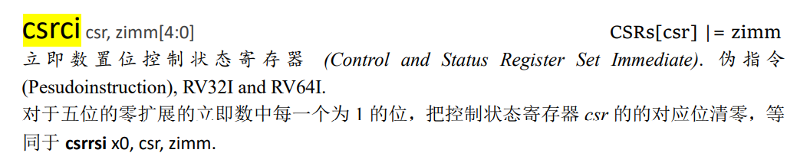

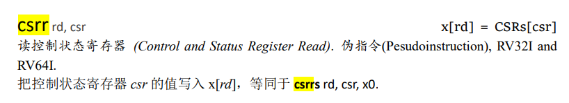

**调试中遇到问题：**寄存器从0开始计位。

如，sstatus寄存器

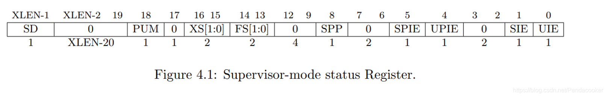

sie寄存器

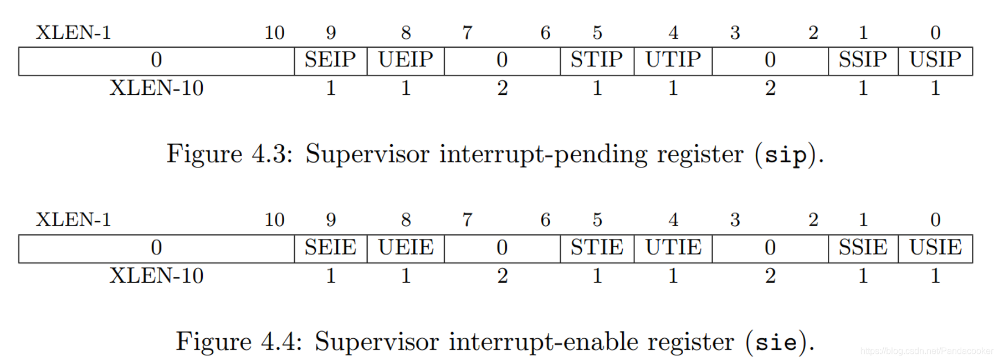

其实需要修改的是第二位(2)和第六位(0x20)，因为是从0开始计数。

```assembly
## set stvec = _traps
    la a0 ,_traps
    csrw stvec, a0

## set sie[STIE] = 1
	#stip is located in fifth bit in sie
    csrr a0,sie
    ori a0,a0,32
    csrw sie,a0
        
## set first time interrupt
    rdtime a0 
    li a1,10000000
    add a0,a0, a1
    li a7, 0
    li a1,0
    li a2,0
    li a3,0
    li a4,0
    li a5,0
    li a6,0
    ecall

## set sstatus[SIE] = 1
	#sie is located in second bit in sstatus
    csrr a0,sstatus
    ori a0,a0,2
    csrw sstatus,a0
```


### 4.3 实现上下文切换

我们要使用汇编实现上下文切换机制， 包含以下几个步骤：

1. 在 `arch/riscv/kernel/` 目录下添加 `entry.S` 文件。

2. 保存CPU的寄存器（上下文）到内存中（栈上）。

3. 将 `scause` 和 `sepc` 中的值传入异常处理函数 `trap_handler` ( `trap_handler` 在 4.4 中介绍 ) ，我们将会在 `trap_handler` 中实现对异常的处理。

   > sepc寄存器
   >  当陷阱发生时，RISC-V将程序计数器的值保存在这里，因为随后pc的值将被stvec的值覆盖掉；
   >  sret指令拷贝sepc的值到pc中；
   >  内核可向spec中写入值来控制sret返回到哪里；

4. 在完成对异常的处理之后， 我们从内存中（栈上）恢复CPU的寄存器（上下文）。

5. 从 trap 中返回。

```assembly
	……#saving registers(omitted)
	csrr a1,sepc
    sd a1, -256(sp)
    addi sp,sp, -256
    
## 2. call trap_handler  
    li a0, 0x80000005
    call trap_handler
    
## 3. restore sepc and 32 registers (a(sp) should be restore last) from stack
    ld t6, 0(sp)
    csrw sepc, t6
    addi sp,sp,8
    ……#Loading regisers (omitted)
```

### 4.4 实现异常处理函数

1. 在 `arch/riscv/kernel/` 目录下添加 `trap.c` 文件。
2. 在 `trap.c` 中实现异常处理函数 `trap_handler()`, 其接收的两个参数分别是 `scause` 和 `sepc` 两个寄存器中的值。
2. 

```c
#include "types.h"
#include "printk.h"
#include "sbi.h"
void trap_handler(unsigned long scause, unsigned long sepc) {
    // 通过 `scause` 判断trap类型
    // 如果是interrupt 判断是否是timer interrupt
    // 如果是timer interrupt 则打印输出相关信息, 并通过 `clock_set_next_event()` 设置下一次时钟中断
    // `clock_set_next_event()` 见 4.5 节
    // 其他interrupt / exception 可以直接忽略
    if((int)scause<0){
        if(scause%16==5) {
            printk("[S] Supervisor Mode Timer Interrupt\nkernel is running\n");
            clock_set_next_event();
        }
    }
}
```

### 4.5 实现时钟中断相关函数

1. 在 `arch/riscv/kernel/` 目录下添加 `clock.c` 文件。
2. 在 `clock.c` 中实现 get_cycles ( ) : 使用 `rdtime` 汇编指令获得当前 `time` 寄存器中的值。
3. 在 `clock.c` 中实现 clock_set_next_event ( ) : 调用 `sbi_ecall`，设置下一个时钟中断事件。

| Function Name                        | Function ID | Extension ID |
| :----------------------------------- | :---------- | :----------- |
| sbi_set_timer （设置时钟相关寄存器） | 0           | 0x00         |
| sbi_console_putchar （打印字符）     | 0           | 0x01         |
| sbi_console_getchar （接收字符）     | 0           | 0x02         |
| sbi_shutdown （关机）                | 0           | 0x08         |

```c
#include "types.h"
#include "sbi.h"
// QEMU中时钟的频率是10MHz, 也就是1秒钟相当于10000000个时钟周期。
unsigned long TIMECLOCK = 10000000;

unsigned long get_cycles() {
    // 使用 rdtime 编写内联汇编，获取 time 寄存器中 (也就是mtime 寄存器 )的值并返回
    unsigned long time;
    __asm__ volatile (
        "rdtime a0\n"
        "mv %[time], a0\n"
        :[time] "=r" (time)
        :
        :"memory"
    );
    return time;

}

void clock_set_next_event() {
    // 下一次 时钟中断 的时间点
    unsigned long next = get_cycles() + TIMECLOCK;

    // 使用 sbi_ecall 来完成对下一次时钟中断的设置
    sbi_ecall(00,0,0,0,0,0,0,0);
} 
```

### 4.6 编译及测试

由于加入了一些新的 .c 文件，可能需要修改一些Makefile文件，请同学自己尝试修改，使项目可以编译并运行。

一个窗口`make debug`

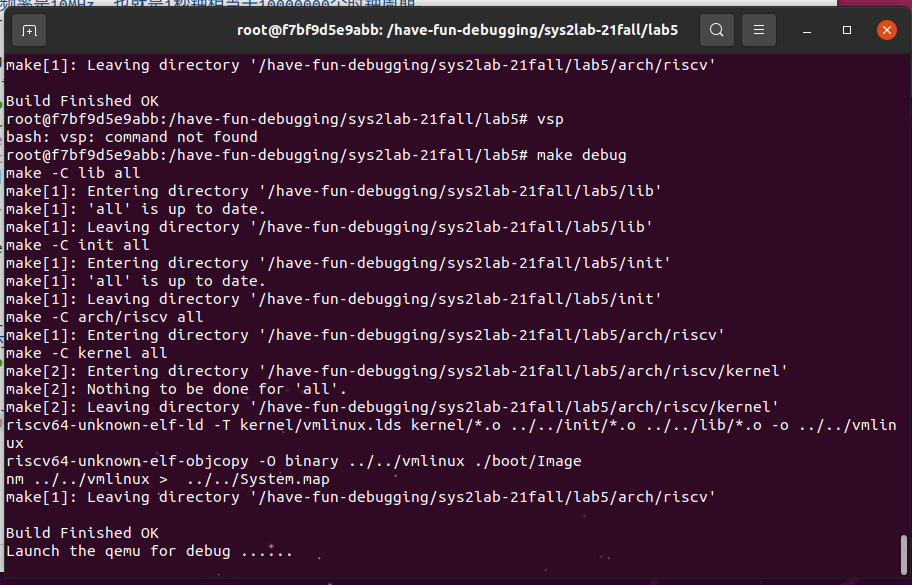

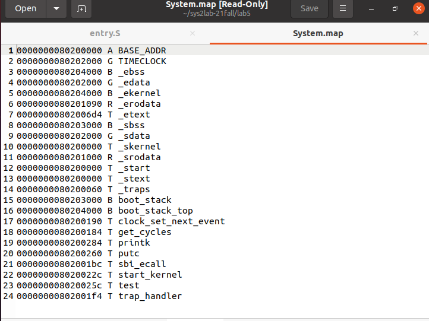

另一个窗口输入以下指令可远程连接。

```
riscv64-unknown-linux-gnu-gdb vmlinux
(gdb) target LAYOUT ASMremote  :1234
```

初始进入的函数地址。

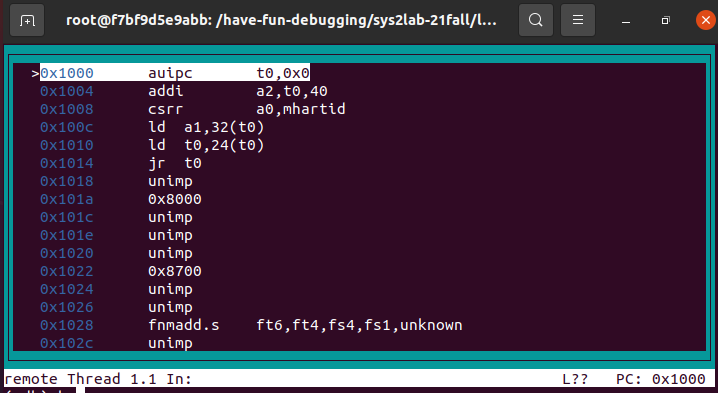

开始设置`b _stext`，进入到_start。因为 _ start是全局的第一个程序，写在 _ stext模块中，故 _ stext和 _ start起始地址一样。

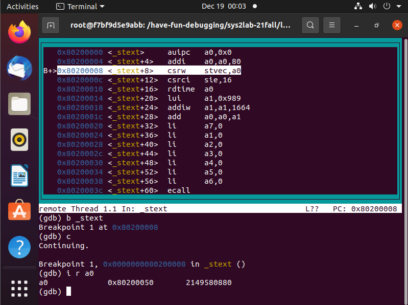


上图中查看寄存器值发现赋值未成功，结果是赋值位数出错，从0开始第五位。改正后可看到。此时sie，sepc，sstatus都被成功赋值，进入printk函数。


在调试窗口中单步运行，发现在printk和sbi_ecall函数中来回跳转，每次进入sbi_ecall函数时，调用ecall指令。

S 模式不直接控制时钟中断和软件中断，而是 使用 ecall 指令请求 M 模式设置定时器或代表它发送处理器间中断。所以在调用ecall指令后，系统便执行了

此时在调试窗口持续执行，在另一个窗口内可看到traps中不断输出字符。发现和样例有所不同，是因为字符串中没写换行符。

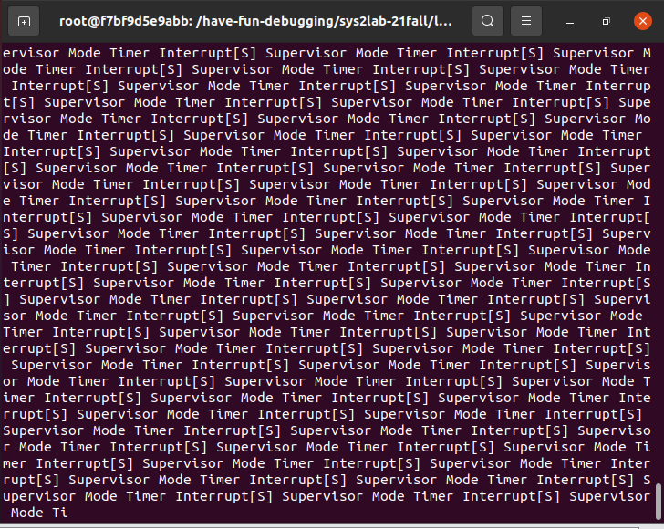


更改换行符之后，可以看到：

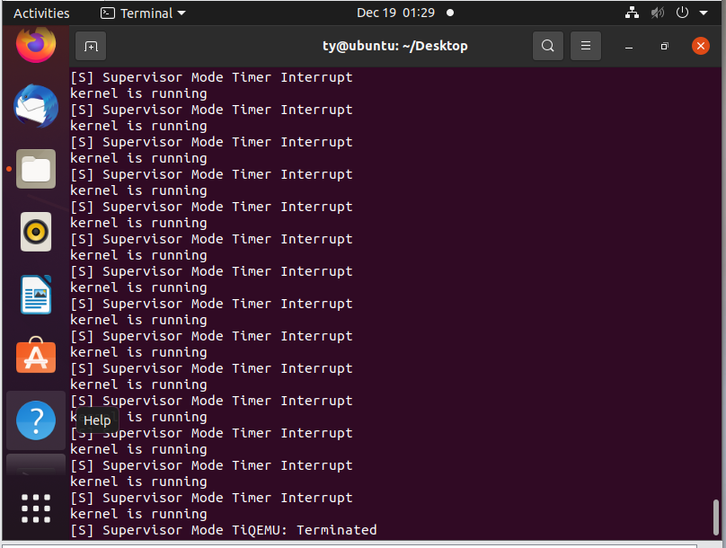

与给出的样例相吻合。

## 思考题

1. 在我们使用make run时， OpenSBI 会产生如下输出:

   ```bash
   OpenSBI v0.9
   ____                    _____ ____ _____
   / __ \                  / ____|  _ \_   _|
   | |  | |_ __   ___ _ __ | (___ | |_) || |
   | |  | | '_ \ / _ \ '_ \ \___ \|  _ < | |
   | |__| | |_) |  __/ | | |____) | |_) || |_
   \____/| .__/ \___|_| |_|_____/|____/_____|
           | |
           |_|
   
   ......
   
   Boot HART MIDELEG         : 0x0000000000000222
   Boot HART MEDELEG         : 0x000000000000b109
   
   ......
   ```

   通过查看 `RISC-V Privileged Spec` 中的 `medeleg` 和 `mideleg` 解释上面 `MIDELEG` 值的含义。

hart 是硬件线程 (hardware thread)的缩略形式。	

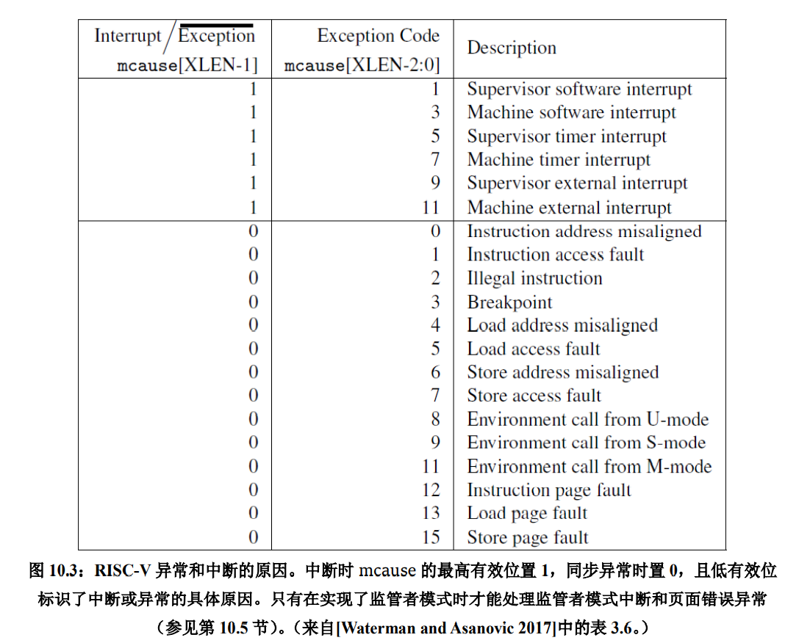

mideleg（Machine Interrupt Delegation，机器中断委托）CSR 控制将哪些中断（上图上部分）委托给 S 模式。与 mip 和 mie 一样，mideleg 中的每个位对应不同的异常。 mideleg[5]对应于 S 模式的时钟中断，如果把它置位，S 模式的时钟中断将会移交 S 模式的异常处理程序，而不是 M 模式的异常处理程序。0x0000000000000222的后十二位是0010 0010 0010，第五位是1，标明S模式的时钟中断会移交给S模式的处理程序，第1，9位是1，标明相应中断都会移交给S模式。

M 模式还可以通过 medeleg CSR 将同步异常委托给 S 模式。该机制类似于刚才提到的中断委托，但 medeleg 中的位对应的不再是中断，而是图 10.3 中的同步异常编码（上图下部分）。置上 medeleg[15]便会把 store page fault（store 过程中出现的缺页）委托给 S 模式。0x000000000000b109后16位是1011 0001 0000 1001，第0，3，8，12，13，15位置1，标明相应的异常会被移交给S模式来处理。