# 实验6——RV64 内核线程调度

> | 姓名：汤尧            | 学号：3200106252 |
> | --------------------- | ---------------- |
> | 课程名称：计算机系统Ⅱ | 指导老师：申文博 |

## 1 实验目的

* 了解线程概念，并学习线程相关结构体，并实现线程的初始化功能。
* 了解如何使用时钟中断来实现线程的调度。
* 了解线程切换原理，并实现线程的切换。
* 掌握简单的线程调度算法，并完成两种简单调度算法的实现。


## 2 实验环境

* Docker in Lab3

## 3 背景知识

#### 3.1 进程与线程

`源代码`经编译器一系列处理（编译、链接、优化等）后得到的可执行文件，我们称之为`程序（Program）`。而通俗地说，`进程`就是`正在运行并使用计算机资源`的程序。`进程`与`程序`的不同之处在于，`进程`是一个动态的概念，其不仅需要将其运行的程序的代码/数据等加载到内存空间中，还需要拥有自己的`运行栈`。同时一个`进程`可以对应一个或多个`线程`，`线程`之间往往具有相同的代码，共享一块内存，但是却有不同的CPU执行状态。

在本次实验中，为了简单起见， 我们采用 `single-threaded process` 模型， 即`一个进程`对应`一个线程`，进程与线程不做明显区分。

#### 3.1 线程相关属性

在不同的操作系统中，为每个线程所保存的信息都不同。在这里，我们提供一种基础的实现，每个线程会包括：

* `线程ID`：用于唯一确认一个线程。
* `运行栈`：每个线程都必须有一个独立的运行栈，保存运行时的数据。
* `执行上下文`：当线程不在执行状态时，我们需要保存其上下文（其实就是`状态寄存器`的值），这样之后才能够将其恢复，继续运行。
* `运行时间片`：为每个线程分配的运行时间。
* `优先级`：在优先级相关调度时，配合调度算法，来选出下一个执行的线程。

#### 3.2 线程切换流程图

```
           Process 1         Operating System            Process 2
               +
               |                                            X
 P1 executing  |                                            X
               |                                            X
               v Timer Interrupt Trap                       X
               +---------------------->                     X
                                      +                     X
               X                  do_timer()                X
               X                      +                     X
               X                  schedule()                X
               X                      +                     X
               X              save state to PCB1            X
               X                      +                     X
               X           restore state from PCB2          X
               X                      +                     X
               X                      |                     X
               X                      v Timer Interrupt Ret
               X                      +--------------------->
               X                                            |
               X                                            |  P2 executing
               X                                            |
               X                       Timer Interrupt Trap v
               X                      <---------------------+
               X                      +
               X                  do_timer()
               X                      +
               X                  schedule()
               X                      +
               X              save state to PCB2
               X                      +
               X           restore state from PCB1
               X                      +
               X                      |
                 Timer Interrupt Ret  v
               <----------------------+
               |
 P1 executing  |
               |
               v
```

* 在每次处理时钟中断时，操作系统首先会将当前线程的运行剩余时间减少一个单位。之后根据调度算法来确定是继续运行还是调度其他线程来执行。
* 在进程调度时，操作系统会遍历所有可运行的线程，按照一定的调度算法选出下一个执行的线程。最终将选择得到的线程与当前线程切换。
* 在切换的过程中，首先我们需要保存当前线程的执行上下文，再将将要执行线程的上下文载入到相关寄存器中，至此我们就完成了线程的调度与切换。

## 4 实验步骤 

### 4.1 准备工程

* 此次实验基于 lab5 所实现的代码进行。

* 从 `repo` 同步以下代码: `rand.h/rand.c`, `string.h/string.c`, `mm.h/mm.c`。并按照以下步骤将这些文件正确放置。其中 `mm.h\mm.c` 提供了简单的物理内存管理接口，`rand.h\rand.c`提供了 `rand()` 接口用以提供伪随机数序列，`string.h/string.c`提供了`memset` 接口用以初始化一段内存空间。

* 在 lab6 中我们需要一些物理内存管理的接口，在此我们提供了 `kalloc` 接口 ( 见`mm.c` ) 给同学。同学可以用 `kalloc` 来申请 4KB 的物理页。由于引入了简单的物理内存管理，需要在 `_start` 的适当位置调用`mm_init`, 来初始化内存管理系统，并且在初始化时需要用一些自定义的宏，需要修改 `defs.h`, 在 `defs.h` `添加 如下内容：

  ```c++
  #define PHY_START 0x0000000080000000
  #define PHY_SIZE  128 * 1024 * 1024 // 128MB， QEMU 默认内存大小 
  #define PHY_END   (PHY_START + PHY_SIZE)
  
  #define PGSIZE 0x1000 // 4KB
  #define PGROUNDUP(addr) ((addr + PGSIZE - 1) & (~(PGSIZE - 1)))
  #define PGROUNDDOWN(addr) (addr & (~(PGSIZE - 1)))
  ```

* 

  

### 4.3 线程调度功能实现

#### 4.3.1 线程初始化

* 在初始化线程的时候，我们参考[Linux v0.11中的实现](https://elixir.bootlin.com/linux/0.11/source/kernel/fork.c#L93)为每个线程分配一个 4KB 的物理页，我们将 `task_struct` 存放在该页的低地址部分， 将线程的栈指针 `sp` 指向该页的高地址。具体内存布局如下图所示：

  ```
                      ┌─────────────┐◄─── High Address
                      │             │
                      │    stack    │
                      │             │
                      │             │
                sp ──►├──────┬──────┤
                      │      │      │
                      │      ▼      │
                      │             │
                      │             │
                      │             │
                      │             │
      4KB Page        │             │
                      │             │
                      │             │
                      │             │
                      ├─────────────┤
                      │             │
                      │             │
                      │ task_struct │
                      │             │
                      │             │
                      └─────────────┘◄─── Low Address
  ```

* 当我们的 OS run 起来时候，其本身就是一个线程 `idle 线程`，但是我们并没有为它设计好 `task_struct`。所以第一步我们要为 `idle` 设置 `task_struct`。并将 `current`, `task[0]` 都指向 `idle`。

  ```c
  void task_init() {
      // 1. 调用 kalloc() 为 idle 分配一个物理页
      // 2. 设置 state 为 TASK_RUNNING;
      // 3. 由于 idle 不参与调度 可以将其 counter / priority 设置为 0
      // 4. 设置 idle 的 pid 为 0
      // 5. 将 current 和 taks[0] 指向 idle
      idle = kalloc();
      idle->state = TASK_RUNNING;
      idle->counter=0;
      idle->priority=0;
      idle->pid=0;
      current=idle;
      task[0]=idle;
  
      // 1. 参考 idle 的设置, 为 task[1] ~ task[NR_TASKS - 1] 进行初始化
      // 2. 其中每个线程的 state 为 TASK_RUNNING, counter 为 0,
      // priority 使用 rand() 来设置, pid 为该线程在线程数组中的下标。
      // 3. 为 task[1] ~ task[NR_TASKS - 1] 设置 `thread_struct` 中的 `ra` 和 `sp`, 
      // 4. 其中 `ra` 设置为 __dummy （见 4.3.2）的地址， 
      //`sp` 设置为 该线程申请的物理页的高地址
  
      for(int i=1;i<NR_TASKS;i++){
          idle = kalloc();
          idle->state = TASK_RUNNING;
          idle->counter=0;
          idle->priority=rand();
  
          idle->pid=i;
          task[i]=idle;
          idle->thread.ra=__dummy;
          idle->thread.sp=PGSIZE+((uint64)idle);
      }
      idle = task[0];
      printk("...proc_init done!\n");
  }
  ```

* 为了方便起见，我们将 `task[1]` ~ `task[NR_TASKS - 1]`, 全部初始化， 这里和 `idle` 设置的区别在于要为这些线程设置 `thread_struct` 中的 `ra` 和 `sp`.

* 在 `_start` 适当的位置调用 `task_init

###### **遇到bug及解决方案**

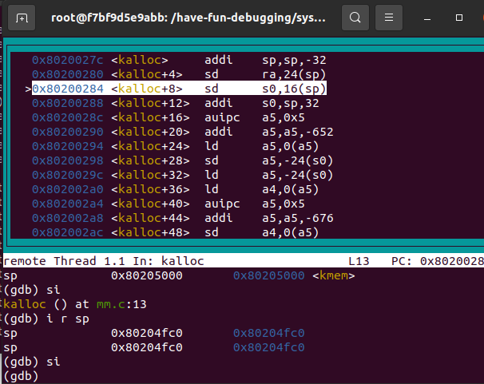

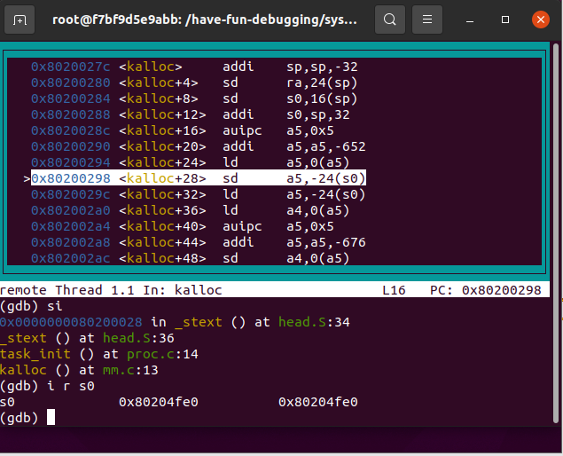

单步调试发现总是在ld a4, 0(a5)处出错，中断后查看scauses发现是2，非法指令，运行后发现a5=0，推断是函数位置错误。还没初始化空间就运用指针进行数值读取，应该将head.s中的mm_init改写到所有函数调用的最前面。

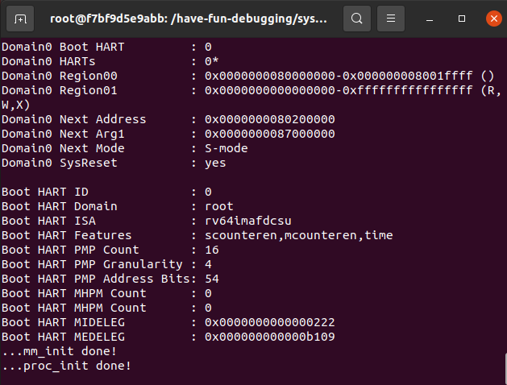

#### 4.3.2 `__dummy` 与 `dummy` 介绍

* `task[1]` ~ `task[NR_TASKS - 1]`都运行同一段代码 `dummy()` 我们在 `proc.c` 添加 `dummy()`:

  ```c++
  // arch/riscv/kernel/proc.c
  
  void dummy() {
      uint64 MOD = 1000000007;
      uint64 auto_inc_local_var = 0;
      int last_counter = -1;
      while(1) {
          if (last_counter == -1 || current->counter != last_counter) {
              last_counter = current->counter;
              auto_inc_local_var = (auto_inc_local_var + 1) % MOD;
              printk("[PID = %d] is running. auto_inc_local_var = %d\n", current->pid, auto_inc_local_var); 
          }
      }
  }
  ```

* 当线程在运行时，由于时钟中断的触发，会将当前运行线程的上下文环境保存在栈上 ( lab5 中实现的 `_traps` )。 当线程再次被调度时，会将上下文从栈上恢复，但是当我们创建一个新的线程，此时线程的栈为空，当这个线程被调度时，是没有上下文需要被恢复的，所以我们需要为线程`第一次调度`提供一个特殊的返回函数 `__dummy`

* 在 `entry.S` 添加 `__dummy`

  - 在`__dummy` 中将 sepc 设置为 `dummy()` 的地址, 并使用 `sret` 从中断中返回。
  - `__dummy` 与 `_traps`的 `restore`部分相比， 其实就是省略了从栈上恢复上下文的过程 （ 但是手动设置了 `sepc` ）。

  ```asm
  .extern dummy
  .global __dummy
  __dummy:
      la a0, dummy
      csrw sepc, a0
      sret
  ```

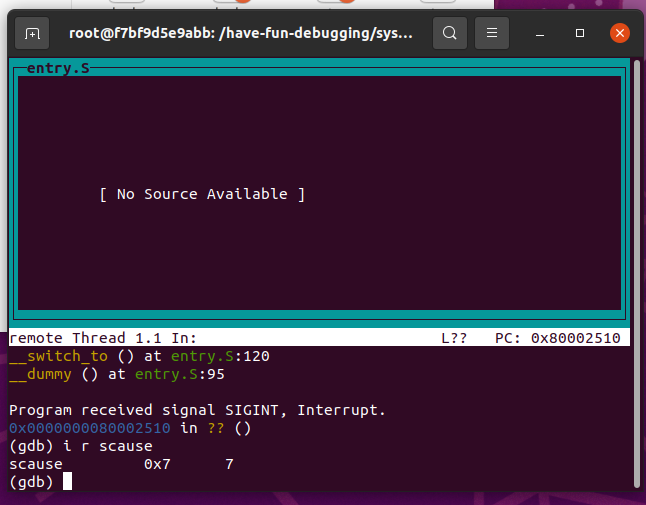

进入dummy的时候，异常中断，查看scause是7，为store access fault储存访问故障。


再次复现bug，查看变量时发现sepc数值正常，sp为0，再次复现bug时，发现从__switch_to开始sp为0，是进程切换的问题，sp赋值失败。

```
(gdb) x/64xb 0x87ffd000
(gdb) x/64xb 0x87ffb000
```

使用以上两个指令使用将a1的储存地址和值打印出来可以发现结构体储存地址和数值，将相对地址更改正确得到正确的答案。

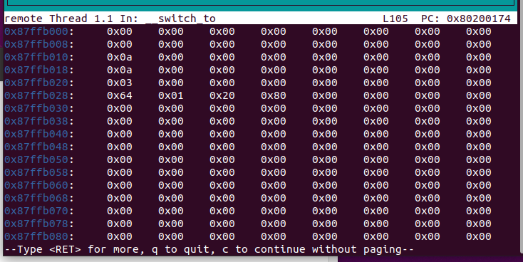

#### 4.3.3 实现线程切换

* 判断下一个执行的线程 `next` 与当前的线程 `current` 是否为同一个线程，如果是同一个线程，则无需做任何处理，否则调用 `__switch_to` 进行线程切换。

  ```c++
  extern void __switch_to(struct task_struct* prev, struct task_struct* next);
  void switch_to(struct task_struct* next) {
      if(next!=current) {
          printk("switch to [PID = %d COUNTER = %d PRIORITY = %d]\n",next->pid,next->counter,next->priority); 
          struct task_struct* temp=current;
          current=next;
          __switch_to(temp,next);  
      }
  }
  ```

  ###### 遇到bug及解决方案

  在进入__ switch_to之后，current的值并没有改变，在 __ switch_to中，寄存器的值被更改到next的进程数值，但是a1，a0本身寄存器的值（结构体指针）没有变化，故在调用 __ switch_to之前将current指针指向next。

* 在 `entry.S` 中实现线程上下文切换 `__switch_to`:

  - `__switch_to`接受两个 `task_struct` 指针作为参数
  - 保存当前线程的`ra`, `sp`, `s0~s11`到当前线程的 `thread_struct` 中
  - 将下一个线程的 `thread_struct` 中的相关数据载入到`ra`, `sp`, `s0~s11`中。

  ```asm
  .globl __switch_to
  __switch_to:
      # save state to prev process
      sd ra,40(a0)
      sd sp,48(a0)
      sd s0,56(a0)
      sd s1,64(a0)
      sd s2,72(a0)
      sd s3,80(a0)
      sd s4,88(a0)
      sd s5,96(a0)
      sd s6,104(a0)
      sd s7,112(a0)
      sd s8,120(a0)
      sd s9,128(a0)
      sd s10,136(a0)
      sd s11,144(a0)
  
      # restore state from next process
      ld ra,40(a1)
      ld sp,48(a1)
      ld s0,56(a1)
      ld s1,64(a1)
      ld s2,72(a1)
      ld s3,80(a1)
      ld s4,88(a1)
      ld s5,96(a1)
      ld s6,104(a1)
      ld s7,112(a1)
      ld s8,120(a1)
      ld s9,128(a1)
      ld s10,136(a1)
      ld s11,144(a1)
  
      ret
  ```

###### 遇到bug及其解决方案

​	在switch_to(next)的时候发生异常中断，scause提示为异常指令，此时跟踪代码发现是next没有成功赋值，导致切换到了空指针。查看汇编代码发现是在比较task[i]->counter时，因为task[i]->counter是uint64类型，编译器将其翻译成了无符号比较，这时永远不可能满足  task[i]->counter  >  $(-1))_补$， 此时在task[i]->counter前加上类型强制转换，转换为int类型进行比较。

#### 4.3.4 实现调度入口函数

* 实现 `do_timer()`, 并在 `时钟中断处理函数` 中调用。

  ```c++
  void do_timer(void) {
      /* 1. 如果当前线程是 idle 线程 或者 当前线程运行剩余时间为0 进行调度 */
      /* 2. 如果当前线程不是 idle 且 运行剩余时间不为0 则对当前线程的运行剩余时间减1 直接返回 */  
      if(current!=idle&&current->counter!=0){
          current->counter--;
      }
      if(current==idle||current->counter==0){
          schedule();
      }
  }
  ```

#### 4.3.5 实现线程调度

本次实验我们需要实现两种调度算法：1.短作业优先调度算法，2.优先级调度算法。

##### 4.3.5.1 短作业优先调度算法

* 当需要进行调度时按照一下规则进行调度：

  * 遍历线程指针数组`task`(不包括 `idle` ，即 `task[0]` )，在所有运行状态 (`TASK_RUNNING`) 下的线程运行剩余时间`最少`的线程作为下一个执行的线程。
  * 如果`所有`运行状态下的线程运行剩余时间都为0，则对 `task[1]` ~ `task[NR_TASKS-1]` 的运行剩余时间重新赋值 (使用 `rand()`) ，之后再重新进行调度。

  ```c
  #ifdef SJF
  
  void schedule(void) {
  	//printk("Enter SJF schedule\n");
  	
      int scheMin=999999;
      struct task_struct* next;
      next=task[0];  
      while(1){
          for(int i=1;i<NR_TASKS;i++){
           // printk("look [PID = %d COUNTER = %d]\n",task[i]->pid,task[i]->counter); 
              if(task[i]->state==TASK_RUNNING &&task[i]->counter&& (int)task[i]->counter < scheMin){
                  scheMin= task[i]->counter ;
                  next=task[i];
              }
          }
          if(next==idle){
              for(int i=1;i<NR_TASKS;i++){
                  task[i]->counter=rand();
                  printk("SET [PID = %d COUNTER = %d]\n",task[i]->pid,task[i]->counter); 
              }
          }
          else 
              break;
      }
      switch_to(next);
  }
  #endif
  ```
  
  ###### 遇到bug及解决方案
  
  开始没有判断counter是否等于0，导致next一直为第一个进程，无法switch_to下一个进程，调试时一直输出`SET [PID = 1 COUNTER = 0]`。后在判断里加入判断counter是否为0。

##### 4.3.5.2 优先级调度算法

* 参考 [Linux v0.11 调度算法实现](https://elixir.bootlin.com/linux/0.11/source/kernel/sched.c#L122) 实现。

  ```c++
  #ifdef PRIORITY
  
  void schedule(void) {
      int c,pri=0;
      struct task_struct* next;
      while(1){
          c=-1;
          next=task[0];
          for(int i=1;i<NR_TASKS;i++){
              if(task[i]->state==TASK_RUNNING && (int)task[i]->counter){
                  if(task[i]->priority>next->priority){
                      next=task[i];
                  }
              }
          }
          if(next==task[0]){
              for(int i=1;i<NR_TASKS;i++){
                  task[i]->counter = rand();
                  printk("SET [PID = %d COUNTER = %d PRIORITY = %d]\n",task[i]->pid,task[i]->counter,task[i]->priority); 
              }
              printk("\n");
              
          }
          else
              break;
      }
      switch_to(next);
  }
  #endif
  ```


### 4.4 编译及测试结果

先开启

```
make debug
riscv64-unknown-linux-gnu-gdb vmlinux
(gdb)
target remote:1234
```

符号表

```
0000000080200000 A BASE_ADDR
0000000080203000 G TIMECLOCK
000000008020015c T __dummy
000000008020016c T __switch_to
0000000080205fe8 B _ebss
0000000080203000 G _edata
0000000080205fe8 B _ekernel
0000000080202148 R _erodata
0000000080201404 T _etext
0000000080204000 B _sbss
0000000080203000 G _sdata
0000000080200000 T _skernel
0000000080202000 R _srodata
0000000080200000 T _start
0000000080200000 T _stext
0000000080200040 T _traps
0000000080204000 B boot_stack
0000000080205000 B boot_stack_top
000000008020020c T clock_set_next_event
0000000080205010 B current
00000000802006f4 T do_timer
00000000802005dc T dummy
00000000802001e0 T get_cycles
0000000080205008 B idle
0000000080205018 B initialize
0000000080200274 T kalloc
00000000802002d0 T kfree
0000000080200348 T kfreerange
0000000080205000 B kmem
0000000080201394 T memset
00000000802003c8 T mm_init
0000000080201004 T printk
0000000080200ad8 T putc
0000000080205048 B r
0000000080201084 T rand
0000000080200964 T sbi_ecall
0000000080200798 T schedule
0000000080200a88 T start_kernel
000000008020067c T switch_to
000000008020501c B t
0000000080205020 B task
000000008020040c T task_init
0000000080200ac8 T test
0000000080200a30 T trap_handler
0000000080200b28 t vprintfmt
```

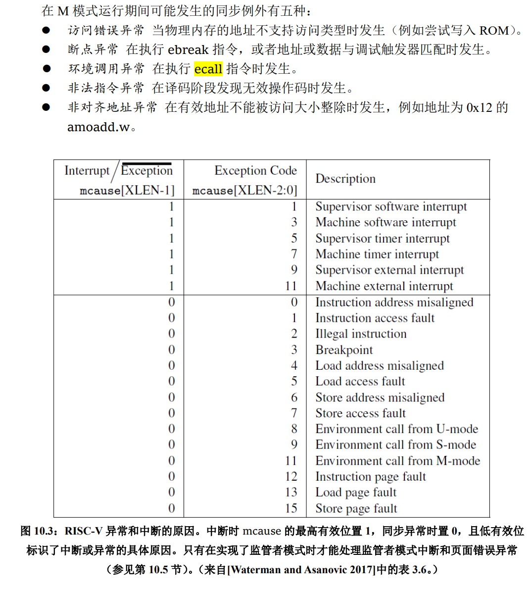

- 由于加入了一些新的 .c 文件，可能需要修改一些Makefile文件，请同学自己尝试修改，使项目可以编译并运行。

- 由于本次实验需要完成两个调度算法，因此需要两种调度算法可以使用[`gcc –D`](https://www.rapidtables.com/code/linux/gcc/gcc-d.html)选项进行控制。

  ```
  $ gcc -D DEBUG myfile.c -o myfile
  $ ./myfile
  Debug run
  ```

  - DSJF （短作业优先调度）。
  - DPRIORITY （优先级调度）。
  - 在`proc.c`中使用 `#ifdef` , `#endif` 来控制代码。 修改Makefile中的 `CFLAG = ${CF} ${INCLUDE} -DSJF / -DPRIORITY` (作业提交的时候 `Makefile` 选择任意一个都可以)

- 短作业优先调度输出示例 (为了便于展示，这里一共只初始化了 4 个线程) 同学们最后提交时需要 保证 NR_TASKS 为 32 不变

  ```bash
  OpenSBI v0.9
    ____                    _____ ____ _____ 
   / __ \                  / ____|  _ \_   _|
  | |  | |_ __   ___ _ __ | (___ | |_) || |  
  | |  | | '_ \ / _ \ '_ \ \___ \|  _ < | |  
  | |__| | |_) |  __/ | | |____) | |_) || |_ 
   \____/| .__/ \___|_| |_|_____/|____/_____|
         | |                                 
         |_|                                 
                                                  
  ...
  
  Boot HART MIDELEG         : 0x0000000000000222
  Boot HART MEDELEG         : 0x000000000000b109
                      
  ...mm_init done!
  ...proc_init done!                                                                               
  Hello RISC-V
  idle process is running!
  
  SET [PID = 1 COUNTER = 10]
  SET [PID = 2 COUNTER = 10]
  SET [PID = 3 COUNTER = 5]
  SET [PID = 4 COUNTER = 2]
  
  switch to [PID = 4 COUNTER = 2] 
  [PID = 4] is running. auto_inc_local_var = 1
  [PID = 4] is running. auto_inc_local_var = 2
  
  switch to [PID = 3 COUNTER = 5] 
  [PID = 3] is running. auto_inc_local_var = 1
  .....
  [PID = 3] is running. auto_inc_local_var = 5
  
  switch to [PID = 2 COUNTER = 10] 
  [PID = 2] is running. auto_inc_local_var = 1
  ...
  [PID = 2] is running. auto_inc_local_var = 10
  
  switch to [PID = 1 COUNTER = 10] 
  [PID = 1] is running. auto_inc_local_var = 1
  ...
  [PID = 1] is running. auto_inc_local_var = 10
  
  SET [PID = 1 COUNTER = 9]
  SET [PID = 2 COUNTER = 4]
  SET [PID = 3 COUNTER = 4]
  SET [PID = 4 COUNTER = 10]
  
  switch to [PID = 3 COUNTER = 4] 
  [PID = 3] is running. auto_inc_local_var = 6
  ...
  [PID = 3] is running. auto_inc_local_var = 9
  
  ```

  ###### NR_TASKS = 5 时

  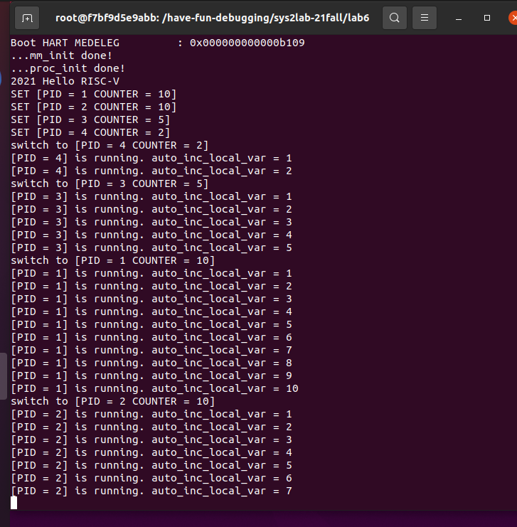

  ###### NR_TASKS = 32 时

  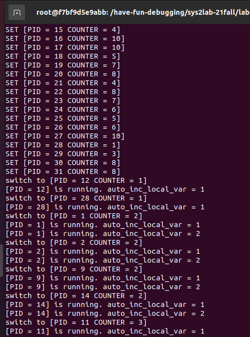

- 优先级调度输出示例

  ```bash
  OpenSBI v0.9
    ____                    _____ ____ _____ 
   / __ \                  / ____|  _ \_   _|
  | |  | |_ __   ___ _ __ | (___ | |_) || |  
  | |  | | '_ \ / _ \ '_ \ \___ \|  _ < | |  
  | |__| | |_) |  __/ | | |____) | |_) || |_ 
   \____/| .__/ \___|_| |_|_____/|____/_____|
         | |                                 
         |_|                                 
                                                  
  ...
  
  Boot HART MIDELEG         : 0x0000000000000222
  Boot HART MEDELEG         : 0x000000000000b109
                      
  ...mm_init done!
  ...proc_init done!                                                                               
  Hello RISC-V
  idle process is running!
  
  SET [PID = 1 PRIORITY = 1 COUNTER = 1]                                                       
  SET [PID = 2 PRIORITY = 4 COUNTER = 4]        
  SET [PID = 3 PRIORITY = 10 COUNTER = 10]                                                       
  SET [PID = 4 PRIORITY = 4 COUNTER = 4]
  
  switch to [PID = 3 PRIORITY = 10 COUNTER = 10]                                                   
  [PID = 3] is running. auto_inc_local_var = 1                                                     
  ...
  [PID = 3] is running. auto_inc_local_var = 10
  
  switch to [PID = 4 PRIORITY = 4 COUNTER = 4] 
  [PID = 4] is running. auto_inc_local_var = 1
  ...
  [PID = 4] is running. auto_inc_local_var = 4
  
  switch to [PID = 2 PRIORITY = 4 COUNTER = 4] 
  [PID = 2] is running. auto_inc_local_var = 1
  ...
  [PID = 2] is running. auto_inc_local_var = 4
  
  switch to [PID = 1 PRIORITY = 1 COUNTER = 1] 
  [PID = 1] is running. auto_inc_local_var = 1
  
  SET [PID = 1 PRIORITY = 1 COUNTER = 1]
  SET [PID = 2 PRIORITY = 4 COUNTER = 4]
  SET [PID = 3 PRIORITY = 10 COUNTER = 10]
  SET [PID = 4 PRIORITY = 4 COUNTER = 4]
  
  switch to [PID = 3 PRIORITY = 10 COUNTER = 10] 
  [PID = 3] is running. auto_inc_local_var = 11
  ...
  ```

###### NR_TASKS = 5 时

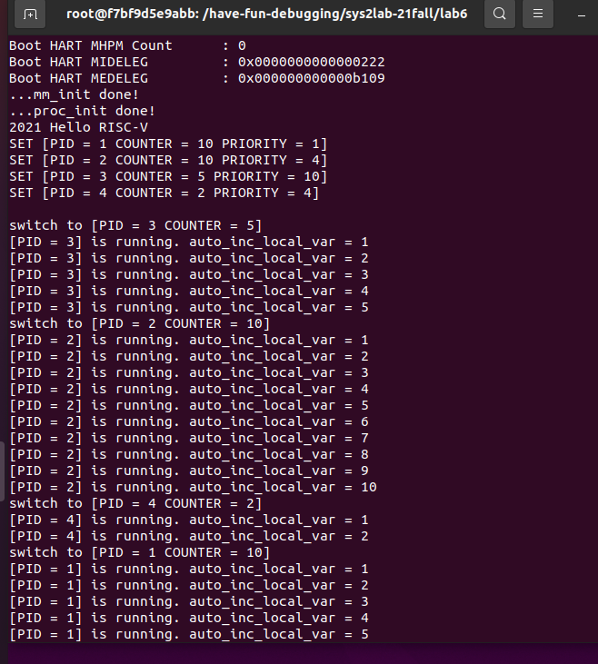

###### NR_TASKS = 32 时

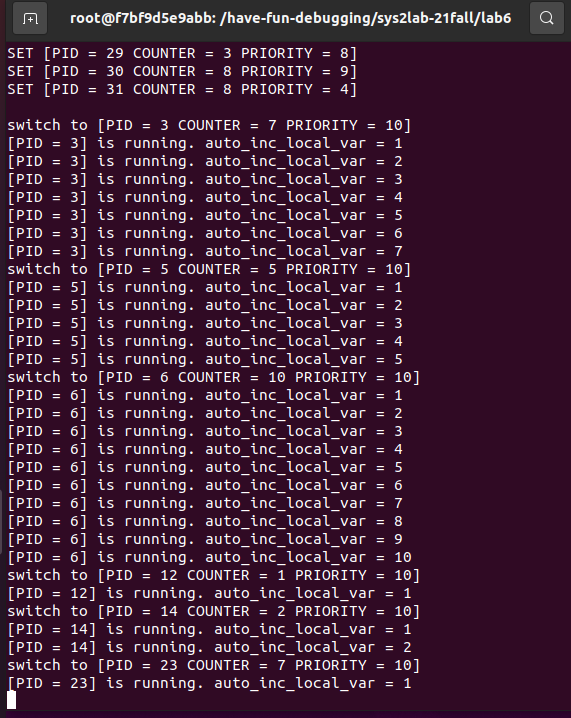

# 思考题

1. 在 RV64 中一共用 32 个通用寄存器， 为什么 `context_switch` 中只保存了14个？

   因为进程是分配内存的单位，同一进程的不同线程共用同一个堆、代码区、数据区，有自己不同的栈，且使用相同的寄存器。故保存的时候只需保存与栈的切换有关以及重要的寄存器值，不需要切换更多的寄存器。

   

2. 当线程第一次调用时， 其 `ra` 所代表的返回点是 `__dummy`。 那么在之后的线程调用中 `context_switch` 中，`ra` 保存/恢复的函数返回点是什么呢 ？ 请同学用gdb尝试追踪一次完整的线程切换流程， 并关注每一次 `ra` 的变换。

   ra第一次返回点是__ dummy。在dummy中，将sepc 设置为了 dummy 的地址，所以以后进行context _ switch 时， ra保存的返回点是dummy。查看sepc和system _ map即可确定sepc被设置为了dummy的地址。

   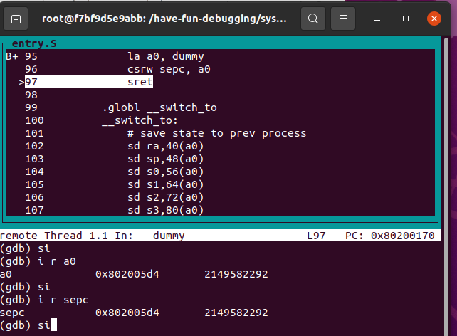

## 作业提交

见附件。