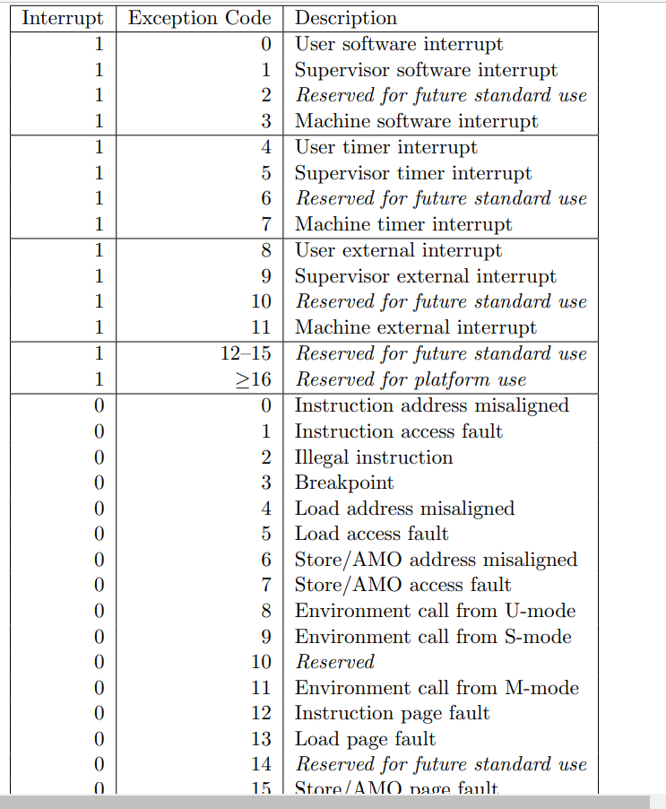

新建寄存器：mepc，mtvec（异常函数地址），mcause，mstatus

新建指令：

- csrr，csrw，csrc
- ecall异常
- mret
- 非法指令

新增接口：

- csr_write   csr_read信号,addrCSR编号(每个状态id,ex,mem,wb)
  - addrCSR立即数
- din,dout数据端口，`pc`输入端口和`mepc`写端口，`mcause`的写端口。
- din：
  - pc的值，ecall的时候
  - forwarding的值，写CSR的时候
- mcause， ecall的时候

```
    CSR CSR(
        .clk(clk),
        .rst(rst),
        .ecall(ecall),
        .id_addrCSR(wb_addrCSR),
        .csr_write(wb_csr_write),
        .csr_read(id_csr_read),
        .mcause(mstatus),
        .din(id_din),
        .dout(id_dout)
    );
    control
    .mstatus(id_mstatus),
    .dinsrc(dinsrc),
    .ecall(ecall),
    .csr_read(id_csr_read),
    .csr_write(id_csr_write)
```


2021.12.29

- 完成了基本思路的梳理，单周期时指令的走向
- 完成了接口的编写
- 目标
  - 完成控制状态寄存器和寄存器的关系，什么时候合并，现在感觉是可以直接和register合并，但是addr和控制信号又不一样，CSR只需要在muxb的时候加入就行，muxb如果不前递，也可能 是register或CSR
  - 完成流水线中数据流前递和冲突的逻辑梳理，其实关于数据hazard寄存器和CSR完全一致的思想，完全相同的体系，更新的完全是CSR传入MUX运算的值，因为只有mem传到ex这一种数据冲突（和memory无关），所以只需要在fowarding里加入CSR是否forwarding的判断，然后muxB的forwarding有可能是register也有可能是CSR
  - csrr/w/c的流水线传递只写了参数还没放到各个状态的寄存器里。
  - csrri需要做吗？如果需要就得扩展extend，或者，用inst
  - ecall里面的pc实现，这个东西应该把register和CSR关系处理好了，他们传入后面的值就可以自己实现去pc那（alu result）。
  - ecall不同的中断的指令是怎么样，哪里是mcause，需要control里读出来
  - 写一些机器码来验证，apuic,csrr,csrw,csrc,ecall,mret.

-  8:01:48
  解决寄存器forwarding冲突：用面向对象的眼光去看它，我们只需要判断普通寄存器会不会需要读，csr会不会需要读，同一个指令最多读两个，所以在forwading里面两个往前输出接口肯定是够的，内部判断条件多加几个就行，而且条件肯定是互斥的。

   8:01:49
  解决寄存器mux冲突：接入mux，当前直接读的，mem前递，wb前递的，只需要在接入mux之前筛选是register还是csr就行

   8:01:49
  还有一个问题：我们调用sbiecall，翻译成汇编的代码有什么不同？还是中断代码的问题。==寄存器啊憨批，lab6咋写的==

   8:01:49
  异常代码的mepc怎么实现还没有看诶

   8:01:49
  关于不同的中断，查手册==看那个图图就行==

  Volume II: RISC-V Privileged Architectures V20190608-Priv-MSU-Ratified 37

  

   8:01:50
  中断和异常，怎么区分呢？我现在实现的都叫中断，异常应该是取决于汇编代码格式，在最后加一个else里面的所有值都是不认识的异常代码

   8:01:50
  ecall里面的一些小操作还没有写

和助教讨论结果：

csr操作可以插stall，不前递，但是我不会stall啊xs

csrri先不用做，先放着吧

makefile里面有关于ELF，COE的操作，用不着image

考完试再做吧
