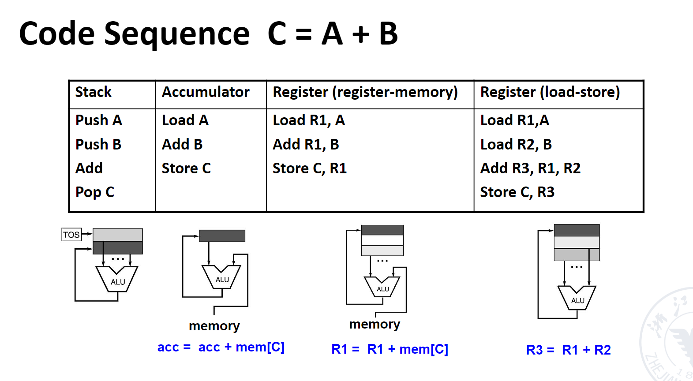
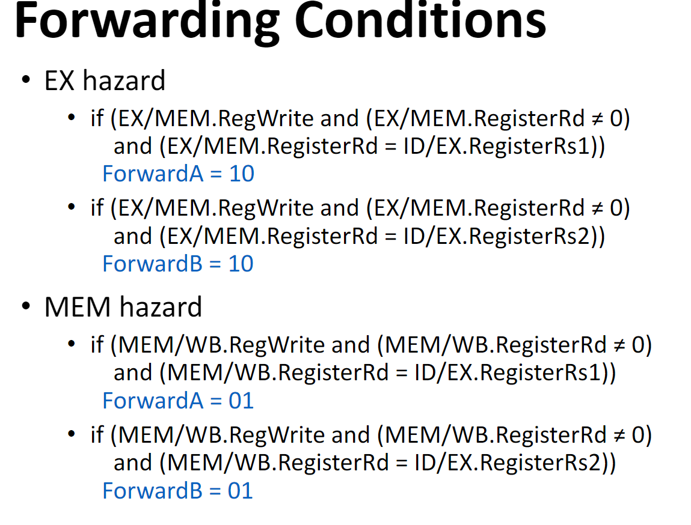
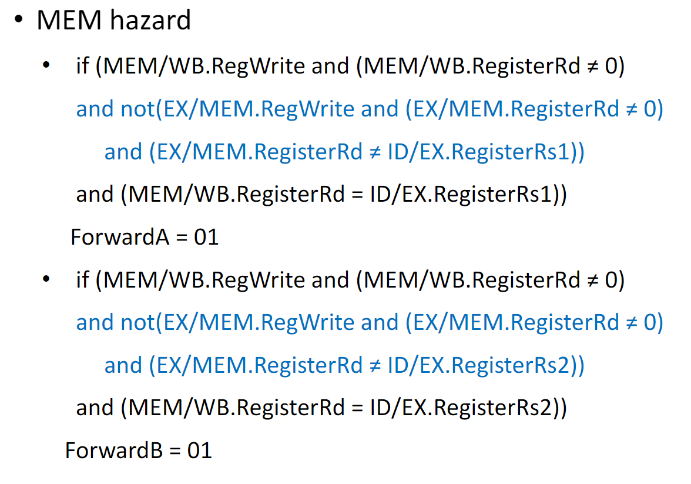
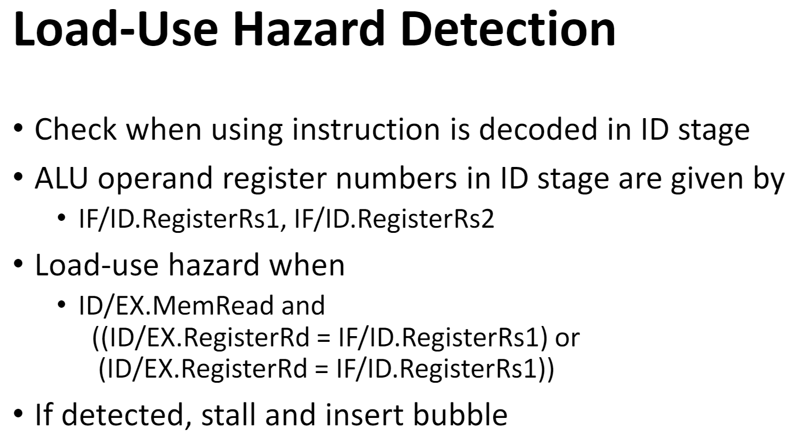
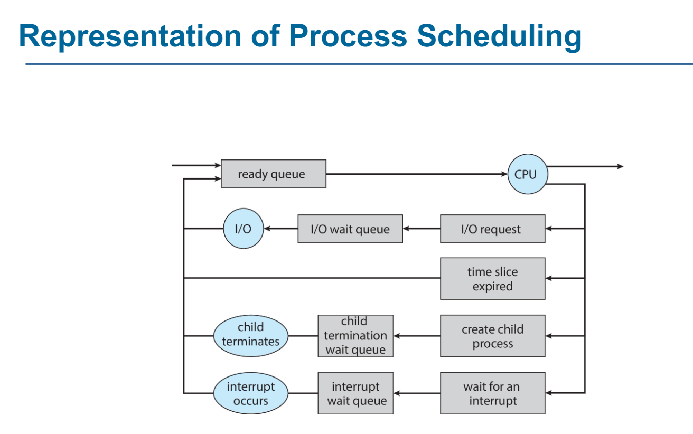

期末划重点

1. ISA四种架构，架构的指令，图中数据流转  Lec1-1

   1. 

   四种原则没考

2. 寄存器和储存器的比较  lec1-2

3. 流水线 

   1. 提高吞吐率来提高整个效率

   2. segment和stage没有区别，就是阶段

   3. 饿饿饿饿饿饿饿饿饿饿 

   4. 计算throughput，speedup，clock_cycle

   5. 流水线的characterastic

   6. 分类classes of pipelining

      1. single function

         multi function

      2. static pipeline

         dynamic pipeline

      3. linear

         nonlinear

      4. 标量处理器

         向量处理器

   7. pipeline performance

      1. Throughput（TP）
      2. Speed up
      3. Efficiency    （ η ）

   8. 流水线图改了东西，看hint，要补ex阶段alu前的一个多路选择器，才能把前递信号穿过来（paper要画流水线和信号）

      1. 
      2. 
      3. 
      4. 

   9. 冒险hazard

      1. 分类
         1. Structural Hazard
         2. data hazard
      2. Detecting hazard三类条件

4. 后面很多，都比较重要

#### OS      15填空，5个大题

1. computer architecture

   1. 第一个电脑组装时间：194几——Computer Architecture

      组装的这两个人是ISCA（顶会，由组装这两个人命名）

   2. Mutex-UNIX-

   3. 为了增加管理硬件的管理

      1. Privilege
      2. Unprivileged

2. OS instruction

   1. syscall=接口 index是syscall number
   2. 通过寄存器传参（数值，block地址（register放不下），stack（少见）），返回值，0号寄存器
      1. bug——Double fetch
   3. slize好好看！ELF格式去补CSAPP。

3. OS structure

4. Process

   1. Allocation单元
   2. Management
   3. 状态
      1. Waiting——list_head
      1. 
   4. fork，不难创建thread
   5. clone可以创建

5. IPC——为了process通信

6. Thread

   1. ==RISCV分时怎么实现的？== 什么head？？？
   2. unit of execution, dispaching（调度） 
   3. Share 
      1. Open file table
      2. 堆
      3. data
   4. 不share：stack
   5. 效率高，隔离性差

7. Scheduling

   1. switch_to返回ra，ra是之前被swtich走的时候存的。
   2. Gaint chart
   3. Average waiting time
   4. Average Turnaround time

8. Synchronization

   1. 原理
   2. tools（大题）上课例子
   3. ==Sem，写wait，signal==

9. Deadlock

   1. hh

21机组https://www.cc98.org/topic/5114223
20机组https://www.cc98.org/topic/4963719
19OS  https://www.cc98.org/topic/4819419
20OS  https://www.cc98.org/topic/4899773/2#1
21OS  https://www.cc98.org/topic/5024979

[操作系统进程同步问题大题_C_ChunJin的博客-CSDN博客_一组生产者进程和一组消费者进程共享9个缓冲区](https://blog.csdn.net/C_ChunJin/article/details/110748685)

进程调度（SJF）、磁盘调度（SSTF）、页替换（LRU）各有一题 感觉许多内容都是考的概念性的理解，没有考出具体细节 填空题 - 10 空，10 分

 1、用户级线程和内核级线程的对应关系（给了 many-to-many，写另两个） 

2、进程状态的转移（从 running 可以转移到哪三个状态）

 3、死锁的四个条件（给出了 mutual exclustion 和 circular wait，写另两个） 

4、Linux 中的 PCB 是哪个结构 

5、swap-space 的两个形式 

大题，30 分 

1、200 人容量的会议厅，出口入口各一个且每次仅允许一人通过，用信号量同步 

begin { ... enter; ... meeting; ... exit; ... } 

填空30
1.写运行状态变化
2.写出微核和巨核之间的对比优点和理由
3.5个信号量。一顿操作变2，求当前剩余资源数，线程拥有资源数，等待数

大题30
1.给出线程序列，求FCFS，SFJ，RR，priority算法的甘特图和平均等待时间
2.一个页表相关的题目
3.一个信号量的题目，五个线程相互等待，怎么设计信号量

1. Multicycle CPU implementation
   - (several kind of exceptions, interrupts) Identify states where these exceptions can be identified
   - 一段关于中断与异常扩展的描述，但在一般的EPC, Cause寄存器外，又整了个 "Error Trap" 和 "ErrorPC"
     - 扩充数据通路和控制信号来支持"Error Trap"
     - eret FSM
