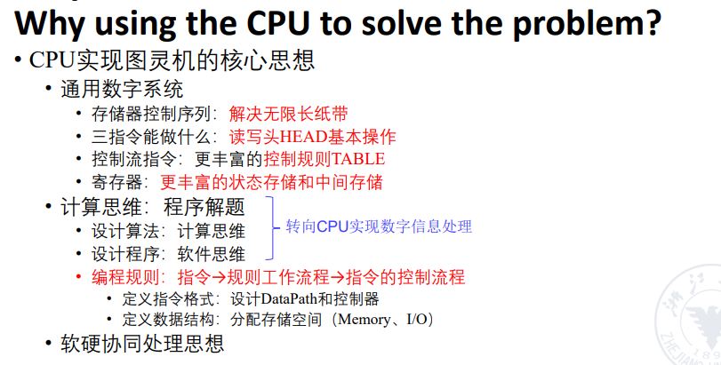
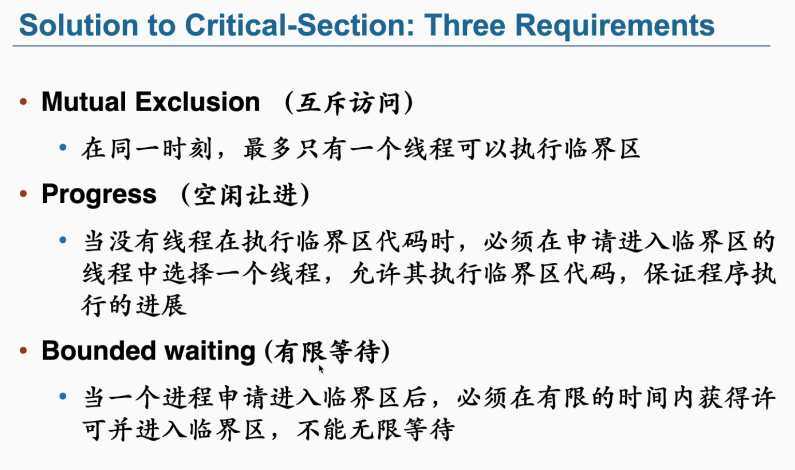

[TOC]


# lec 1-1



##### Basic principles of CPU/ISA design（ Instruction Set Architecture）

• Compatibility兼容

 • Versatility多功能

 • High efficiency 

• Security

#### The Four ISA Design Principles


##### ISA Classes（根据 internal storage内部储存方式区分的）

 • Stack architecture 


• Accumulator architecture 


• General-purpose register architecture (GPR）

​	Two Classes: 

​	• Register-memory architecture（ any instruction can access memory ）


​	• Load-store architecture （ only load and store instructions can access memory）


# Lec 1-2

##### Interpret Memory Address

 • Byte ordering in memory: 0x12345678 

小端法  **Little Endian**: store least significant byte in the smallest address 

78 | 56 | 34 | 12 

大端法  **Big Endian**: store most significant byte in the smallest address 

12 | 34 | 56 | 78

##### Procedure Invocation Options: Save Registers

 • Caller Saving the calling procedure saves the registers that it wants preserved for  access after the call

 • Callee Saving the called procedure saves the registers it wants to use

##### The improvement of ISA


# Lec 4

### **what influnce the performance of pipeline?**

* **Throughput(TP)**

  单位时间内执行指令数目

  TP=n/T

  T=（m+n-1)dt   m为级数

  上界：TPmax=1/dt  当n趋近于无穷大.

* **speedup 加速比**

  nonpineline_time/ pineline_time

  =n*m dt/（m+n-1)dt

  当n趋近于无穷大.sp趋近于m（级数）

  直观上理解：m级数意味着m次硬件执行过程。

  是不是m越大越好？

  no: complications, huge control logic, dependence

* **efficiency**

  背景：指令的执行阶段占时不同，造成waste

  **efficiency**=speedup/m

  注意复杂情况通过segment-t画框图来解决。

  eg. vector A(a1, a2, a3, a4)

  vector B(b1, b2, b3, b4)  求A*B的值

  分析：static pipeline with more than 2 types instr.

  peak：why? 冒险是限制效率的最大因素

### PIpeline hazard

* structual

  * 某个结构同时被两条指令想用

    eg. single memory

    -------------------------

    解决方式：**Add more hardware**（more often）

    Take in turns, some instruction have to stall(等待)

* data 

  * 可能依赖于上一条指令的数据结果

  * need to wait for previous instruction to complete its data_write

    -------

    解决方式:  add 气泡 气泡 sub : 没提高多少效率

    forwarding: sub 从 add EX 取数 

    but 不是所有的都能避免 bubble

    **Reorder: 将接下来未冲突的指令先执行，而非bubble （整体观）**

* control

  * 上一条指令结果决定下一条指令在哪（PC）

    典例：beq bne

    -----------

    解决方式：

    * 等待 bubble （硬件）

    * prediction （预测）：just “while” 可行 

      ！硬件层面上实现预测器！

      assemble  层面上——回到硬件层面

    * **延迟决策——reorder：先在等待的地方放一条程序里边的不相关代码先执行，也可以是前面的代码**

      ——在编译器层面上

### pipeline datapath

* state register: hold state from previous stage.

  why? 

  What to store?(后续阶段要使用的量)

  * 不同指令不一样

  eg.load

  IF/ID: **PC** (考虑jal branch),instr

  ID/EX: reg_data_rs1, imm, rd ， pc

  EX/MEM:  PC rd  addr

  MEM/WB: mem_data,  rd, (这个时候PC就没有了)

  eg.addi

  IF/ID: PC INSTR

  ID/EX: reg_datda1   imm   rd     control   pc

  EX/MEM: ALU_result  rd control pc

  mem/wb: 同上

  

### pinpeline control

* 最大不同：控制信号要传到流水上去

* control 控制信号 先存到状态寄存器上，

  弄清楚哪个寄存器要哪些状态 

​    上一条代码和下一条代码表现在寄存器组中的状态

# Lec 4

增加指令并行性两种方法

1. 增加深度（层数），超级流水线
2. 多发射，增加一个时钟周期的指令数
2. 
2. 
2. 

# Lec 5

#### 5-1分支预测


5.2 Multiple Issue多发射处理器

1. Static multiple issue静态

   编译器来处理，避免冒险

2. Dynamic multiple issue动态

   CPU来做

Compiler/Hardware  *Speculation*：猜测要做什么，

Two types of Multiple Issue processor

1. Superscalar超标量 : the number of inst in each clock is not fixed.超标量对programmer来说是transparent透明的，因为操作者看不见，没办法
2. VLIW超长指令字: the number of inst in each clock is fixed (4~16)，只有ex阶段不一样，因为其他阶段直接拓展位数就行。

#### Hazard 冲突类型

1. 结构冒险，用单个physical resource，总是可以通过添加硬件来解决

2. 数据冒险，instruction depends on result from previous

   1. RAW冲突，写操作预约，改寄存器状态表，使得操作数无法被读取。
   2. WAW冲突，由于指令是按照顺序流出的，当有多条指令写同一个寄存器的时候，后一个可以将前一个的写预约覆盖，最后一条留下的预约结果就是最后一条指令的。（注意：无论操作数是否就绪，流出后即进行写预约）
   3. WAR冲突，寄存器换名，将寄存器换成保留站的标识，之后等保存站中操作完成，将数据流出到总线再传至换名的标识处。可以看出换名后对寄存器进行的任何操作都与换名处无关了，即保证了读取数据的时间节点正确

   解决方案：forwarding，添加额外硬件

   

# lec5-2

##### 超长指令字Very long instruction word technology(VLIW)

主要受以下三个方面的影响：

- 程序固有的指令级并行性。
- 硬件实现方面的困难。
- 超标量和超长指令字处理器固有的技术限制

静态流水线和动态流水线
这是按照同一时间内各段的连接方式来分类的。静态流水线指的是，同一时间内，流水线的各段只能按同一种功能的连接方式工作。上例ASC的8段就属于静态流水线，只能进行加减运算或者定乘运算。因此在静态流水线中，只有当输入端是一串相同的运算操作时，流水的效率才能发挥。而动态流水线指的是，同一时间内，某些段正在实现某种操作（如定乘）而另外一些段却在实现另一种运算（如浮点加法）。这样不同类型的操作也可以进行流水处理。然而动态流水线对于控制的要求是很高的。目前绝大多数的流水线是静态流水线。
从下图给出的静态和动态流水线的时空图，可以清晰地看到两种流水方式的不同。


3、部件级、处理机级及处理机间流水线
这是按照流水的级别来进行分类的。
部件级流水线，叫运算操作流水线，它是把处理机的运算逻辑部件分段，使得各种数据类型的操作能够进行流水。
处理机级流水线，又叫**指令流水线**，它是把解释指令的过程按照流水方式处理。处理机要处理的主要时序过程就是解释指令的过程。按照流水方式进行，可以使处理机重叠地解释多条指令。
处理机间流水线，又叫宏流水线。它是由两个以上的处理机串行地对同一数据流进行处理，每个处理机完成一项任务。


4、标量流水处理机和向量流水处理机
这是按照数据的表示来进行分类的。标量流水处理机指的是，处理机不具有向量数据的表示，仅对标量数据进行流水处理。类似的，向量流水处理机指的是，处理机具有向量数据的表示，通过向量指令对向量的各元素进行处理。

5、线性流水线和非线性流水线
按照流水线中是否有反馈回路来进行分类的。线性流水线指的是，流水线的各段串行连接，没有反馈回路。而非线性流水线，指的是流水线中除有串行连接的通路外，还有反馈回路。


# Lec 7 OS introduction

Unix是Bell lab,belong to AT&T公司（通信业务），不开源

开源运动GNU

操作系统：管理硬件给软件使用。resource abstractor and resource allocator.

- BIOS: Basic Input Output System
- ROM: read only memory
- RAM: random access memory.

Run before OS: the **Bootstrap program**,called bootloader

ppid: Parent of pid,进程从哪里来的

pstree -p进程展开树

- lean -> nothing more不臃肿，不多

- mean-> single-minded.

##### UI发展史

UI->GUI->Touch UI->Voice UI->Movement……

## System Calls

输出output

```
write(1,"hello world\n",13);
	  fd               number
```

| fd number | Meaning |
| --------- | ------- |
| 0         | stdin   |
| 1         | stdout  |
| 2         | stderr  |

Homework ：build all head pointer

|                       | Dynamic                  | Static                         |
| --------------------- | ------------------------ | ------------------------------ |
| Memory                | 8.2k,没有打包进去        | 826k将头文件打包，不需要系统了 |
|                       | 需要dynamic loader       | First appear                   |
| strace调用系统syscall | 很多，大部分是loader做的 | 较少                           |

#### Type of syscall

- Process Control
- File management
- Device management
- Information maintenance(get and set time/data/sys_process/attribute)
- Communications
- Protection


LAB3 思考题用si step instruction

## OS Structures

User mode & **kernal** mode(privilege!!和LC-3区分)

#### linux命令

- strace 文件名//展开所有操作系统做的事情
- man 指令名//说明书，同help
- ls 列出文件夹下所有文件
- si：step instruction
- gcc -static main.c	//Static Link
- gcc main.c//Dynamic link
- file a.out查看文件属性
- vim 文件名//在框里打开文件
- cat 文件名//读文件
- 

#### ELF： executable and linkable format.

操作系统栈就是一块内存，有一个pointer指向栈顶。

main(argc, argv)

## Linkers and loaders

三个/bin / cat映射

- r-xp 可读和执行——elf里text
- rw-p 可读可写不可执行——elf里data
- r--p 只可读——rodata
- p——private/share

#### Operating System Design important principle

1. Policy: What to be done?
2. Mechanism: How to do it?

##### Microkernel System Structure

把user mode和kernel mode分开，用IPC连接跳转

（Inter Process communication）

##### 一些不同操作系统公司的历史

- MacOS把微内核和file 集成了
- Android是Linux kernel，用Bionic的libc，Apaeche lisence不用开源

- 标准的libc是GNU提供的，开源的，和Ubuntu一起发展的，GPL lisence要求：无论商用还是什么，如果改了linux的kernel必须开源

- Ubuntu是Canonical公司，南非，每年四月更新版本2021.04（偶数年04是长期支持版5-10年）,11月发2021.10版（6个月）

- 鲲鹏——ARM架构


make menuconfig

# Process

a unit of resource allocation and protection

和job

1. code(text)
2. data section
3. stack
4. heap

### Process Control Block(PCB)

thread进程和process的区别

### 1. new

如何创建一个进程——fork

#### fork()

通过系统调用创建一个与原来进程几乎完全相同的进程，这个新的进程就成为子进程。一个进程调用fork()函数以后，系统先给新的进程分配资源，例如存储数据可代码空间。然后把原来进程的值都复制到新的进程当中，只有少数值与原来不同。

调用fork()函数之后，fork()之后的代码一定是两个进程同时执行，而之前的代码已经由父进程执行完毕。

返回值： 若成功调用一次则返回两个值，子进程返回0，父进程返回子进程ID；否则，出错返回-1

##### 例题1

```c
会输出几个hello？
pid1=fork();
printf("hello\n");
pid2=fork();
printf("hello\n");
```

```
答案：6个
执行完第二行时缓冲区：
缓冲区1：hello
缓冲区2：hello(从缓冲区1fork出来的)
执行完第四行
缓冲区1：hello \n
缓冲区2：hello \n
缓冲区3：hello \n（从缓冲区1fork出来的）
缓冲区4：hello \n（从缓冲区2fork出来的）
```

##### 例题2

```
int a=12;
//因为fork()只对parent返回>0，if能做，子进程返回0，所以跑去else
if(pid = fork()){//parent
	sleep(10);
	printf("%d",a);
}
else {//child
	a+=3;
	while(1);
}
```

结果：child里的a=15，parent里a=12.

fork完之后，两个进程完全隔离，各用各的stack，heap，data，text，不share任何东西，但是因为fork所以数据完全相同。

##### 例题3

```
int main(){
	fork();//2个
	if(fork()){//parent->2,child->2
		fork();//parent->2,2*parent(2)->4 + child(2)=6
	if}
	fork();//6*2=12
}
```

一共有12个进程

#### exec()

输入ls的背后发生了什么，在子进程里面调用execv

```
if(fork()==0){
	char *const argv[]={"ls","-l",}
	execv("bin/ls",argv);
}
```

exev参数很多

fork和WIndows CreateProcess的优点和缺点

- Pros
  - 简洁：需提供10个参数
  - 分工：fork骨架，exec灵魂
  - 联系：进程和进程之间的联系
- Cons
  - 复杂
  - 性能差（每次fork一遍但是不用）
  - 安全问题

malicious恶意的benign


### 2. Terminate

会把子进程占用的内存clean up

Java里面解决memory leak的问题：垃圾收集 Garbage Collection 通常被称为“GC”

详细：[java中的GC机制_老王不让用的博客-CSDN博客_java中gc](https://blog.csdn.net/wangquan1992/article/details/99679969)

ctrl+c 发interrupt signal();

如果给signal(SIGINT, my_handler);，my_handler又什么都不做（摆烂），你就跳不出来，可以用kill （序列号）

### 3. ready

waiting to be assigned to a process

Ready queue—— runqueue in linux

### 4. running

用CPU了，开跑

唯一一个没有队列

### 5. waiting

 waiting for some event to occur.

Wait queue

用来等一些读磁盘之类的超慢操作，它做好了发signal然后把任务移到ready

```
linux指令：
top//看cpu使用率
ps -aux//看clock目录

```

### Process Schedule

Wait queue ,Ready  queue


### Context Switch

> - 线程切换，同一进程中的两个线程之间的切换
> - 进程切换，两个进程之间的切换
> - 模式切换，在给定线程中，用户模式和内核模式的切换
> - 地址空间切换，将虚拟内存切换到物理内存

When：CPU_swithch_to

Where: PCB 具体来说是 thread_struct

将x0 <- p0    x1 <- p1

寄存器换了，将p0的寄存器存到p0的栈里，p1的数据从p1的栈里拿出来。

arm汇编指令：

```
stp x19, x20, [x8], #16 // store pair
ret //lr->pc return
```

调用中断的时候kernel_entry存寄存器


```
ag类似grep 和 find，但是执行效率比后两者高。

ag -g <File Name> 类似于 find . -name <File Name>

ag -i PATTERN： 忽略大小写搜索含PATTERN文本
```

读一下

### TASK struct

最初

搜索NR_TASKS,可以看到define成64


一次更新，

1. 扩充PCB table，从64到512，
2. 引入ready queue
3. 引入ready queue


690行左右，schedule

###### WAIT queue， 在0.11里面只有4个


##### Zombie


##### Orphan


# Inter-process Communication(IPC)进程间通信

相对：Intra-process Communication进程内通信

例子：浏览器的每个网页都是独立的process

###### Reasons：

1. Information sharing
2. Computation speedup
3. Modularity

###### 两种主要方式

1. Shared memory共用内存数据交流
   - 映射内存，效率高
   - 不安全
2. Message passing通过内核的传达
   - 安全
   - 慢，overhead高

### shared memory


```
ipcs -a  //可以查看所有shared memory id(shmid)
cat proc/pid/maps
可以看到shared memory进程是rw-s
s代表share
p代表private
```

### Message Passing


##### Logical

- Direct: $ C^2_n$ 个channal，很慢
- asynchronous&&synchronous
  - synchronous：反应快但整体效率差，有message就能收到
  - asynchronous：整体效率高
- Buffering
  - Zero capacity
  - Bounded capacity一般来说指定n message
  - Unbounded capacity无限长

### pipes

-用shared memory实现和message passing并列的机制

1. Ordinary pipe：直接在parent和child建立，没有名字，一端写，一端读，单向，所以需要两个达成来回，win里面叫anonymous pipe

2. Named pipe：建立一个文件来沟通

   - 创建文件

     

   - 打开文件，读

     

   - 写

     

```
find | grep sched.h  //|是ordinary的pipe
把find的结果给grep
```


### Client-Server Communication

- Sockets
  - id address+port number
  - 适合传data，用于不同主机间通信
- RPC (remote precedure call)
  - 适合传函数参数，打包传输，关键在打包解包
  - Danger：不能确定是否执行、丢了，回复也有可能丢
  - Weak semantic：最多执行一次
  - Strong semantic：只执行一次（复杂）
- Java RMI(就是java 的 RPC)
  - 一个Java machine想要和另一个联系
  - 也是打包解包

# Thread

这是一个进程process


#### 线程：

- 进程的执行单元
- 不需要IPC来switch
- 快：只需要分配stack，不需要复制内存

#### 两种

- 单线程
- 多线程，共用file，code，data，不同的stack，heap，pc

##### kernel thread && user thread

- many to one 缺点：阻塞，
- one to one  安全，但比较慢，因为要调用很多kernel
- many to many n个映射到m，太过复杂，没人用
- two level 同时采用2、3，太复杂，没人用

linux只fork一个线程

#### Safe thread cancellation——pthread_testcancel()

- asynchronous cancellation 异步合适的时候cancel
- deferred cancellation 延迟cancel

### Windows thread


### linux thread

doesn't distinguish PCB and TCB

kernel data structure: task_struct


how to write lkm

# 调度CPU Scheduling

- I/O-bound 现在基本上都是io，手机等你
- CPU-bound 处理超大的视频


#### Dispatch

Context Switch

#### Scheduling Algorithm

非抢占式：你只能等他

抢占式：基本上所有的操作系统都是抢占的


1. 抢占式和非抢占式都可能
2. 还能跑，所以必然是抢占式（cpu抢占），时间片用完了。
3. 4. 5. 两种都可能

prefer throughput rather than responsiveness

就是，干的很快，但是它觉得不急就没有立即执行，所以反应慢。

**考点：画Gantt chart**


#####  非抢占式（Shortest Job First）

##### FCFS先来先服务

#####  Shortest Job First(SJF)


3是时间点

p1 p2 p3 都是0时刻来的
$$
WaitingTime=startTime -arrivalTime
$$


1. P1: wt=6-0=6
2. P2: 0-0=0
3. P3:3-0=3
4. Average: wt=(6+3) / 3 = 3

$$
Turnaround Time = Finish Time - Arrival Time
$$

1. P1 30
2. P2 3
3. P3 6
4. Average turnaround time (30+3+6) / 3 = 13

如果来的顺序变成p1 p2 p3

Average waiting time =17 

Average turnaround time =27

#### convey effect 

long job slow down the whole system

##### 抢占式Shortest Remaining time First(SRTF)


每次比较剩余时间和新任务执行时间，选择当前需要最小时间的任务。
$$
Average Waiting Time = Finish Time-Duration-Arrival Time
$$
(25-10-0)+(10-6-2)+(17-7-4)+(7-5-2)=23/4=5.75
$$
AverageTurnaroundTime=FinishTime-ArrivalTime
$$


#### Round-Robin Schedule(RR)

轮流跑，轮询


total waiting time=(30-24-0)+(7-0-3)+(10-3-0)=17

选择quantum：取决于运行程序的大小


##### Priority Scheduling


Priority Scheduling x/ Round-Robin

同优先级round-robin，不同优先级按顺序。


##### Multilevel Queue Scheduling

Simple idea:将不同类比的processes分在不同的queue里，不同queue采用不同的策略。


1. 给8个时间片，怎么还没完，扔到另一个q
2. 16时间片还没完，扔到另一个q

##### Thread Scheduling

1. process-contention scope(PCS) 每一个进程的时间片一样
2. system-contention scope(SCS) 每一个线程时间片一样

##### Multiple-Processor Scheduling

windows数越大优先级越高

linux数越小，优先级越高

###### 时间运行优先级和程序优先级没关系

###### 抢锁，实际是在抢cpu

#### 引起线程上下文切换的因素

- 当前执行任务（线程）的**时间片用完**之后，系统CPU正常调度下一个任务
- 中断处理，在中断处理中，其他程序”打断”了当前正在运行的程序。当CPU接收到中断请求时，会在正在运行的程序和发起中断请求的程序之间进行一次上下文切换。**中断分为硬件中断和软件中断**，软件中断包括因为IO阻塞、未抢到资源或者用户代码等原因，线程被挂起。
- 用户态切换，对于一些操作系统，当进行用户态切换时也会进行一次上下文切换，虽然这不是必须的。
- 多个任务**抢占锁资源**，在多任务处理中，CPU会在不同程序之间来回切换，每个程序都有相应的处理时间片，CPU在两个时间片的间隔中进行上下文切换

# 同步synchronization

[操作系统理论知识：同步与互斥_平凡-CSDN博客_操作系统同步互斥](https://blog.csdn.net/D5__J9/article/details/90479266)

Uncontrolled Scheduling

Race Condition

- preemptive：可抢断
- non-preemptive

#### 3 requirement



## Peterson's Solution 


#### 同步解决方案

- 硬件的两个指令(靠原子性来实现)

  - Test-and-Set 不满足dounded waiting
  - Compare-and-swap 叫 cmpxchg

- 软件的设置

  - mutex lock

    - 每个互斥锁有一个bool类型变量available

    - release();  // available = true，表示可以用

    - acquire(); //  等available是true了就把它设置成false

    - 在多个程序是变成了自旋锁

    - > 何谓**自旋锁**？它是为实现保护[共享资源](https://baike.baidu.com/item/共享资源)而提出一种锁机制。其实，自旋锁与[互斥锁](https://baike.baidu.com/item/互斥锁)比较类似，它们都是为了解决对某项资源的互斥使用。无论是**[互斥锁](https://baike.baidu.com/item/互斥锁)**，还是**自旋锁**，在任何时刻，最多只能有一个保持者，也就说，在任何时刻最多只能有一个执行单元获得锁。但是两者在调度机制上略有不同。
      >
      > 对于互斥锁，如果资源已经被占用，资源申请者只能进入睡眠状态。但是自旋锁不会引起调用者睡眠，如果自旋锁已经被别的执行单元保持，调用者就一直循环在那里看是否该自旋锁的保持者已经释放了锁，"自旋"一词就是因此而得名。

  - Semaphore （dijikstra引入的）

    - 整型变量S

    - wait(); // 等S大于0时，S--

    - signal(); // S++

    - 计数信号量

    - 二进制信号量（类似互斥锁）

    - > 1. 所以如果使用mutex，那第一个进入临界区的进程一定可以执行，而其他的进程必须等待。
      > 2. 而semaphore则不一定，如果一开始初始化为0，则所有进程都必须等待。
      > 3. 同时mutex和semaphore还有一个区别是，获得mutex的进程必须亲自释放它，而semaphore则可以一个进程获得，另一个进程释放。

- 死锁deadlock和等待busy waiting

  - 无限阻塞 indefinite blocking
  - 饥饿 starvation

- 优先级反转 priority inversion

  - 优先级继承协议 priority-inheritance protocol
  - Mars火星探测者的问题


！！考题，怎样用semaphore同步进程，是否存在busy waiting

##### 

#### 经典同步问题（软件层面解决）

##### bounded-buffer problem有界缓冲

- full-slot 
- empty-slot

##### 生产者-消费者

- consume

  ```c
  while(1){
  	wait(full);//ful--,如果队列为空会sleep，如果把mutex放到前面，会带着mutex sleep掉
      wait(mutex)//所以这个不能放在前面
  	//consume
       signal(mutex);
  	signal(empty);//empty++
  }
  ```

- produce

##### readers-writers

reader可以共存，writer不能共存，reader读的时候要把writer锁起来，

> -  priority inherit 优先级继承
> - priority inversion 把高优先级等待的低优先级变成高优先级

##### Dining-Philosophers problem

```c
do{
    wait(i);
    wait(i+1%n);
    
}
```

#### 一个习题或是例子Semaphore(!!!)

```
struct semaphore{
	lock;//下面两个不能同时访问，lock用来保护他们
	count;
	wait_list;
}
```

down()

- 如果count>0, count--
- 如果count==0 , block();

semaphore里面会带着lock sleep，直接就死锁了。现在的实现是，先解锁再sleep

up()

p1----|

​		 |----->p3

p2----|

```c
sem s1=0,s2=0;

funct1(){
        P1
    sig(s1)
}
funct2(){
        P2
    sig(s2)
}
funct3(){
    wait(s1) wait(s2) //if(p1 p2 都运行完了)
        P3
}
```

> linux里面trace机制（追溯），复现bug
>
> user-----pt_regs(process trace)----->kernel

# Deadlock

#### 条件（必要非充分）

- Mutual exclusion
- hold and wait
- no preemption（A不能抢B，B不能抢A）
- circular wait

##### 处理

- 不让它死锁：因为运行的时候不知道需要多少资源（听歌的时候不知道听多久）

  - Prevention：打破四个条件

  - Avoidance：分配资源之前通过算法算一下会不会死锁
- 撤回

  - Deadlock detection and recovery
- Ignore the problem
- 4637  -7778
- 3332
- 2130
- 0120
- 2222
- 3454

