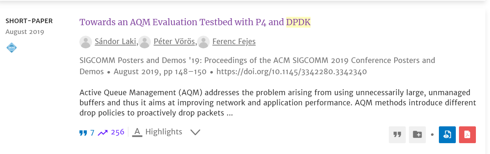

针对给定范围内某一领域展开搜索，找到至少1篇近年综述和10篇近年论文，撰写至少2000字的文献综述（中文）。

要求独立完成（被发现任何抄袭行为者，直接0分）。

注意隐名。

https://dl.acm.org/doi/10.1145/3342280.3342340

[张帆 - 浙江大学 - 计算机科学与技术 (x-mol.com)](https://www.x-mol.com/university/faculty/70720)