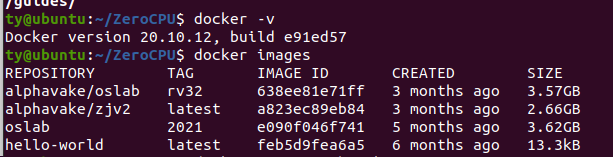
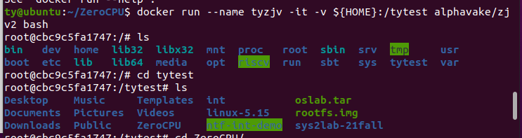
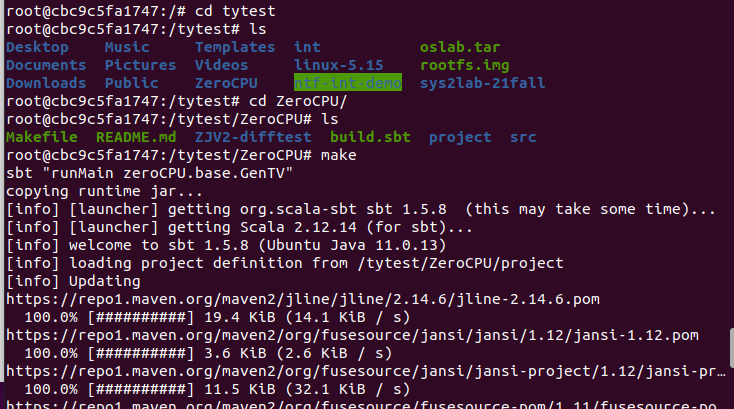
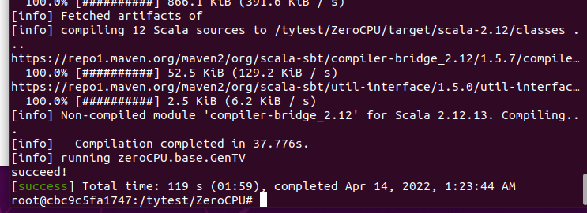
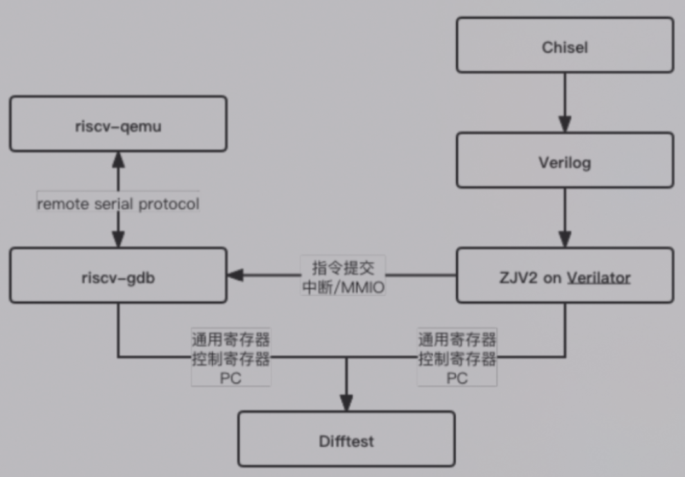
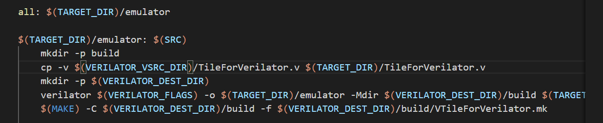

## 过程记录

为了入门，先试着运行一下[Zerokei/ZeroCPU: My Own CPU (github.com)](https://github.com/Zerokei/ZeroCPU)

#### 配置环境

首先下载docker，链接在这里[riscv-zju/zjv2-env: Dockerized environment for developing Chisel based CPU core. (github.com)](https://github.com/riscv-zju/zjv2-env)。

其实就输入以下一行就行，2G多，等一会。

```
$ docker pull alphavake/zjv2
```

下载完成后，可使用以下查看镜像是否导入成功。

```
# 查看docker镜像
$ docker images
```



#### 启动docker

```
# 挂载本地目录
# 把用户的 home 目录映射到 docker 镜像内的 tytest 目录
$ docker run --name tyzjv -it -v ${HOME}:/tytest alphavake/zjv2 bash    # -v 本地目录:容器内目录
```



可以看到，我们的本地目录已经挂载到docker里。

#### 运行ZeroCPU

在本地git clone下来

```
git clone https://github.com/Zerokei/ZeroCPU.git
```

可以直接看到docker里存在以下文件夹，进入文件夹后make，运行成功可看到以下图样。

make是为了`Generate CPU.v in build/verilog/base automatically`






##### 关于docker的一些存档

以下指令间==不存在==运行顺序，并且大部分功能一样，不能一起做，比如说不能创建名字相同的容器，想要把本地挂载容器就不要在最开始用那个名字直接创建容器。

```
# 导入docker镜像
$ cat oslab.tar | docker import - oslab:2021

# 查看docker镜像
$ docker images
REPOSITORY   TAG       IMAGE ID       CREATED        SIZE
oslab        latest    b2b39a3bcd81   404 days ago   3.62GB

# 从镜像创建一个容器
$ docker run --name oslab -it oslab:2021 bash   # --name:容器名称 -i:交互式操作 -t:终端
root@132a140bd724:/#                            # 提示符变为 '#' 表明成功进入容器 后面的字符串根据容器而生成，为容器id
root@132a140bd724:/# exit (or CTRL+D)           # 从容器中退出 此时运行docker ps，运行容器的列表为空

# 启动处于停止状态的容器
$ docker start oslab        # oslab为容器名称
$ docker ps                 # 可看到容器已经启动
CONTAINER ID   IMAGE        COMMAND       CREATED              STATUS        PORTS     NAMES
132a140bd724   oslab:2021   "bash"        About a minute ago   Up 1 second             oslab

# 从终端连入 docker 容器
$ docker exec -it oslab bash

# 挂载本地目录
# 把用户的 home 目录映射到 docker 镜像内的 have-fun-debugging 目录
$ docker run --name oslab -it -v ${HOME}:/have-fun-debugging oslab:2021 bash    # -v 本地目录:容器内目录

```

## 试图理解一下



大概是这个逻辑

- Chisel转verilog是在Chisel代码的最后通过一些

	D:\computer_system\ZeroCPU\src\main\scala\platform\base\Tile.scala

	```
	
	object GenTV extends App{
	  println("succeed!")
	  (new chisel3.stage.ChiselStage).execute(
	      Array("-td", "build/verilog/base", "-X", "verilog"), 
	      Seq(ChiselGeneratorAnnotation(() => new TileForLab())))
	}
	object GenTVDebug extends App{
	  println("succeed!")
	  (new chisel3.stage.ChiselStage).execute(
	      Array("-td", "build/verilog/base", "-X", "verilog"), 
	      Seq(ChiselGeneratorAnnotation(() => new TileForVerilator())))
	}
	```

- 然后，在makefile里面，通过prepare在上一级目录的build里面生成一个elf文件，然后make的时候应该是比较。~~这里yzkgg改了一个TileForVerilator改成了TileForLab，要把makefile改一下才能跑。~~
- 订正：直接make debug就可以生成

	

- test里面的elf都是各个比赛的时候或者github上面的测试样例，我们做的事情是让qemu和verilator一起去跑它，然后比较输出。

	
