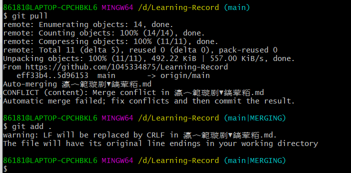

# 面向小组合作的git使用

git是啥，懂的都懂，用了就知道，ppt放在同文件夹下了，我这里只放一套可以完成基本git功能的指令，更多指令见ppt或网络。

### 开始

找到你想要的仓库（随便找了例子）


打开cmd或者任何一个终端（vscode也行）进入在电脑的某个地方运行以下指令，到git上面，复制运行http的或者ssh

```
git clone https://github.com/Zerokei/ZeroCPU.git
或者
git clone git@github.com:Zerokei/ZeroCPU.git
cd ZeroCPU
```

之后，本地会有一个新的文件夹，`cd ZeroCPU`进入文件夹后其实有一个隐藏文件夹.git。此时cmd显示最后会出现一个`(master)`或者`main`，因为我们clone的默认是master分支。


这时候我们应当建立自己的分支，输入以下指令：建立自己分支，分支名为ty；切换到ty分支。注意，此时的操作都是在本地，和远程无关。

```
git branch ty
git checkout ty
```

新建分支时，分支会默认继承master分支的内容。

###### 从0开始建立

（如果想从0开始新建仓库建议直接github网页端新建仓库，然后安装里面的提示在cmd里面输入，它给的7、8行代码直接一起复制进去就好了，之后和这里都一样）

#### 改动之后提交本地git

这时候，本地是处于ty分支下的，在里面改东西或者加文件都可以，改动之后，需要以下指令

```
git add .
或者
git add --all
```

将本地新增文件添加到本地git仓库。注意一定要在add之后加空格再加`.`。`.`是默认所有的意思。之后

```
git commit -m "update message"
或者
git commit --message 更新了xx文件，修复了xxbug
```

提交上传信息，这里`-m` 就是`--message`可换用，后面要加信息，中文不用加双引号但是英文需要。

但是，这个依旧是提交到本地的暂存库，和远程没有关系。只要你做了这个，本地也能获取到你不同时期的commit记录。

这个时候，在本地git的管理中，ty分支的修改才算保存好，此时才能在本地切换分支。

这个时候本地有一个很神奇的现象，就是ty分支的文件内容，只有你切换到ty分支才看得到。如果在cmd里面`git checkout master`会发现刚刚添加的文件消失了，再切换回来`git checkout ty`会发现文件还在。在没有保存（提交commit）之前是不能切换分支的（理论上）。

#### 上传远端

上面的都准备好后，直接

```
git push
```

如果是第一次上传分支，它会提示你一个指令，把它给你的指令复制输入一遍，就好了。

```
 git push --set-upstream origin test
```

### 合并

在本地是自己分支的情况下，先切换到`main`分支，就是要保证本地有两个即将合并分支的内容。（如果没有的话main分支需要从远端再拉`git pull`一下，一般如果是从main分支生成出来的都不用拉pull了）

最终停留在要改变的分支上（这里要把test合并到main里），在main的时候直接

```
git merge test
```

会汇报add 和update的信息，如果有相同文件被修改，此时文件夹可以直接用vscode打开，vscode知道你现在刚merge，有两个地方来的文件信息，vsc代码里面会显示不同的地方，可以修改保存。（网上说也可以使用mergetool，但其实vsc就够了我觉得）




在解决了所有文件里的所有冲突后，运行 `git add .`将把它们标记为已解决（resolved）。

##### 全部操作过程

```
git clone https://github.com/1045334875/database.git
cd database
git branch tytest
git checkout tytest
(加一个文件或者改一个文件)
git add .
git commit -m "update message"
git push
git checkout main
git merge tytest
```

全部操作如图：


